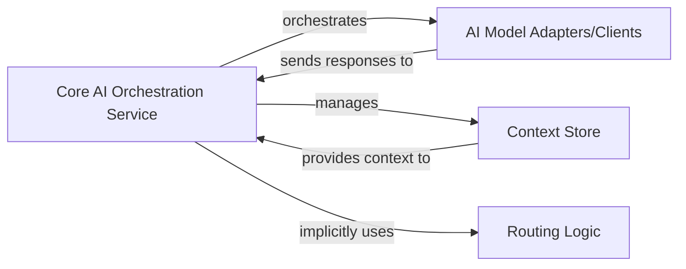

## Details

The core of this AI interaction system is the Core AI Orchestration Service, embodied by the Chatbot class, which manages the overall user interaction flow. It leverages the AI Model Adapters/Clients (specifically the AsyncChatbot class and its ask method) to communicate with external AI models like Google Bard, handling the intricacies of request and response processing. Conversational continuity is maintained by the Context Store, also integrated within the AsyncChatbot class through its save_conversation and load_conversation methods, which persist and retrieve session-specific data. While a distinct Routing Logic component is not explicitly present, its function is implicitly handled by the Core AI Orchestration Service, which directly dispatches requests to the single configured AI model adapter. This architecture ensures a streamlined and efficient interaction with the AI, abstracting the underlying complexities of model communication and context management.

### Core AI Orchestration Service [[Expand]](./Core_AI_Orchestration_Service.md)
This service acts as the primary orchestrator of AI interactions. It receives user requests, manages the overall flow of communication with the AI model, and processes responses. It also implicitly handles the selection and dispatch of requests to the underlying AI model adapter.

**Related Classes/Methods**:

- <a href="https://github.com/acheong08/Bard/blob/main/src/Bard.py" target="_blank" rel="noopener noreferrer">`src.Bard.Chatbot`</a>
- <a href="https://github.com/acheong08/Bard/blob/main/src/Bard.py" target="_blank" rel="noopener noreferrer">`src.Bard.Chatbot`</a>

### AI Model Adapters/Clients
This component provides a standardized interface for communicating with external AI models. It handles the specifics of sending requests and parsing responses from the AI service, including protocol translation and managing session-specific parameters.

**Related Classes/Methods**:

- <a href="https://github.com/acheong08/Bard/blob/main/src/Bard.py#L87-L298" target="_blank" rel="noopener noreferrer">`src.Bard.AsyncChatbot`:87-298</a>

### Context Store
Responsible for persisting and retrieving conversational context across user sessions. This ensures continuity in interactions by storing and loading conversation IDs, response IDs, and other relevant session data.

**Related Classes/Methods**:

- <a href="https://github.com/acheong08/Bard/blob/main/src/Bard.py#L87-L298" target="_blank" rel="noopener noreferrer">`src.Bard.AsyncChatbot`:87-298</a>

### Routing Logic
In this architecture, the routing logic is minimal and implicitly handled within the `Core AI Orchestration Service`. Given the current single AI model integration, explicit routing to different models is not required. The orchestration service directly dispatches requests to the configured AI model adapter.

**Related Classes/Methods**:

- <a href="https://github.com/acheong08/Bard/blob/main/src/Bard.py" target="_blank" rel="noopener noreferrer">`src.Bard.Chatbot`</a>
- <a href="https://github.com/acheong08/Bard/blob/main/src/Bard.py" target="_blank" rel="noopener noreferrer">`src.Bard.Chatbot`</a>

### [FAQ](https://github.com/CodeBoarding/GeneratedOnBoardings/tree/main?tab=readme-ov-file#faq)