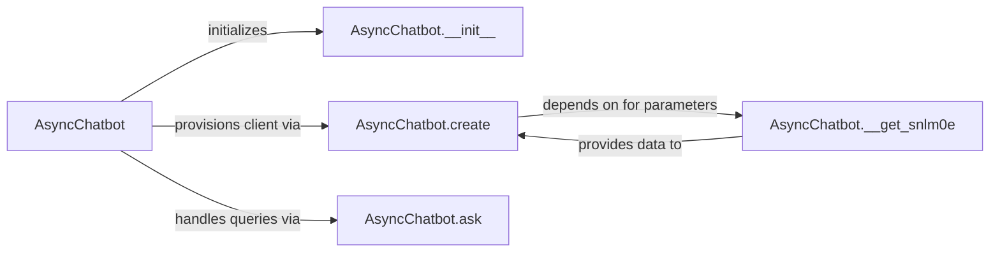

## Details

This subsystem is dedicated to establishing and managing secure, efficient interactions with external Artificial Intelligence services, such as the Google Bard API. In the context of a Cloud Infrastructure Deployment project, its primary focus is on robust communication protocols, secure authentication, optimized request/response handling, and the initial provisioning of AI clients within a cloud-native environment.

### AsyncChatbot
This is the primary orchestrator for all interactions with external AI services. It manages the entire lifecycle of AI communication, from initial client setup and authentication to handling conversational requests and responses. In a cloud context, it is responsible for secure API key management (e.g., integration with cloud secret managers), robust error handling, retry mechanisms, and efficient data transfer protocols optimized for cloud environments.

**Related Classes/Methods**:

- <a href="https://github.com/acheong08/Bard/blob/main/src/Bard.py#L87-L298" target="_blank" rel="noopener noreferrer">`AsyncChatbot`:87-298</a>

### AsyncChatbot.__init__
Initializes the `AsyncChatbot` instance. This involves setting up internal state, loading configuration parameters (such as API endpoints or default settings), and preparing the object for subsequent operations. In a cloud context, this might involve configuring cloud-specific client libraries or logging mechanisms, ensuring the service is ready for secure and efficient operation.

**Related Classes/Methods**:

- <a href="https://github.com/acheong08/Bard/blob/main/src/Bard.py" target="_blank" rel="noopener noreferrer">`AsyncChatbot.__init__`</a>

### AsyncChatbot.create
Manages the provisioning, setup, and authentication of the external AI client. This includes establishing the secure connection, handling authentication tokens or credentials, and instantiating the necessary client objects to communicate with the AI service. For cloud deployments, this method is critical for secure credential handling (e.g., using IAM roles or service accounts) and potentially configuring network access policies.

**Related Classes/Methods**:

- <a href="https://github.com/acheong08/Bard/blob/main/src/Bard.py" target="_blank" rel="noopener noreferrer">`AsyncChatbot.create`</a>

### AsyncChatbot.__get_snlm0e
An internal helper method responsible for retrieving or generating specific session-related or authentication parameters required for the AI service's initial handshake or ongoing communication. This could involve managing session IDs, unique identifiers, or other protocol-specific data, ensuring secure and stateful interactions.

**Related Classes/Methods**:

- <a href="https://github.com/acheong08/Bard/blob/main/src/Bard.py" target="_blank" rel="noopener noreferrer">`AsyncChatbot.__get_snlm0e`</a>

### AsyncChatbot.ask
Handles the core interaction logic with the AI service. This includes formatting user queries into the AI's required input structure, sending the request to the external AI API, parsing the AI's response, and managing the conversational flow or state. In a cloud environment, this method focuses on efficient data serialization/deserialization and robust API call management, crucial for performance and reliability.

**Related Classes/Methods**:

- <a href="https://github.com/acheong08/Bard/blob/main/src/Bard.py" target="_blank" rel="noopener noreferrer">`AsyncChatbot.ask`</a>

### [FAQ](https://github.com/CodeBoarding/GeneratedOnBoardings/tree/main?tab=readme-ov-file#faq)