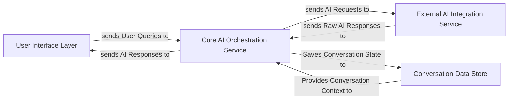

## Details

The `Bard` project implements a conversational AI system structured around a `Core AI Orchestration Service`. This service is central to managing user interactions, routing queries, and processing responses. The `User Interface Layer` provides the interactive front-end, capturing user input and displaying AI-generated content. For AI model interactions, the `Core AI Orchestration Service` communicates with the `External AI Integration Service`, which handles all external API calls and data formatting. Conversational history and context are managed by the `Conversation Data Store`, which the `Core AI Orchestration Service` uses to persist and retrieve session data, ensuring continuity across interactions. This design promotes clear separation of concerns, with the orchestration service mediating all core data flows and external integrations.

### User Interface Layer
Provides the primary interface for users to interact with the AI system, handling input capture, displaying AI-generated responses, and managing the interactive session.

**Related Classes/Methods**:

- <a href="https://github.com/acheong08/Bard/blob/main/src/Bard.py" target="_blank" rel="noopener noreferrer">`src.Bard.Chatbot`</a>
- <a href="https://github.com/acheong08/Bard/blob/main/src/Bard.py#L23-L24" target="_blank" rel="noopener noreferrer">`src.Bard.__create_session`:23-24</a>
- <a href="https://github.com/acheong08/Bard/blob/main/src/Bard.py#L27-L28" target="_blank" rel="noopener noreferrer">`src.Bard.__create_completer`:27-28</a>
- <a href="https://github.com/acheong08/Bard/blob/main/src/Bard.py#L31-L48" target="_blank" rel="noopener noreferrer">`src.Bard.__get_input`:31-48</a>

### Core AI Orchestration Service [[Expand]](./Core_AI_Orchestration_Service.md)
Acts as the central point for managing conversational flow, routing user queries to the appropriate AI model, processing responses, and maintaining conversational context.

**Related Classes/Methods**:

- <a href="https://github.com/acheong08/Bard/blob/main/src/Bard.py#L246-L298" target="_blank" rel="noopener noreferrer">`src.Bard.ask`:246-298</a>

### External AI Integration Service [[Expand]](./External_AI_Integration_Service.md)
Responsible for secure interaction with external AI services (e.g., Google Bard API), handling communication protocols, authentication, request formatting, response parsing, and initial provisioning/setup of AI clients.

**Related Classes/Methods**:

- <a href="https://github.com/acheong08/Bard/blob/main/src/Bard.py" target="_blank" rel="noopener noreferrer">`src.Bard.AsyncChatbot:__init__`</a>
- <a href="https://github.com/acheong08/Bard/blob/main/src/Bard.py" target="_blank" rel="noopener noreferrer">`src.Bard.AsyncChatbot:create`</a>
- `src.Bard.AsyncChatbot:__get_snlm0e`
- <a href="https://github.com/acheong08/Bard/blob/main/src/Bard.py" target="_blank" rel="noopener noreferrer">`src.Bard.AsyncChatbot:ask`</a>

### Conversation Data Store
Manages the persistence and retrieval of conversational history and context, ensuring that ongoing conversations can maintain state across multiple interactions. This component typically interfaces with a managed database service.

**Related Classes/Methods**:

- <a href="https://github.com/acheong08/Bard/blob/main/src/Bard.py#L158-L194" target="_blank" rel="noopener noreferrer">`src.Bard.save_conversation`:158-194</a>
- <a href="https://github.com/acheong08/Bard/blob/main/src/Bard.py#L196-L201" target="_blank" rel="noopener noreferrer">`src.Bard.load_conversations`:196-201</a>
- <a href="https://github.com/acheong08/Bard/blob/main/src/Bard.py#L203-L219" target="_blank" rel="noopener noreferrer">`src.Bard.load_conversation`:203-219</a>

### [FAQ](https://github.com/CodeBoarding/GeneratedOnBoardings/tree/main?tab=readme-ov-file#faq)