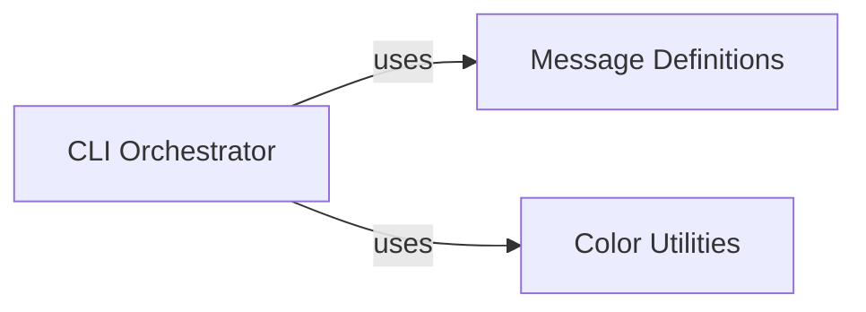

## Details

The `bashfuscator` CLI subsystem serves as the primary interface for users to interact with the obfuscation engine. It is orchestrated by the main script, which handles argument parsing, input acquisition, and output presentation. This orchestrator relies heavily on dedicated `Message Definitions` for standardized textual feedback and `Color Utilities` to enhance the readability and visual hierarchy of terminal output. This clear separation of concerns ensures a robust and user-friendly command-line experience, with the orchestrator acting as the central coordinator for user interaction and feedback.

### CLI Orchestrator
This is the primary entry point for the `bashfuscator` CLI. It is responsible for parsing command-line arguments, acquiring input (from command, file, or stdin), initiating the obfuscation process (by interacting with the core obfuscation engine, not part of this subsystem), presenting the final obfuscated output to the user, and managing user feedback and error messages. It acts as the central coordinator for the user's interaction with the application.

**Related Classes/Methods**:

- <a href="https://github.com/Bashfuscator/Bashfuscator/blob/master/bashfuscator/bin/bashfuscator" target="_blank" rel="noopener noreferrer">`bashfuscator.bin.bashfuscator`</a>

### Message Definitions
This component centralizes all predefined string literals used for application messages, warnings, and errors. By consolidating these messages, it ensures consistency across the CLI output and simplifies localization or modification of user-facing text.

**Related Classes/Methods**:

- <a href="https://github.com/Bashfuscator/Bashfuscator/blob/master/bashfuscator/common/messages.py" target="_blank" rel="noopener noreferrer">`bashfuscator.common.messages`</a>

### Color Utilities
This component provides functions and constants for applying ANSI escape codes to text, enabling colored and styled output in the terminal. It enhances readability and user experience by visually distinguishing different types of messages (e.g., errors, warnings, success messages).

**Related Classes/Methods**:

- <a href="https://github.com/Bashfuscator/Bashfuscator/blob/master/bashfuscator/common/colors.py" target="_blank" rel="noopener noreferrer">`bashfuscator.common.colors`</a>

### [FAQ](https://github.com/CodeBoarding/GeneratedOnBoardings/tree/main?tab=readme-ov-file#faq)