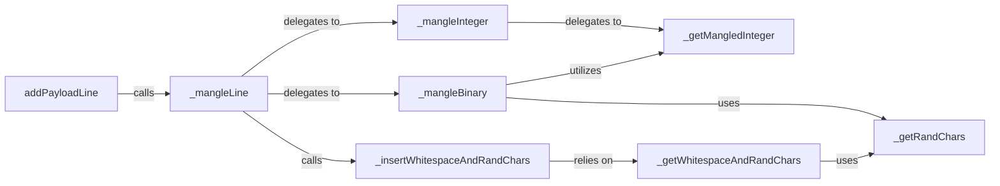

## Details

The `Code Mangling Engine` subsystem is primarily defined by the `mangler.py` file located at `/mnt/e/StartUp/Bashfuscator/bashfuscator/core/engine/mangler.py`. Its core responsibility is the low-level manipulation of obfuscated Bash code, including binary name mangling, random whitespace insertion, and integer transformation into arithmetic expressions, all aimed at increasing complexity and evading detection.

### addPayloadLine
The primary entry point for initiating the obfuscation process for a given line of Bash code and integrating the result into the final obfuscated payload. It acts as the initial interface for the mangling operations.

**Related Classes/Methods**:

- <a href="https://github.com/Bashfuscator/Bashfuscator/blob/master/bashfuscator/core/engine/mangler.py#L254-L269" target="_blank" rel="noopener noreferrer">`addPayloadLine`:254-269</a>

### _mangleLine
The central orchestrator responsible for applying various low-level obfuscation techniques to a single line of Bash code. It dispatches the line to specialized mangling functions based on the content.

**Related Classes/Methods**:

- <a href="https://github.com/Bashfuscator/Bashfuscator/blob/master/bashfuscator/core/engine/mangler.py#L271-L329" target="_blank" rel="noopener noreferrer">`_mangleLine`:271-329</a>

### _mangleInteger
Manages the transformation of integer literals found within the Bash script into obfuscated arithmetic expressions or other complex forms, making them harder to analyze.

**Related Classes/Methods**:

- <a href="https://github.com/Bashfuscator/Bashfuscator/blob/master/bashfuscator/core/engine/mangler.py#L623-L631" target="_blank" rel="noopener noreferrer">`_mangleInteger`:623-631</a>

### _mangleBinary
Handles the obfuscation of binary names (e.g., `ls`, `cat`) within the Bash script, often by replacing them with obfuscated equivalents or expressions to obscure their true purpose.

**Related Classes/Methods**:

- <a href="https://github.com/Bashfuscator/Bashfuscator/blob/master/bashfuscator/core/engine/mangler.py#L347-L480" target="_blank" rel="noopener noreferrer">`_mangleBinary`:347-480</a>

### _insertWhitespaceAndRandChars
Manages the injection of random whitespace and arbitrary characters into the Bash code. This increases the code's visual complexity and hinders automated parsing and analysis.

**Related Classes/Methods**:

- <a href="https://github.com/Bashfuscator/Bashfuscator/blob/master/bashfuscator/core/engine/mangler.py#L516-L522" target="_blank" rel="noopener noreferrer">`_insertWhitespaceAndRandChars`:516-522</a>

### _getMangledInteger
Implements the detailed logic for various integer obfuscation methods, including base conversions and recursive expansion, providing the actual obfuscated integer strings.

**Related Classes/Methods**:

- <a href="https://github.com/Bashfuscator/Bashfuscator/blob/master/bashfuscator/core/engine/mangler.py#L633-L651" target="_blank" rel="noopener noreferrer">`_getMangledInteger`:633-651</a>

### _getWhitespaceAndRandChars
Generates the actual random whitespace and character strings that are injected into the Bash code for obfuscation purposes, ensuring variety and unpredictability.

**Related Classes/Methods**:

- <a href="https://github.com/Bashfuscator/Bashfuscator/blob/master/bashfuscator/core/engine/mangler.py#L524-L541" target="_blank" rel="noopener noreferrer">`_getWhitespaceAndRandChars`:524-541</a>

### _getRandChars
A utility component responsible for providing random character strings of specified lengths, used across various obfuscation techniques to introduce randomness and unpredictability into the output.

**Related Classes/Methods**:

- <a href="https://github.com/Bashfuscator/Bashfuscator/blob/master/bashfuscator/core/engine/mangler.py#L559-L608" target="_blank" rel="noopener noreferrer">`_getRandChars`:559-608</a>

### [FAQ](https://github.com/CodeBoarding/GeneratedOnBoardings/tree/main?tab=readme-ov-file#faq)