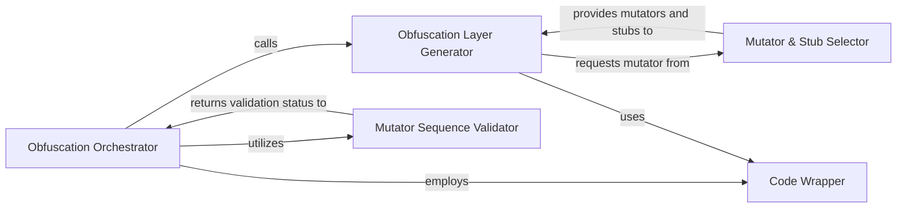

## Details

Analysis of the Obfuscation Orchestrator subsystem, focusing on its central components and their interactions within the obfuscation pipeline.

### Obfuscation Orchestrator [[Expand]](./Obfuscation_Orchestrator.md)
The central engine of `bashfuscator`. It manages the entire obfuscation pipeline, initiating the process, coordinating the creation of multiple obfuscation layers, validating the chosen mutator sequence, and finalizing the output by applying necessary wrapping. This component embodies the "central engine" aspect.

**Related Classes/Methods**:

- <a href="https://github.com/Bashfuscator/Bashfuscator/blob/master/bashfuscator/core/engine/obfuscation_handler.py" target="_blank" rel="noopener noreferrer">`bashfuscator.core.engine.obfuscation_handler.py:generatePayload`</a>

### Obfuscation Layer Generator
Responsible for constructing a single layer of obfuscation within the pipeline. It selects a specific mutator for its layer and ensures proper evaluation wrapping is applied, contributing to the multi-layered obfuscation effect.

**Related Classes/Methods**:

- <a href="https://github.com/Bashfuscator/Bashfuscator/blob/master/bashfuscator/core/engine/obfuscation_handler.py" target="_blank" rel="noopener noreferrer">`bashfuscator.core.engine.obfuscation_handler.py:genObfuscationLayer`</a>

### Mutator & Stub Selector
Manages the intelligent selection of mutators and their associated stubs based on predefined preferences and available options. It serves as the primary interface for requesting a mutator and contains the consolidated logic for choosing the most suitable ones from the available modules.

**Related Classes/Methods**:

- <a href="https://github.com/Bashfuscator/Bashfuscator/blob/master/bashfuscator/core/engine/obfuscation_handler.py" target="_blank" rel="noopener noreferrer">`bashfuscator.core.engine.obfuscation_handler.py:getMutator`</a>
- <a href="https://github.com/Bashfuscator/Bashfuscator/blob/master/bashfuscator/core/engine/obfuscation_handler.py" target="_blank" rel="noopener noreferrer">`bashfuscator.core.engine.obfuscation_handler.py:choosePrefMutator`</a>
- <a href="https://github.com/Bashfuscator/Bashfuscator/blob/master/bashfuscator/core/engine/obfuscation_handler.py" target="_blank" rel="noopener noreferrer">`bashfuscator.core.engine.obfuscation_handler.py:getPrefMutators`</a>
- <a href="https://github.com/Bashfuscator/Bashfuscator/blob/master/bashfuscator/core/engine/obfuscation_handler.py" target="_blank" rel="noopener noreferrer">`bashfuscator.core.engine.obfuscation_handler.py:getPrefStubs`</a>
- <a href="https://github.com/Bashfuscator/Bashfuscator/blob/master/bashfuscator/core/engine/obfuscation_handler.py" target="_blank" rel="noopener noreferrer">`bashfuscator.core.engine.obfuscation_handler.py:choosePrefStub`</a>

### Code Wrapper
Handles the wrapping of obfuscated code, typically to ensure its correct execution, integration, or to add protective layers (e.g., `eval` or `base64` encoding). This is crucial for the final usability of the obfuscated output.

**Related Classes/Methods**:

- <a href="https://github.com/Bashfuscator/Bashfuscator/blob/master/bashfuscator/core/engine/obfuscation_handler.py" target="_blank" rel="noopener noreferrer">`bashfuscator.core.engine.obfuscation_handler.py:evalWrap`</a>

### Mutator Sequence Validator
Validates the sequence or list of selected mutators to ensure they adhere to specific rules, constraints, or compatibility requirements before application, preventing invalid or conflicting obfuscation chains.

**Related Classes/Methods**:

- <a href="https://github.com/Bashfuscator/Bashfuscator/blob/master/bashfuscator/core/engine/obfuscation_handler.py" target="_blank" rel="noopener noreferrer">`bashfuscator.core.engine.obfuscation_handler.py:checkMutatorList`</a>

### [FAQ](https://github.com/CodeBoarding/GeneratedOnBoardings/tree/main?tab=readme-ov-file#faq)