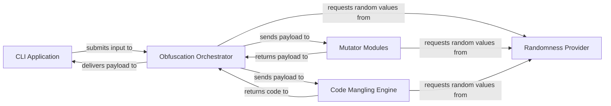

## Details

The Bashfuscator architecture is a clear example of a plugin-based security framework, designed for modularity and extensibility. At its core, the Obfuscation Orchestrator acts as the central processing unit, managing the flow of a Bash script through a series of transformation stages. It dynamically integrates various Mutator Modules for high-level obfuscation techniques and leverages the Code Mangling Engine for granular, low-level code manipulation. The entire process is driven by user input from the CLI Application, which also serves as the output interface. A dedicated Randomness Provider ensures that each obfuscation run produces unique and unpredictable results, enhancing evasion capabilities. This design allows for easy integration of new obfuscation techniques and provides a robust pipeline for transforming Bash scripts into highly evasive forms.

### CLI Application [[Expand]](./CLI_Application.md)
The primary user interface for `bashfuscator`. It handles command-line argument parsing, input acquisition (from command, file, or stdin), and presentation of the final obfuscated output. It also manages user feedback and error messages.

**Related Classes/Methods**:

- <a href="https://github.com/Bashfuscator/Bashfuscator/blob/master/bashfuscator/bin/bashfuscator" target="_blank" rel="noopener noreferrer">`bashfuscator/bin/bashfuscator`</a>
- <a href="https://github.com/Bashfuscator/Bashfuscator/blob/master/bashfuscator/common/colors.py" target="_blank" rel="noopener noreferrer">`bashfuscator/common/colors.py`</a>
- <a href="https://github.com/Bashfuscator/Bashfuscator/blob/master/bashfuscator/common/messages.py" target="_blank" rel="noopener noreferrer">`bashfuscator/common/messages.py`</a>

### Obfuscation Orchestrator [[Expand]](./Obfuscation_Orchestrator.md)
The central engine of `bashfuscator`. It manages the entire obfuscation pipeline, selecting and applying multiple layers of mutators and coordinating with the Code Mangling Engine.

**Related Classes/Methods**:

- <a href="https://github.com/Bashfuscator/Bashfuscator/blob/master/bashfuscator/core/engine/obfuscation_handler.py" target="_blank" rel="noopener noreferrer">`bashfuscator/core/engine/obfuscation_handler.py`</a>

### Mutator Modules
A collection of concrete implementations of various obfuscation techniques. These modules "plug into" the Mutator Framework and are applied by the Obfuscation Orchestrator to transform the input Bash script.

**Related Classes/Methods**:

- <a href="https://github.com/Bashfuscator/Bashfuscator/blob/master/bashfuscator/modules/encoders/xor_non_null.py" target="_blank" rel="noopener noreferrer">`bashfuscator/modules/encoders/xor_non_null.py`</a>
- <a href="https://github.com/Bashfuscator/Bashfuscator/blob/master/bashfuscator/modules/token_obfuscators/special_char_only.py" target="_blank" rel="noopener noreferrer">`bashfuscator/modules/token_obfuscators/special_char_only.py`</a>

### Code Mangling Engine [[Expand]](./Code_Mangling_Engine.md)
Responsible for low-level manipulation of the obfuscated code, such as mangling binary names, inserting random whitespace, and transforming integers into arithmetic expressions. This adds further complexity and evades detection.

**Related Classes/Methods**:

- <a href="https://github.com/Bashfuscator/Bashfuscator/blob/master/bashfuscator/core/engine/mangler.py" target="_blank" rel="noopener noreferrer">`bashfuscator/core/engine/mangler.py`</a>

### Randomness Provider
A utility component that provides various random generation functions to ensure variability and unpredictability throughout the obfuscation and mangling processes.

**Related Classes/Methods**:

- <a href="https://github.com/Bashfuscator/Bashfuscator/blob/master/bashfuscator/core/engine/random.py" target="_blank" rel="noopener noreferrer">`bashfuscator/core/engine/random.py`</a>

### [FAQ](https://github.com/CodeBoarding/GeneratedOnBoardings/tree/main?tab=readme-ov-file#faq)