```mermaid
graph LR
    Model_Architectures_Baselines_["Model Architectures (Baselines)"]
    baselines_ModelName_["baselines.<ModelName>"]
    baselines_ModelName_arch["baselines.<ModelName>.arch"]
    baselines_ModelName_arch_ModelName__Arch["baselines.<ModelName>.arch.<ModelName>_Arch"]
    Internal_Sub_components["Internal Sub-components"]
    Model_Architectures_Baselines_ -- "contains" --> baselines_ModelName_
    baselines_ModelName_ -- "contains" --> baselines_ModelName_arch
    baselines_ModelName_arch -- "houses" --> baselines_ModelName_arch_ModelName__Arch
    baselines_ModelName_arch_ModelName__Arch -- "composes and processes data using" --> Internal_Sub_components
    click Model_Architectures_Baselines_ href "https://github.com/CodeBoarding/GeneratedOnBoardings/blob/main/BasicTS/Model_Architectures_Baselines_.md" "Details"
```

## Details

The baselines subsystem is structured as a collection of independent time series forecasting model implementations. Each model is encapsulated within its own top-level package, providing a modular and extensible design. The core of each model's implementation resides in a dedicated arch module, which defines the PyTorch computational graph and layers. The main model class, typically named <ModelName>_Arch, serves as the runnable instance, composed of various internal sub-components that provide reusable building blocks for complex architectures. This clear separation of concerns facilitates the development, testing, and integration of diverse forecasting models.

### Model Architectures (Baselines) [[Expand]](./Model_Architectures_Baselines_.md)
The top-level conceptual component representing the entire repository of time series forecasting model implementations. It serves as the primary entry point for accessing and managing different baseline models within the toolkit.

**Related Classes/Methods**:

- <a href="https://github.com/GestaltCogTeam/BasicTS/blob/master/baselines/" target="_blank" rel="noopener noreferrer">`baselines`</a>

### baselines.<ModelName>
A specific top-level package dedicated to a single time series forecasting model implementation. Each such package encapsulates all components, configurations, and specific logic related to that particular model.

**Related Classes/Methods**:

- <a href="https://github.com/GestaltCogTeam/BasicTS/blob/master/baselines/AGCRN/" target="_blank" rel="noopener noreferrer">`baselines.AGCRN`</a>

### baselines.<ModelName>.arch
A dedicated module within each specific model package responsible for housing the core PyTorch model implementation. This module defines the computational graph and layers of the model.

**Related Classes/Methods**:

- <a href="https://github.com/GestaltCogTeam/BasicTS/blob/master/baselines/AGCRN/arch/" target="_blank" rel="noopener noreferrer">`baselines.AGCRN.arch`</a>

### baselines.<ModelName>.arch.<ModelName>_Arch
The main PyTorch `nn.Module` class that implements the core logic and structure of a specific time series forecasting model. This is the actual runnable model instance.

**Related Classes/Methods**:

- <a href="https://github.com/GestaltCogTeam/BasicTS/blob/master/baselines/AGCRN/arch/agcrn_arch.py" target="_blank" rel="noopener noreferrer">`baselines.AGCRN.arch.agcrn_arch.AGCRN_Arch`</a>

### Internal Sub-components
Various internal sub-modules, layers, or helper classes that constitute the specific model's architecture. These are typically defined within the `arch` module or as separate helper classes, providing reusable building blocks for complex models.

**Related Classes/Methods**:

- <a href="https://github.com/GestaltCogTeam/BasicTS/blob/master/baselines/AGCRN/arch/agcn.py" target="_blank" rel="noopener noreferrer">`baselines.AGCRN.arch.agcn`</a>
- <a href="https://github.com/GestaltCogTeam/BasicTS/blob/master/baselines/AGCRN/arch/agcrn_cell.py" target="_blank" rel="noopener noreferrer">`baselines.AGCRN.arch.agcrn_cell`</a>

### [FAQ](https://github.com/CodeBoarding/GeneratedOnBoardings/tree/main?tab=readme-ov-file#faq)