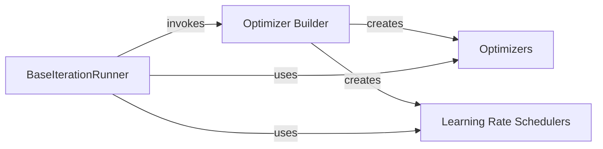

## Details

The core of this subsystem revolves around the `BaseIterationRunner`, which orchestrates the entire training, validation, and testing lifecycle for iteration-based models. It leverages the `Optimizer Builder` to dynamically configure and instantiate `Optimizers` and `Learning Rate Schedulers`, which are then directly utilized by the `BaseIterationRunner` during the iterative training process to update model parameters and adjust learning rates. This design promotes a flexible and extensible approach to defining and managing optimization strategies within the training pipeline.

### BaseIterationRunner
This component serves as the central orchestrator for the iteration-based training, validation, and testing processes. It manages the overall training loop, initializes the model, data loaders, and crucially, invokes the `Optimizer Builder` to set up the optimization strategy. It then directly applies the configured optimizers and learning rate schedulers during each training iteration.

**Related Classes/Methods**:

- <a href="https://github.com/GestaltCogTeam/BasicTS/blob/master/basicts/runners/base_iteration_runner.py#L33-L970" target="_blank" rel="noopener noreferrer">`basicts.runners.base_iteration_runner.BaseIterationRunner`:33-970</a>

### Optimizer Builder
This component acts as a factory, dynamically instantiating and configuring optimizer and learning rate scheduler objects based on runtime configurations. It abstracts the creation logic, promoting a flexible and extensible approach to defining optimization strategies. Its fundamental importance lies in enabling a configuration-driven architecture for training.

**Related Classes/Methods**:

- <a href="https://github.com/GestaltCogTeam/BasicTS/blob/master/basicts/runners/optim/builder.py" target="_blank" rel="noopener noreferrer">`basicts.runners.optim.builder`</a>

### Optimizers
This component encapsulates the implementations of various optimization algorithms (e.g., Adam, SGD) responsible for updating model parameters to minimize the loss function during training. It is crucial for the core training loop of any machine learning model.

**Related Classes/Methods**:

- <a href="https://github.com/GestaltCogTeam/BasicTS/blob/master/basicts/runners/optim/optimizers.py" target="_blank" rel="noopener noreferrer">`basicts.runners.optim.optimizers`</a>

### Learning Rate Schedulers
This component provides diverse strategies for dynamically adjusting the learning rate during the training process, including advanced methods like cosine schedules with warm-up or hard restarts. It is vital for fine-tuning model convergence and performance, a common requirement in ML research and benchmarking.

**Related Classes/Methods**:

- <a href="https://github.com/GestaltCogTeam/BasicTS/blob/master/basicts/runners/optim/lr_schedulers.py" target="_blank" rel="noopener noreferrer">`basicts.runners.optim.lr_schedulers`</a>

### [FAQ](https://github.com/CodeBoarding/GeneratedOnBoardings/tree/main?tab=readme-ov-file#faq)