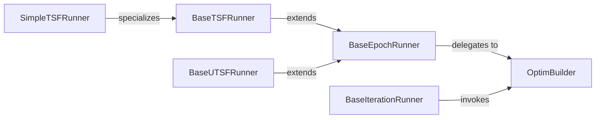

## Details

The Training & Evaluation Core subsystem in BasicTS is responsible for orchestrating the entire training, validation, and testing lifecycle of machine learning models, particularly focusing on time series analysis. It provides a flexible and extensible framework for defining various training paradigms (epoch-based, iteration-based) and specialized runners for different time series tasks.

### BaseEpochRunner
Establishes the fundamental structure for epoch-based training, validation, and testing pipelines. It defines the overall training flow, including train_epoch, val_epoch, and test_epoch methods, and manages lifecycle hooks for epoch-level operations.

**Related Classes/Methods**:

- <a href="https://github.com/GestaltCogTeam/BasicTS/blob/master/basicts/runners/base_epoch_runner.py#L29-L1022" target="_blank" rel="noopener noreferrer">`basicts.runners.base_epoch_runner.BaseEpochRunner`:29-1022</a>
- <a href="https://github.com/GestaltCogTeam/BasicTS/blob/master/basicts/runners/base_epoch_runner.py" target="_blank" rel="noopener noreferrer">`basicts.runners.base_epoch_runner.BaseEpochRunner:train_epoch`</a>
- <a href="https://github.com/GestaltCogTeam/BasicTS/blob/master/basicts/runners/base_epoch_runner.py" target="_blank" rel="noopener noreferrer">`basicts.runners.base_epoch_runner.BaseEpochRunner:val_epoch`</a>
- <a href="https://github.com/GestaltCogTeam/BasicTS/blob/master/basicts/runners/base_epoch_runner.py" target="_blank" rel="noopener noreferrer">`basicts.runners.base_epoch_runner.BaseEpochRunner:test_epoch`</a>

### BaseIterationRunner
Provides the base for iteration-based training, validation, and testing. It manages resources and lifecycle at the individual iteration level, offering finer-grained control than BaseEpochRunner, suitable for scenarios where epoch boundaries are less relevant or for very large datasets.

**Related Classes/Methods**:

- <a href="https://github.com/GestaltCogTeam/BasicTS/blob/master/basicts/runners/base_iteration_runner.py#L33-L970" target="_blank" rel="noopener noreferrer">`basicts.runners.base_iteration_runner.BaseIterationRunner`:33-970</a>

### BaseTSFRunner
Specializes BaseEpochRunner for Time Series Forecasting (TSF) tasks. It incorporates TSF-specific functionalities such as data scaling, graph setup, and tailored training/inference steps, adapting the general epoch-based flow for time series data.

**Related Classes/Methods**:

- <a href="https://github.com/GestaltCogTeam/BasicTS/blob/master/basicts/runners/base_tsf_runner.py" target="_blank" rel="noopener noreferrer">`basicts.runners.base_tsf_runner.BaseTSFRunner`</a>

### BaseUTSFRunner
Serves as a base for Unsupervised Time Series Forecasting (UTSF) runners. Its focus is on data preprocessing, postprocessing, and potentially feature selection relevant to unsupervised learning, extending the BaseEpochRunner for unsupervised paradigms.

**Related Classes/Methods**:

- <a href="https://github.com/GestaltCogTeam/BasicTS/blob/master/basicts/runners/base_utsf_runner.py" target="_blank" rel="noopener noreferrer">`basicts.runners.base_utsf_runner.BaseUTSFRunner`</a>

### SimpleTSFRunner
A concrete implementation of a TSF runner, inheriting from BaseTSFRunner. It defines the specific forward pass logic for a simple TSF model, showcasing how specific models integrate into the general TSF pipeline and providing a runnable example.

**Related Classes/Methods**:

- <a href="https://github.com/GestaltCogTeam/BasicTS/blob/master/basicts/runners/runner_zoo/simple_tsf_runner.py" target="_blank" rel="noopener noreferrer">`basicts.runners.runner_zoo.simple_tsf_runner.SimpleTSFRunner`</a>
- <a href="https://github.com/GestaltCogTeam/BasicTS/blob/master/basicts/runners/runner_zoo/simple_tsf_runner.py" target="_blank" rel="noopener noreferrer">`basicts.runners.runner_zoo.simple_tsf_runner.SimpleTSFRunner:forward`</a>

### OptimBuilder
A utility module responsible for constructing PyTorch optimizers and learning rate schedulers based on configuration. It centralizes the logic for creating and configuring optimization strategies, decoupling it from the runner's core training loop.

**Related Classes/Methods**:

- <a href="https://github.com/GestaltCogTeam/BasicTS/blob/master/basicts/runners/optim/builder.py" target="_blank" rel="noopener noreferrer">`basicts.runners.optim.builder.OptimBuilder`</a>

### [FAQ](https://github.com/CodeBoarding/GeneratedOnBoardings/tree/main?tab=readme-ov-file#faq)