```mermaid
graph LR
    System_Orchestration_Launchers["System Orchestration & Launchers"]
    Configuration_Management["Configuration Management"]
    Data_Management_Preprocessing["Data Management & Preprocessing"]
    Model_Architectures_Baselines_["Model Architectures (Baselines)"]
    Training_Evaluation_Core["Training & Evaluation Core"]
    Optimization_Utilities["Optimization & Utilities"]
    Metrics_Evaluation_Reporting["Metrics & Evaluation Reporting"]
    System_Orchestration_Launchers -- "initiates" --> Configuration_Management
    System_Orchestration_Launchers -- "configures" --> Data_Management_Preprocessing
    System_Orchestration_Launchers -- "configures" --> Model_Architectures_Baselines_
    System_Orchestration_Launchers -- "triggers" --> Training_Evaluation_Core
    Configuration_Management -- "provides configurations to" --> Data_Management_Preprocessing
    Configuration_Management -- "provides configurations to" --> Model_Architectures_Baselines_
    Configuration_Management -- "provides configurations to" --> Training_Evaluation_Core
    Data_Management_Preprocessing -- "provides processed data to" --> Training_Evaluation_Core
    Training_Evaluation_Core -- "executes" --> Model_Architectures_Baselines_
    Training_Evaluation_Core -- "utilizes" --> Optimization_Utilities
    Training_Evaluation_Core -- "sends results to" --> Metrics_Evaluation_Reporting
    Metrics_Evaluation_Reporting -- "provides feedback to" --> System_Orchestration_Launchers
    click Model_Architectures_Baselines_ href "https://github.com/CodeBoarding/GeneratedOnBoardings/blob/main/BasicTS/Model_Architectures_Baselines_.md" "Details"
    click Training_Evaluation_Core href "https://github.com/CodeBoarding/GeneratedOnBoardings/blob/main/BasicTS/Training_Evaluation_Core.md" "Details"
    click Optimization_Utilities href "https://github.com/CodeBoarding/GeneratedOnBoardings/blob/main/BasicTS/Optimization_Utilities.md" "Details"
```

## Details

The BasicTS project is structured around a configuration-driven architecture, orchestrated by the `System Orchestration & Launchers` component. This central component initiates and configures various workflows, leveraging the `Configuration Management` component for all system settings. Data flows from `Data Management & Preprocessing`, which prepares datasets for the `Training & Evaluation Core`. The `Training & Evaluation Core` then interacts with `Model Architectures (Baselines)` to execute training and evaluation, utilizing `Optimization & Utilities` for model optimization. Finally, `Metrics & Evaluation Reporting` processes the results, providing crucial feedback to the `System Orchestration & Launchers` for iterative refinement and overall system control. This modular design ensures clear separation of concerns, facilitating maintainability and extensibility.

### System Orchestration & Launchers
The primary entry points and control mechanisms for initiating various project workflows (training, evaluation, inference). It acts as the orchestrator for the entire system.

**Related Classes/Methods**:

- <a href="https://github.com/GestaltCogTeam/BasicTS/blob/master/experiments/train.py" target="_blank" rel="noopener noreferrer">`experiments/train.py`</a>
- <a href="https://github.com/GestaltCogTeam/BasicTS/blob/master/basicts/launcher.py" target="_blank" rel="noopener noreferrer">`basicts/launcher/launcher.py`</a>
- <a href="https://github.com/GestaltCogTeam/BasicTS/blob/master/server/engine/engine.py" target="_blank" rel="noopener noreferrer">`server/engine/engine.py`</a>

### Configuration Management
Centralized handling of all project configurations, enabling flexible and reproducible experiments. This component is crucial for the "Configuration-Driven Architecture" bias.

**Related Classes/Methods**:

- <a href="https://github.com/GestaltCogTeam/BasicTS/blob/master/basicts/utils/config.py" target="_blank" rel="noopener noreferrer">`basicts/utils/config.py`</a>

### Data Management & Preprocessing
Manages the entire data lifecycle, from raw input to processed datasets ready for model consumption. This includes data loading, transformation, feature engineering, and serialization.

**Related Classes/Methods**:

- <a href="https://github.com/GestaltCogTeam/BasicTS/blob/master/basicts/data/simple_tsf_dataset.py" target="_blank" rel="noopener noreferrer">`basicts/data/simple_tsf_dataset.py`</a>
- <a href="https://github.com/GestaltCogTeam/BasicTS/blob/master/basicts/data/simple_inference_dataset.py" target="_blank" rel="noopener noreferrer">`basicts/data/simple_inference_dataset.py`</a>
- <a href="https://github.com/GestaltCogTeam/BasicTS/blob/master/basicts/utils/serialization.py" target="_blank" rel="noopener noreferrer">`basicts/utils/serialization.py`</a>

### Model Architectures (Baselines) [[Expand]](./Model_Architectures_Baselines_.md)
A comprehensive collection of diverse time series forecasting model implementations, each with its unique architecture. This component represents the core intellectual property of the toolkit.

**Related Classes/Methods**:

- <a href="https://github.com/GestaltCogTeam/BasicTS/blob/master/baselines/Autoformer/arch/autoformer_arch.py" target="_blank" rel="noopener noreferrer">`baselines/Autoformer/arch/autoformer_arch.py`</a>

### Training & Evaluation Core [[Expand]](./Training_Evaluation_Core.md)
Encapsulates the fundamental logic for executing training, validation, and testing pipelines. This includes epoch/iteration-based loops, model building, and integration with optimization strategies.

**Related Classes/Methods**:

- <a href="https://github.com/GestaltCogTeam/BasicTS/blob/master/basicts/runners/base_epoch_runner.py" target="_blank" rel="noopener noreferrer">`basicts/runners/base_epoch_runner.py`</a>
- <a href="https://github.com/GestaltCogTeam/BasicTS/blob/master/basicts/runners/base_iteration_runner.py" target="_blank" rel="noopener noreferrer">`basicts/runners/base_iteration_runner.py`</a>
- <a href="https://github.com/GestaltCogTeam/BasicTS/blob/master/basicts/runners/base_tsf_runner.py" target="_blank" rel="noopener noreferrer">`basicts/runners/base_tsf_runner.py`</a>
- <a href="https://github.com/GestaltCogTeam/BasicTS/blob/master/basicts/runners/base_utsf_runner.py" target="_blank" rel="noopener noreferrer">`basicts/runners/base_utsf_runner.py`</a>
- <a href="https://github.com/GestaltCogTeam/BasicTS/blob/master/basicts/runners/runner_zoo/simple_tsf_runner.py" target="_blank" rel="noopener noreferrer">`basicts/runners/runner_zoo/simple_tsf_runner.py`</a>

### Optimization & Utilities [[Expand]](./Optimization_Utilities.md)
Provides common functionalities for model optimization (optimizers, learning rate schedulers) and general utilities that support the training and evaluation processes.

**Related Classes/Methods**:

- <a href="https://github.com/GestaltCogTeam/BasicTS/blob/master/basicts/runners/optim/builder.py" target="_blank" rel="noopener noreferrer">`basicts/runners/optim/builder.py`</a>
- <a href="https://github.com/GestaltCogTeam/BasicTS/blob/master/basicts/runners/optim/lr_schedulers.py" target="_blank" rel="noopener noreferrer">`basicts/runners/optim/lr_schedulers.py`</a>
- <a href="https://github.com/GestaltCogTeam/BasicTS/blob/master/basicts/runners/optim/optimizers.py" target="_blank" rel="noopener noreferrer">`basicts/runners/optim/optimizers.py`</a>
- <a href="https://github.com/GestaltCogTeam/BasicTS/blob/master/basicts/utils/adjacent_matrix_norm.py" target="_blank" rel="noopener noreferrer">`basicts/utils/adjacent_matrix_norm.py`</a>

### Metrics & Evaluation Reporting
Defines and calculates various performance metrics for time series forecasting models and generates comprehensive evaluation reports.

**Related Classes/Methods**:

- <a href="https://github.com/GestaltCogTeam/BasicTS/blob/master/basicts/metrics/mae.py" target="_blank" rel="noopener noreferrer">`basicts/metrics/mae.py`</a>

### [FAQ](https://github.com/CodeBoarding/GeneratedOnBoardings/tree/main?tab=readme-ov-file#faq)