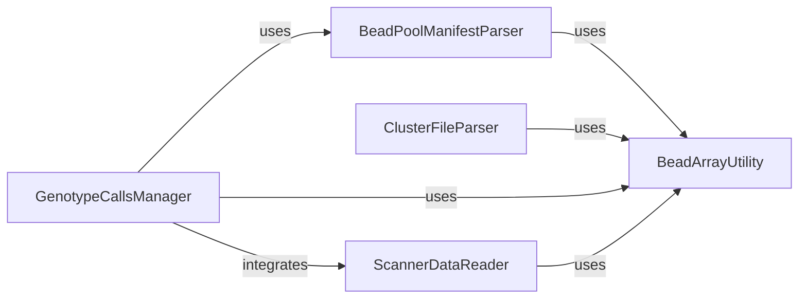

## Component Details

This component overview describes the core components within the `BeadArrayFiles` subsystem, focusing on their responsibilities in parsing various binary file formats related to bead array data. The main flow involves different parsers utilizing a low-level utility component for basic data reading, with the `GenotypeCallsManager` acting as a central orchestrator integrating data from other parsers.

### BeadArrayUtility
This component provides fundamental utility functions for reading various primitive data types (like bytes, integers, strings, and floats) from file handles and performing basic operations like DNA complement. It acts as a low-level data parsing layer, supporting other components in the BeadArrayFiles subsystem by abstracting the complexities of binary file reading.

**Related Classes/Methods**:

- <a href="https://github.com/Illumina/BeadArrayFiles/blob/master/module/BeadArrayUtility.py#L82-L109" target="_blank" rel="noopener noreferrer">`BeadArrayFiles.module.BeadArrayUtility.read_string` (82:109)</a>
- <a href="https://github.com/Illumina/BeadArrayFiles/blob/master/module/BeadArrayUtility.py#L70-L80" target="_blank" rel="noopener noreferrer">`BeadArrayFiles.module.BeadArrayUtility.read_byte` (70:80)</a>
- <a href="https://github.com/Illumina/BeadArrayFiles/blob/master/module/BeadArrayUtility.py#L46-L56" target="_blank" rel="noopener noreferrer">`BeadArrayFiles.module.BeadArrayUtility.read_int` (46:56)</a>
- <a href="https://github.com/Illumina/BeadArrayFiles/blob/master/module/BeadArrayUtility.py#L58-L68" target="_blank" rel="noopener noreferrer">`BeadArrayFiles.module.BeadArrayUtility.read_float` (58:68)</a>
- <a href="https://github.com/Illumina/BeadArrayFiles/blob/master/module/BeadArrayUtility.py#L5-L20" target="_blank" rel="noopener noreferrer">`BeadArrayFiles.module.BeadArrayUtility.complement` (5:20)</a>
- <a href="https://github.com/Illumina/BeadArrayFiles/blob/master/module/BeadArrayUtility.py#L34-L44" target="_blank" rel="noopener noreferrer">`BeadArrayFiles.module.BeadArrayUtility.read_ushort` (34:44)</a>

### BeadPoolManifestParser
This component is responsible for parsing Bead Pool Manifest (BPM) files, which contain crucial information about genetic loci, assay types, and normalization parameters. It orchestrates the reading of the manifest header and individual locus entries, ensuring data integrity and version compatibility.

**Related Classes/Methods**:

- <a href="https://github.com/Illumina/BeadArrayFiles/blob/master/module/BeadPoolManifest.py#L46-L129" target="_blank" rel="noopener noreferrer">`BeadArrayFiles.module.BeadPoolManifest.BeadPoolManifest.__parse_file` (46:129)</a>
- <a href="https://github.com/Illumina/BeadArrayFiles/blob/master/module/BeadPoolManifest.py#L236-L368" target="_blank" rel="noopener noreferrer">`BeadArrayFiles.module.BeadPoolManifest.LocusEntry` (236:368)</a>
- <a href="https://github.com/Illumina/BeadArrayFiles/blob/master/module/BeadPoolManifest.py#L276-L295" target="_blank" rel="noopener noreferrer">`BeadArrayFiles.module.BeadPoolManifest.LocusEntry.__parse_file` (276:295)</a>
- <a href="https://github.com/Illumina/BeadArrayFiles/blob/master/module/BeadPoolManifest.py#L297-L342" target="_blank" rel="noopener noreferrer">`BeadArrayFiles.module.BeadPoolManifest.LocusEntry.__parse_locus_version_6` (297:342)</a>
- <a href="https://github.com/Illumina/BeadArrayFiles/blob/master/module/BeadPoolManifest.py#L344-L355" target="_blank" rel="noopener noreferrer">`BeadArrayFiles.module.BeadPoolManifest.LocusEntry.__parse_locus_version_7` (344:355)</a>
- <a href="https://github.com/Illumina/BeadArrayFiles/blob/master/module/BeadPoolManifest.py#L357-L368" target="_blank" rel="noopener noreferrer">`BeadArrayFiles.module.BeadPoolManifest.LocusEntry.__parse_locus_version_8` (357:368)</a>
- <a href="https://github.com/Illumina/BeadArrayFiles/blob/master/module/BeadPoolManifest.py#L161-L182" target="_blank" rel="noopener noreferrer">`BeadArrayFiles.module.BeadPoolManifest.SourceStrand.from_string` (161:182)</a>
- <a href="https://github.com/Illumina/BeadArrayFiles/blob/master/module/BeadPoolManifest.py#L214-L234" target="_blank" rel="noopener noreferrer">`BeadArrayFiles.module.BeadPoolManifest.RefStrand.from_string` (214:234)</a>

### ClusterFileParser
This component handles the parsing of EGT cluster files, which store clustering information for genotype calls. It reads various sections of the cluster file, including version information, manifest details, and arrays of cluster records and scores, ensuring proper reconstruction of the cluster data.

**Related Classes/Methods**:

- <a href="https://github.com/Illumina/BeadArrayFiles/blob/master/module/ClusterFile.py#L82-L146" target="_blank" rel="noopener noreferrer">`BeadArrayFiles.module.ClusterFile.ClusterFile.read_cluster_file` (82:146)</a>
- <a href="https://github.com/Illumina/BeadArrayFiles/blob/master/module/ClusterFile.py#L64-L79" target="_blank" rel="noopener noreferrer">`BeadArrayFiles.module.ClusterFile.ClusterFile.read_array` (64:79)</a>
- <a href="https://github.com/Illumina/BeadArrayFiles/blob/master/module/ClusterFile.py#L184-L237" target="_blank" rel="noopener noreferrer">`BeadArrayFiles.module.ClusterFile.ClusterRecord.read_record` (184:237)</a>
- <a href="https://github.com/Illumina/BeadArrayFiles/blob/master/module/ClusterFile.py#L270-L284" target="_blank" rel="noopener noreferrer">`BeadArrayFiles.module.ClusterFile.ClusterScore.read_record` (270:284)</a>
- <a href="https://github.com/Illumina/BeadArrayFiles/blob/master/module/ClusterFile.py#L2-L146" target="_blank" rel="noopener noreferrer">`BeadArrayFiles.module.ClusterFile.ClusterFile` (2:146)</a>
- <a href="https://github.com/Illumina/BeadArrayFiles/blob/master/module/ClusterFile.py#L148-L237" target="_blank" rel="noopener noreferrer">`BeadArrayFiles.module.ClusterFile.ClusterRecord` (148:237)</a>
- <a href="https://github.com/Illumina/BeadArrayFiles/blob/master/module/ClusterFile.py#L287-L317" target="_blank" rel="noopener noreferrer">`BeadArrayFiles.module.ClusterFile.ClusterStats` (287:317)</a>
- <a href="https://github.com/Illumina/BeadArrayFiles/blob/master/module/ClusterFile.py#L240-L284" target="_blank" rel="noopener noreferrer">`BeadArrayFiles.module.ClusterFile.ClusterScore` (240:284)</a>

### GenotypeCallsManager
This component is responsible for reading and managing genotype call data from GTC files. It provides a comprehensive interface for accessing various data points such as genotypes, intensities (raw and normalized), scores, and control data, abstracting the underlying file structure.

**Related Classes/Methods**:

- <a href="https://github.com/Illumina/BeadArrayFiles/blob/master/module/GenotypeCalls.py#L103-L136" target="_blank" rel="noopener noreferrer">`BeadArrayFiles.module.GenotypeCalls.GenotypeCalls.__init__` (103:136)</a>
- <a href="https://github.com/Illumina/BeadArrayFiles/blob/master/module/GenotypeCalls.py#L155-L182" target="_blank" rel="noopener noreferrer">`BeadArrayFiles.module.GenotypeCalls.GenotypeCalls.__get_generic_array` (155:182)</a>
- <a href="https://github.com/Illumina/BeadArrayFiles/blob/master/module/GenotypeCalls.py#L184-L207" target="_blank" rel="noopener noreferrer">`BeadArrayFiles.module.GenotypeCalls.GenotypeCalls.__get_generic_array_numpy` (184:207)</a>
- <a href="https://github.com/Illumina/BeadArrayFiles/blob/master/module/GenotypeCalls.py#L299-L304" target="_blank" rel="noopener noreferrer">`BeadArrayFiles.module.GenotypeCalls.GenotypeCalls.get_genotypes` (299:304)</a>
- <a href="https://github.com/Illumina/BeadArrayFiles/blob/master/module/GenotypeCalls.py#L306-L346" target="_blank" rel="noopener noreferrer">`BeadArrayFiles.module.GenotypeCalls.GenotypeCalls.get_base_calls_generic` (306:346)</a>
- <a href="https://github.com/Illumina/BeadArrayFiles/blob/master/module/GenotypeCalls.py#L348-L361" target="_blank" rel="noopener noreferrer">`BeadArrayFiles.module.GenotypeCalls.GenotypeCalls.get_base_calls_plus_strand` (348:361)</a>
- <a href="https://github.com/Illumina/BeadArrayFiles/blob/master/module/GenotypeCalls.py#L363-L375" target="_blank" rel="noopener noreferrer">`BeadArrayFiles.module.GenotypeCalls.GenotypeCalls.get_base_calls_forward_strand` (363:375)</a>
- <a href="https://github.com/Illumina/BeadArrayFiles/blob/master/module/GenotypeCalls.py#L377-L408" target="_blank" rel="noopener noreferrer">`BeadArrayFiles.module.GenotypeCalls.GenotypeCalls.get_base_calls` (377:408)</a>
- <a href="https://github.com/Illumina/BeadArrayFiles/blob/master/module/GenotypeCalls.py#L410-L415" target="_blank" rel="noopener noreferrer">`BeadArrayFiles.module.GenotypeCalls.GenotypeCalls.get_genotype_scores` (410:415)</a>
- <a href="https://github.com/Illumina/BeadArrayFiles/blob/master/module/GenotypeCalls.py#L424-L429" target="_blank" rel="noopener noreferrer">`BeadArrayFiles.module.GenotypeCalls.GenotypeCalls.get_control_x_intensities` (424:429)</a>
- <a href="https://github.com/Illumina/BeadArrayFiles/blob/master/module/GenotypeCalls.py#L431-L436" target="_blank" rel="noopener noreferrer">`BeadArrayFiles.module.GenotypeCalls.GenotypeCalls.get_control_y_intensities` (431:436)</a>
- <a href="https://github.com/Illumina/BeadArrayFiles/blob/master/module/GenotypeCalls.py#L438-L443" target="_blank" rel="noopener noreferrer">`BeadArrayFiles.module.GenotypeCalls.GenotypeCalls.get_raw_x_intensities` (438:443)</a>
- <a href="https://github.com/Illumina/BeadArrayFiles/blob/master/module/GenotypeCalls.py#L445-L450" target="_blank" rel="noopener noreferrer">`BeadArrayFiles.module.GenotypeCalls.GenotypeCalls.get_raw_y_intensities` (445:450)</a>
- <a href="https://github.com/Illumina/BeadArrayFiles/blob/master/module/GenotypeCalls.py#L488-L495" target="_blank" rel="noopener noreferrer">`BeadArrayFiles.module.GenotypeCalls.GenotypeCalls.get_num_calls` (488:495)</a>
- <a href="https://github.com/Illumina/BeadArrayFiles/blob/master/module/GenotypeCalls.py#L497-L504" target="_blank" rel="noopener noreferrer">`BeadArrayFiles.module.GenotypeCalls.GenotypeCalls.get_num_no_calls` (497:504)</a>
- <a href="https://github.com/Illumina/BeadArrayFiles/blob/master/module/GenotypeCalls.py#L506-L513" target="_blank" rel="noopener noreferrer">`BeadArrayFiles.module.GenotypeCalls.GenotypeCalls.get_num_intensity_only` (506:513)</a>
- <a href="https://github.com/Illumina/BeadArrayFiles/blob/master/module/GenotypeCalls.py#L515-L523" target="_blank" rel="noopener noreferrer">`BeadArrayFiles.module.GenotypeCalls.GenotypeCalls.get_ballele_freqs` (515:523)</a>
- <a href="https://github.com/Illumina/BeadArrayFiles/blob/master/module/GenotypeCalls.py#L525-L533" target="_blank" rel="noopener noreferrer">`BeadArrayFiles.module.GenotypeCalls.GenotypeCalls.get_logr_ratios` (525:533)</a>
- <a href="https://github.com/Illumina/BeadArrayFiles/blob/master/module/GenotypeCalls.py#L535-L550" target="_blank" rel="noopener noreferrer">`BeadArrayFiles.module.GenotypeCalls.GenotypeCalls.get_percentiles_x` (535:550)</a>
- <a href="https://github.com/Illumina/BeadArrayFiles/blob/master/module/GenotypeCalls.py#L552-L567" target="_blank" rel="noopener noreferrer">`BeadArrayFiles.module.GenotypeCalls.GenotypeCalls.get_percentiles_y` (552:567)</a>
- <a href="https://github.com/Illumina/BeadArrayFiles/blob/master/module/GenotypeCalls.py#L569-L581" target="_blank" rel="noopener noreferrer">`BeadArrayFiles.module.GenotypeCalls.GenotypeCalls.get_normalized_intensities` (569:581)</a>
- <a href="https://github.com/Illumina/BeadArrayFiles/blob/master/module/GenotypeCalls.py#L583-L588" target="_blank" rel="noopener noreferrer">`BeadArrayFiles.module.GenotypeCalls.GenotypeCalls.get_normalization_transforms` (583:588)</a>
- <a href="https://github.com/Illumina/BeadArrayFiles/blob/master/module/GenotypeCalls.py#L590-L621" target="_blank" rel="noopener noreferrer">`BeadArrayFiles.module.GenotypeCalls.GenotypeCalls.is_write_complete` (590:621)</a>
- <a href="https://github.com/Illumina/BeadArrayFiles/blob/master/module/GenotypeCalls.py#L223-L228" target="_blank" rel="noopener noreferrer">`BeadArrayFiles.module.GenotypeCalls.GenotypeCalls.get_ploidy_type` (223:228)</a>
- <a href="https://github.com/Illumina/BeadArrayFiles/blob/master/module/GenotypeCalls.py#L237-L242" target="_blank" rel="noopener noreferrer">`BeadArrayFiles.module.GenotypeCalls.GenotypeCalls.get_slide_identifier` (237:242)</a>

### ScannerDataReader
This component is specifically designed to parse and encapsulate scanner-related metadata from file handles. It extracts details such as scanner name, PMT settings, and imaging user, which are typically embedded within genotype call files.

**Related Classes/Methods**:

- <a href="https://github.com/Illumina/BeadArrayFiles/blob/master/module/GenotypeCalls.py#L733-L748" target="_blank" rel="noopener noreferrer">`BeadArrayFiles.module.GenotypeCalls.ScannerData.read_scanner_data` (733:748)</a>
- <a href="https://github.com/Illumina/BeadArrayFiles/blob/master/module/GenotypeCalls.py#L700-L748" target="_blank" rel="noopener noreferrer">`BeadArrayFiles.module.GenotypeCalls.ScannerData` (700:748)</a>

### [FAQ](https://github.com/CodeBoarding/GeneratedOnBoardings/tree/main?tab=readme-ov-file#faq)