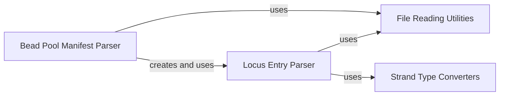

## Component Details

This subsystem is responsible for parsing Bead Pool Manifest (BPM) files, which contain genetic array data. It comprises several components: `File Reading Utilities` for low-level binary file operations, `Bead Pool Manifest Parser` for orchestrating the overall file parsing, `Locus Entry Parser` for handling individual genetic locus entries, and `Strand Type Converters` for standardizing genetic strand information. The main flow involves the `Bead Pool Manifest Parser` reading the file, utilizing `File Reading Utilities` for basic data extraction, and delegating the parsing of individual locus entries to the `Locus Entry Parser`. The `Locus Entry Parser` further relies on `File Reading Utilities` and `Strand Type Converters` to process detailed genetic information.

### File Reading Utilities
This component provides fundamental utility functions for reading various data types (bytes, integers, strings) from file handles. It serves as a low-level interface for binary file parsing within the BeadArrayFiles subsystem.

**Related Classes/Methods**:

- <a href="https://github.com/Illumina/BeadArrayFiles/blob/master/module/BeadArrayUtility.py#L82-L109" target="_blank" rel="noopener noreferrer">`module.BeadArrayUtility.read_string` (82:109)</a>
- <a href="https://github.com/Illumina/BeadArrayFiles/blob/master/module/BeadArrayUtility.py#L70-L80" target="_blank" rel="noopener noreferrer">`module.BeadArrayUtility.read_byte` (70:80)</a>
- <a href="https://github.com/Illumina/BeadArrayFiles/blob/master/module/BeadArrayUtility.py#L46-L56" target="_blank" rel="noopener noreferrer">`module.BeadArrayUtility.read_int` (46:56)</a>

### Bead Pool Manifest Parser
This component is responsible for parsing the overall structure of Bead Pool Manifest (BPM) files. It initializes the manifest object and orchestrates the reading of various sections, including manifest metadata and individual locus entries.

**Related Classes/Methods**:

- <a href="https://github.com/Illumina/BeadArrayFiles/blob/master/module/BeadPoolManifest.py#L21-L44" target="_blank" rel="noopener noreferrer">`module.BeadPoolManifest.BeadPoolManifest.__init__` (21:44)</a>
- <a href="https://github.com/Illumina/BeadArrayFiles/blob/master/module/BeadPoolManifest.py#L46-L129" target="_blank" rel="noopener noreferrer">`module.BeadPoolManifest.BeadPoolManifest.__parse_file` (46:129)</a>

### Locus Entry Parser
This component handles the parsing of individual locus entries within a Bead Pool Manifest file. It supports different versions of locus entry formats and extracts specific genetic information such as SNPs, chromosomes, and mapping details.

**Related Classes/Methods**:

- <a href="https://github.com/Illumina/BeadArrayFiles/blob/master/module/BeadPoolManifest.py#L254-L274" target="_blank" rel="noopener noreferrer">`module.BeadPoolManifest.LocusEntry.__init__` (254:274)</a>
- <a href="https://github.com/Illumina/BeadArrayFiles/blob/master/module/BeadPoolManifest.py#L276-L295" target="_blank" rel="noopener noreferrer">`module.BeadPoolManifest.LocusEntry.__parse_file` (276:295)</a>
- <a href="https://github.com/Illumina/BeadArrayFiles/blob/master/module/BeadPoolManifest.py#L297-L342" target="_blank" rel="noopener noreferrer">`module.BeadPoolManifest.LocusEntry.__parse_locus_version_6` (297:342)</a>
- <a href="https://github.com/Illumina/BeadArrayFiles/blob/master/module/BeadPoolManifest.py#L344-L355" target="_blank" rel="noopener noreferrer">`module.BeadPoolManifest.LocusEntry.__parse_locus_version_7` (344:355)</a>
- <a href="https://github.com/Illumina/BeadArrayFiles/blob/master/module/BeadPoolManifest.py#L357-L368" target="_blank" rel="noopener noreferrer">`module.BeadPoolManifest.LocusEntry.__parse_locus_version_8` (357:368)</a>

### Strand Type Converters
This component provides utility functions for converting string representations of genetic strand types (SourceStrand and RefStrand) into their corresponding internal enum-like representations, ensuring consistent data handling.

**Related Classes/Methods**:

- <a href="https://github.com/Illumina/BeadArrayFiles/blob/master/module/BeadPoolManifest.py#L161-L182" target="_blank" rel="noopener noreferrer">`module.BeadPoolManifest.SourceStrand.from_string` (161:182)</a>
- <a href="https://github.com/Illumina/BeadArrayFiles/blob/master/module/BeadPoolManifest.py#L214-L234" target="_blank" rel="noopener noreferrer">`module.BeadPoolManifest.RefStrand.from_string` (214:234)</a>

### [FAQ](https://github.com/CodeBoarding/GeneratedOnBoardings/tree/main?tab=readme-ov-file#faq)