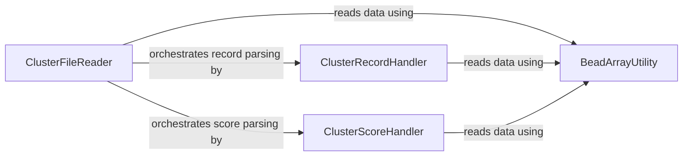

## Component Details

The ClusterFile Parser subsystem is responsible for reading and interpreting .cluster files, which contain genotype clustering information. It orchestrates the parsing of file metadata, individual cluster records, and cluster scores, leveraging a set of utility functions for low-level data extraction.

### ClusterFileReader
This component is responsible for reading and parsing the entire cluster file, including file version, metadata, and orchestrating the reading of individual cluster records and scores. It uses utility functions for basic data type reading and delegates to other components for record and score parsing.

**Related Classes/Methods**:

- <a href="https://github.com/Illumina/BeadArrayFiles/blob/master/module/ClusterFile.py#L82-L146" target="_blank" rel="noopener noreferrer">`BeadArrayFiles.module.ClusterFile.ClusterFile.read_cluster_file` (82:146)</a>
- <a href="https://github.com/Illumina/BeadArrayFiles/blob/master/module/ClusterFile.py#L2-L146" target="_blank" rel="noopener noreferrer">`BeadArrayFiles.module.ClusterFile.ClusterFile` (2:146)</a>
- <a href="https://github.com/Illumina/BeadArrayFiles/blob/master/module/ClusterFile.py#L64-L79" target="_blank" rel="noopener noreferrer">`BeadArrayFiles.module.ClusterFile.ClusterFile.read_array` (64:79)</a>
- <a href="https://github.com/Illumina/BeadArrayFiles/blob/master/module/ClusterFile.py#L38-L46" target="_blank" rel="noopener noreferrer">`BeadArrayFiles.module.ClusterFile.ClusterFile.add_record` (38:46)</a>

### ClusterRecordHandler
This component focuses on reading and interpreting individual cluster records within the cluster file. It extracts various statistical data related to clusters and constructs ClusterRecord and ClusterStats objects.

**Related Classes/Methods**:

- <a href="https://github.com/Illumina/BeadArrayFiles/blob/master/module/ClusterFile.py#L184-L237" target="_blank" rel="noopener noreferrer">`BeadArrayFiles.module.ClusterFile.ClusterRecord.read_record` (184:237)</a>
- <a href="https://github.com/Illumina/BeadArrayFiles/blob/master/module/ClusterFile.py#L148-L237" target="_blank" rel="noopener noreferrer">`BeadArrayFiles.module.ClusterFile.ClusterRecord` (148:237)</a>
- <a href="https://github.com/Illumina/BeadArrayFiles/blob/master/module/ClusterFile.py#L287-L317" target="_blank" rel="noopener noreferrer">`BeadArrayFiles.module.ClusterFile.ClusterStats` (287:317)</a>

### ClusterScoreHandler
This component is dedicated to reading and processing cluster score data from the file. It extracts float and byte values to form ClusterScore objects.

**Related Classes/Methods**:

- <a href="https://github.com/Illumina/BeadArrayFiles/blob/master/module/ClusterFile.py#L270-L284" target="_blank" rel="noopener noreferrer">`BeadArrayFiles.module.ClusterFile.ClusterScore.read_record` (270:284)</a>
- <a href="https://github.com/Illumina/BeadArrayFiles/blob/master/module/ClusterFile.py#L240-L284" target="_blank" rel="noopener noreferrer">`BeadArrayFiles.module.ClusterFile.ClusterScore` (240:284)</a>

### BeadArrayUtility
This component provides fundamental utility functions for reading primitive data types (integers, floats, strings, bytes) from a file handle. These functions are low-level building blocks used by other components for parsing file contents.

**Related Classes/Methods**:

- <a href="https://github.com/Illumina/BeadArrayFiles/blob/master/module/BeadArrayUtility.py#L46-L56" target="_blank" rel="noopener noreferrer">`BeadArrayFiles.module.BeadArrayUtility.read_int` (46:56)</a>
- <a href="https://github.com/Illumina/BeadArrayFiles/blob/master/module/BeadArrayUtility.py#L82-L109" target="_blank" rel="noopener noreferrer">`BeadArrayFiles.module.BeadArrayUtility.read_string` (82:109)</a>
- <a href="https://github.com/Illumina/BeadArrayFiles/blob/master/module/BeadArrayUtility.py#L70-L80" target="_blank" rel="noopener noreferrer">`BeadArrayFiles.module.BeadArrayUtility.read_byte` (70:80)</a>
- <a href="https://github.com/Illumina/BeadArrayFiles/blob/master/module/BeadArrayUtility.py#L58-L68" target="_blank" rel="noopener noreferrer">`BeadArrayFiles.module.BeadArrayUtility.read_float` (58:68)</a>

### [FAQ](https://github.com/CodeBoarding/GeneratedOnBoardings/tree/main?tab=readme-ov-file#faq)