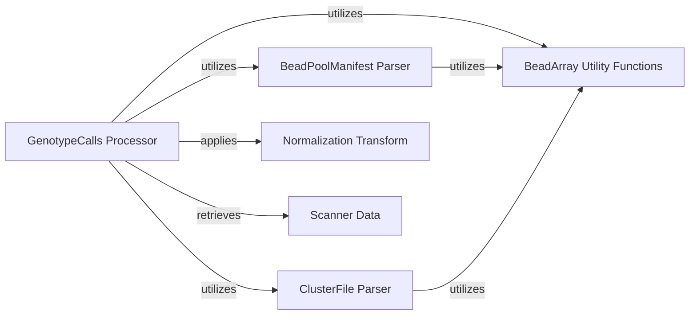

## Component Details

This architecture describes the components involved in processing and retrieving genotype call data from GTC files. The central `GenotypeCalls Processor` component orchestrates the data extraction, relying on `BeadArray Utility Functions` for low-level file operations. It integrates with `BeadPoolManifest Parser` and `ClusterFile Parser` to obtain manifest and clustering information. Additionally, it utilizes `Normalization Transform` for intensity data adjustments and `Scanner Data` to capture scanner-specific details, providing a comprehensive view of genotype call data.

### GenotypeCalls Processor
This is a central component for processing and retrieving genotype call data from GTC files. It provides methods to access various attributes like sample names, intensities, genotypes, and quality scores. It also includes helper classes for normalization transforms and scanner data. It heavily relies on BeadArrayUtility for low-level data reading and interacts with BeadPoolManifest Parser and ClusterFile Parser to get related file information.

**Related Classes/Methods**:

- <a href="https://github.com/Illumina/BeadArrayFiles/blob/master/module/GenotypeCalls.py#L62-L621" target="_blank" rel="noopener noreferrer">`BeadArrayFiles.module.GenotypeCalls.GenotypeCalls` (62:621)</a>
- <a href="https://github.com/Illumina/BeadArrayFiles/blob/master/module/GenotypeCalls.py#L103-L136" target="_blank" rel="noopener noreferrer">`BeadArrayFiles.module.GenotypeCalls.GenotypeCalls.__init__` (103:136)</a>
- <a href="https://github.com/Illumina/BeadArrayFiles/blob/master/module/GenotypeCalls.py#L590-L621" target="_blank" rel="noopener noreferrer">`BeadArrayFiles.module.GenotypeCalls.GenotypeCalls.is_write_complete` (590:621)</a>
- <a href="https://github.com/Illumina/BeadArrayFiles/blob/master/module/GenotypeCalls.py#L155-L182" target="_blank" rel="noopener noreferrer">`BeadArrayFiles.module.GenotypeCalls.GenotypeCalls.__get_generic_array` (155:182)</a>
- <a href="https://github.com/Illumina/BeadArrayFiles/blob/master/module/GenotypeCalls.py#L184-L207" target="_blank" rel="noopener noreferrer">`BeadArrayFiles.module.GenotypeCalls.GenotypeCalls.__get_generic_array_numpy` (184:207)</a>
- <a href="https://github.com/Illumina/BeadArrayFiles/blob/master/module/GenotypeCalls.py#L230-L235" target="_blank" rel="noopener noreferrer">`BeadArrayFiles.module.GenotypeCalls.GenotypeCalls.get_sample_name` (230:235)</a>
- <a href="https://github.com/Illumina/BeadArrayFiles/blob/master/module/GenotypeCalls.py#L138-L153" target="_blank" rel="noopener noreferrer">`BeadArrayFiles.module.GenotypeCalls.GenotypeCalls.__get_generic` (138:153)</a>
- <a href="https://github.com/Illumina/BeadArrayFiles/blob/master/module/GenotypeCalls.py#L237-L242" target="_blank" rel="noopener noreferrer">`BeadArrayFiles.module.GenotypeCalls.GenotypeCalls.get_slide_identifier` (237:242)</a>
- <a href="https://github.com/Illumina/BeadArrayFiles/blob/master/module/GenotypeCalls.py#L244-L249" target="_blank" rel="noopener noreferrer">`BeadArrayFiles.module.GenotypeCalls.GenotypeCalls.get_sample_plate` (244:249)</a>
- <a href="https://github.com/Illumina/BeadArrayFiles/blob/master/module/GenotypeCalls.py#L251-L256" target="_blank" rel="noopener noreferrer">`BeadArrayFiles.module.GenotypeCalls.GenotypeCalls.get_sample_well` (251:256)</a>
- <a href="https://github.com/Illumina/BeadArrayFiles/blob/master/module/GenotypeCalls.py#L258-L263" target="_blank" rel="noopener noreferrer">`BeadArrayFiles.module.GenotypeCalls.GenotypeCalls.get_cluster_file` (258:263)</a>
- <a href="https://github.com/Illumina/BeadArrayFiles/blob/master/module/GenotypeCalls.py#L265-L270" target="_blank" rel="noopener noreferrer">`BeadArrayFiles.module.GenotypeCalls.GenotypeCalls.get_snp_manifest` (265:270)</a>
- <a href="https://github.com/Illumina/BeadArrayFiles/blob/master/module/GenotypeCalls.py#L272-L279" target="_blank" rel="noopener noreferrer">`BeadArrayFiles.module.GenotypeCalls.GenotypeCalls.get_imaging_date` (272:279)</a>
- <a href="https://github.com/Illumina/BeadArrayFiles/blob/master/module/GenotypeCalls.py#L281-L288" target="_blank" rel="noopener noreferrer">`BeadArrayFiles.module.GenotypeCalls.GenotypeCalls.get_autocall_date` (281:288)</a>
- <a href="https://github.com/Illumina/BeadArrayFiles/blob/master/module/GenotypeCalls.py#L290-L297" target="_blank" rel="noopener noreferrer">`BeadArrayFiles.module.GenotypeCalls.GenotypeCalls.get_autocall_version` (290:297)</a>
- <a href="https://github.com/Illumina/BeadArrayFiles/blob/master/module/GenotypeCalls.py#L299-L304" target="_blank" rel="noopener noreferrer">`BeadArrayFiles.module.GenotypeCalls.GenotypeCalls.get_genotypes` (299:304)</a>
- <a href="https://github.com/Illumina/BeadArrayFiles/blob/master/module/GenotypeCalls.py#L306-L346" target="_blank" rel="noopener noreferrer">`BeadArrayFiles.module.GenotypeCalls.GenotypeCalls.get_base_calls_generic` (306:346)</a>
- <a href="https://github.com/Illumina/BeadArrayFiles/blob/master/module/GenotypeCalls.py#L348-L361" target="_blank" rel="noopener noreferrer">`BeadArrayFiles.module.GenotypeCalls.GenotypeCalls.get_base_calls_plus_strand` (348:361)</a>
- <a href="https://github.com/Illumina/BeadArrayFiles/blob/master/module/GenotypeCalls.py#L363-L375" target="_blank" rel="noopener noreferrer">`BeadArrayFiles.module.GenotypeCalls.GenotypeCalls.get_base_calls_forward_strand` (363:375)</a>
- <a href="https://github.com/Illumina/BeadArrayFiles/blob/master/module/GenotypeCalls.py#L377-L408" target="_blank" rel="noopener noreferrer">`BeadArrayFiles.module.GenotypeCalls.GenotypeCalls.get_base_calls` (377:408)</a>
- <a href="https://github.com/Illumina/BeadArrayFiles/blob/master/module/GenotypeCalls.py#L223-L228" target="_blank" rel="noopener noreferrer">`BeadArrayFiles.module.GenotypeCalls.GenotypeCalls.get_ploidy_type` (223:228)</a>
- <a href="https://github.com/Illumina/BeadArrayFiles/blob/master/module/GenotypeCalls.py#L410-L415" target="_blank" rel="noopener noreferrer">`BeadArrayFiles.module.GenotypeCalls.GenotypeCalls.get_genotype_scores` (410:415)</a>
- <a href="https://github.com/Illumina/BeadArrayFiles/blob/master/module/GenotypeCalls.py#L417-L422" target="_blank" rel="noopener noreferrer">`BeadArrayFiles.module.GenotypeCalls.GenotypeCalls.get_scanner_data` (417:422)</a>
- <a href="https://github.com/Illumina/BeadArrayFiles/blob/master/module/GenotypeCalls.py#L424-L429" target="_blank" rel="noopener noreferrer">`BeadArrayFiles.module.GenotypeCalls.GenotypeCalls.get_control_x_intensities` (424:429)</a>
- <a href="https://github.com/Illumina/BeadArrayFiles/blob/master/module/GenotypeCalls.py#L431-L436" target="_blank" rel="noopener noreferrer">`BeadArrayFiles.module.GenotypeCalls.GenotypeCalls.get_control_y_intensities` (431:436)</a>
- <a href="https://github.com/Illumina/BeadArrayFiles/blob/master/module/GenotypeCalls.py#L438-L443" target="_blank" rel="noopener noreferrer">`BeadArrayFiles.module.GenotypeCalls.GenotypeCalls.get_raw_x_intensities` (438:443)</a>
- <a href="https://github.com/Illumina/BeadArrayFiles/blob/master/module/GenotypeCalls.py#L445-L450" target="_blank" rel="noopener noreferrer">`BeadArrayFiles.module.GenotypeCalls.GenotypeCalls.get_raw_y_intensities` (445:450)</a>
- <a href="https://github.com/Illumina/BeadArrayFiles/blob/master/module/GenotypeCalls.py#L452-L457" target="_blank" rel="noopener noreferrer">`BeadArrayFiles.module.GenotypeCalls.GenotypeCalls.get_call_rate` (452:457)</a>
- <a href="https://github.com/Illumina/BeadArrayFiles/blob/master/module/GenotypeCalls.py#L459-L465" target="_blank" rel="noopener noreferrer">`BeadArrayFiles.module.GenotypeCalls.GenotypeCalls.get_gender` (459:465)</a>
- <a href="https://github.com/Illumina/BeadArrayFiles/blob/master/module/GenotypeCalls.py#L467-L472" target="_blank" rel="noopener noreferrer">`BeadArrayFiles.module.GenotypeCalls.GenotypeCalls.get_logr_dev` (467:472)</a>
- <a href="https://github.com/Illumina/BeadArrayFiles/blob/master/module/GenotypeCalls.py#L474-L479" target="_blank" rel="noopener noreferrer">`BeadArrayFiles.module.GenotypeCalls.GenotypeCalls.get_gc10` (474:479)</a>
- <a href="https://github.com/Illumina/BeadArrayFiles/blob/master/module/GenotypeCalls.py#L481-L486" target="_blank" rel="noopener noreferrer">`BeadArrayFiles.module.GenotypeCalls.GenotypeCalls.get_gc50` (481:486)</a>
- <a href="https://github.com/Illumina/BeadArrayFiles/blob/master/module/GenotypeCalls.py#L488-L495" target="_blank" rel="noopener noreferrer">`BeadArrayFiles.module.GenotypeCalls.GenotypeCalls.get_num_calls` (488:495)</a>
- <a href="https://github.com/Illumina/BeadArrayFiles/blob/master/module/GenotypeCalls.py#L497-L504" target="_blank" rel="noopener noreferrer">`BeadArrayFiles.module.GenotypeCalls.GenotypeCalls.get_num_no_calls` (497:504)</a>
- <a href="https://github.com/Illumina/BeadArrayFiles/blob/master/module/GenotypeCalls.py#L506-L513" target="_blank" rel="noopener noreferrer">`BeadArrayFiles.module.GenotypeCalls.GenotypeCalls.get_num_intensity_only` (506:513)</a>
- <a href="https://github.com/Illumina/BeadArrayFiles/blob/master/module/GenotypeCalls.py#L515-L523" target="_blank" rel="noopener noreferrer">`BeadArrayFiles.module.GenotypeCalls.GenotypeCalls.get_ballele_freqs` (515:523)</a>
- <a href="https://github.com/Illumina/BeadArrayFiles/blob/master/module/GenotypeCalls.py#L525-L533" target="_blank" rel="noopener noreferrer">`BeadArrayFiles.module.GenotypeCalls.GenotypeCalls.get_logr_ratios` (525:533)</a>
- <a href="https://github.com/Illumina/BeadArrayFiles/blob/master/module/GenotypeCalls.py#L535-L550" target="_blank" rel="noopener noreferrer">`BeadArrayFiles.module.GenotypeCalls.GenotypeCalls.get_percentiles_x` (535:550)</a>
- <a href="https://github.com/Illumina/BeadArrayFiles/blob/master/module/GenotypeCalls.py#L552-L567" target="_blank" rel="noopener noreferrer">`BeadArrayFiles.module.GenotypeCalls.GenotypeCalls.get_percentiles_y` (552:567)</a>
- <a href="https://github.com/Illumina/BeadArrayFiles/blob/master/module/GenotypeCalls.py#L569-L581" target="_blank" rel="noopener noreferrer">`BeadArrayFiles.module.GenotypeCalls.GenotypeCalls.get_normalized_intensities` (569:581)</a>
- <a href="https://github.com/Illumina/BeadArrayFiles/blob/master/module/GenotypeCalls.py#L583-L588" target="_blank" rel="noopener noreferrer">`BeadArrayFiles.module.GenotypeCalls.GenotypeCalls.get_normalization_transforms` (583:588)</a>
- <a href="https://github.com/Illumina/BeadArrayFiles/blob/master/module/GenotypeCalls.py#L640-L650" target="_blank" rel="noopener noreferrer">`BeadArrayFiles.module.GenotypeCalls.NormalizationTransform.read_normalization_transform` (640:650)</a>
- <a href="https://github.com/Illumina/BeadArrayFiles/blob/master/module/GenotypeCalls.py#L624-L697" target="_blank" rel="noopener noreferrer">`BeadArrayFiles.module.GenotypeCalls.NormalizationTransform` (624:697)</a>
- <a href="https://github.com/Illumina/BeadArrayFiles/blob/master/module/GenotypeCalls.py#L733-L748" target="_blank" rel="noopener noreferrer">`BeadArrayFiles.module.GenotypeCalls.ScannerData.read_scanner_data` (733:748)</a>
- <a href="https://github.com/Illumina/BeadArrayFiles/blob/master/module/GenotypeCalls.py#L700-L748" target="_blank" rel="noopener noreferrer">`BeadArrayFiles.module.GenotypeCalls.ScannerData` (700:748)</a>

### BeadArray Utility Functions
This component provides fundamental utility functions for reading various data types (e.g., byte, int, string, float, char, ushort) from binary files. It also includes a complement function for nucleotide base manipulation. These functions are crucial for low-level data extraction from GTC files.

**Related Classes/Methods**:

- <a href="https://github.com/Illumina/BeadArrayFiles/blob/master/module/BeadArrayUtility.py#L70-L80" target="_blank" rel="noopener noreferrer">`BeadArrayFiles.module.BeadArrayUtility.read_byte` (70:80)</a>
- <a href="https://github.com/Illumina/BeadArrayFiles/blob/master/module/BeadArrayUtility.py#L46-L56" target="_blank" rel="noopener noreferrer">`BeadArrayFiles.module.BeadArrayUtility.read_int` (46:56)</a>
- <a href="https://github.com/Illumina/BeadArrayFiles/blob/master/module/BeadArrayUtility.py#L82-L109" target="_blank" rel="noopener noreferrer">`BeadArrayFiles.module.BeadArrayUtility.read_string` (82:109)</a>
- <a href="https://github.com/Illumina/BeadArrayFiles/blob/master/module/BeadArrayUtility.py#L58-L68" target="_blank" rel="noopener noreferrer">`BeadArrayFiles.module.BeadArrayUtility.read_float` (58:68)</a>
- <a href="https://github.com/Illumina/BeadArrayFiles/blob/master/module/BeadArrayUtility.py#L22-L32" target="_blank" rel="noopener noreferrer">`BeadArrayFiles.module.BeadArrayUtility.read_char` (22:32)</a>
- <a href="https://github.com/Illumina/BeadArrayFiles/blob/master/module/BeadArrayUtility.py#L34-L44" target="_blank" rel="noopener noreferrer">`BeadArrayFiles.module.BeadArrayUtility.read_ushort` (34:44)</a>
- <a href="https://github.com/Illumina/BeadArrayFiles/blob/master/module/BeadArrayUtility.py#L5-L20" target="_blank" rel="noopener noreferrer">`BeadArrayFiles.module.BeadArrayUtility.complement` (5:20)</a>

### BeadPoolManifest Parser
This component is responsible for parsing binary Bead Pool Manifest (BPM) files. It extracts information about loci, including names, SNPs, chromosomes, map information, addresses, and normalization lookups.

**Related Classes/Methods**:

- <a href="https://github.com/Illumina/BeadArrayFiles/blob/master/module/BeadPoolManifest.py#L2-L129" target="_blank" rel="noopener noreferrer">`BeadArrayFiles.module.BeadPoolManifest.BeadPoolManifest` (2:129)</a>
- <a href="https://github.com/Illumina/BeadArrayFiles/blob/master/module/BeadPoolManifest.py#L21-L44" target="_blank" rel="noopener noreferrer">`BeadArrayFiles.module.BeadPoolManifest.BeadPoolManifest.__init__` (21:44)</a>
- <a href="https://github.com/Illumina/BeadArrayFiles/blob/master/module/BeadPoolManifest.py#L46-L129" target="_blank" rel="noopener noreferrer">`BeadArrayFiles.module.BeadPoolManifest.BeadPoolManifest.__parse_file` (46:129)</a>

### ClusterFile Parser
This component is responsible for parsing cluster files, which contain clustering information for genotyping. It provides methods to access cluster-related data.

**Related Classes/Methods**:

- <a href="https://github.com/Illumina/BeadArrayFiles/blob/master/module/ClusterFile.py#L2-L146" target="_blank" rel="noopener noreferrer">`BeadArrayFiles.module.ClusterFile` (2:146)</a>

### Normalization Transform
This component is responsible for handling normalization transformations applied to intensity data. It provides methods to read and apply these transformations to raw intensity values, enabling the calculation of normalized intensities.

**Related Classes/Methods**:

- <a href="https://github.com/Illumina/BeadArrayFiles/blob/master/module/GenotypeCalls.py#L624-L697" target="_blank" rel="noopener noreferrer">`BeadArrayFiles.module.GenotypeCalls.NormalizationTransform` (624:697)</a>
- <a href="https://github.com/Illumina/BeadArrayFiles/blob/master/module/GenotypeCalls.py#L640-L650" target="_blank" rel="noopener noreferrer">`BeadArrayFiles.module.GenotypeCalls.NormalizationTransform.read_normalization_transform` (640:650)</a>

### Scanner Data
This component encapsulates information related to the scanner used for genotyping. It provides methods to read and store details suchs as scanner name, software version, and other relevant scanner-specific data from the GTC file.

**Related Classes/Methods**:

- <a href="https://github.com/Illumina/BeadArrayFiles/blob/master/module/GenotypeCalls.py#L700-L748" target="_blank" rel="noopener noreferrer">`BeadArrayFiles.module.GenotypeCalls.ScannerData` (700:748)</a>
- <a href="https://github.com/Illumina/BeadArrayFiles/blob/master/module/GenotypeCalls.py#L733-L748" target="_blank" rel="noopener noreferrer">`BeadArrayFiles.module.GenotypeCalls.ScannerData.read_scanner_data` (733:748)</a>

### [FAQ](https://github.com/CodeBoarding/GeneratedOnBoardings/tree/main?tab=readme-ov-file#faq)