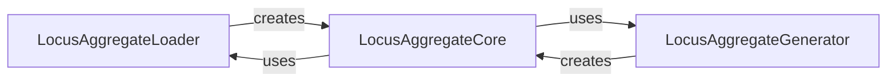

## Component Details

The LocusAggregate Manager subsystem is responsible for efficiently handling and processing genetic locus data, particularly for aggregation across multiple samples. It orchestrates the loading of individual sample locus data, the grouping of loci into manageable batches, and the final aggregation of these loci across all samples. The core purpose is to provide a structured way to access and manipulate aggregated genetic information, enabling downstream analysis.

### LocusAggregateLoader
Responsible for loading a slice of loci data for a single sample, populating a LocusAggregate object with genotype, score, B-allele frequency, log R ratio, and intensity data, and handling different sample versions.

**Related Classes/Methods**:

- <a href="https://github.com/Illumina/BeadArrayFiles/blob/master/module/LocusAggregate.py#L23-L53" target="_blank" rel="noopener noreferrer">`BeadArrayFiles.module.LocusAggregate.Loader.__call__` (23:53)</a>

### LocusAggregateGenerator
Creates a LocusAggregate object representing data for a single locus aggregated across all samples by iterating through sample buffers and appending relevant data.

**Related Classes/Methods**:

- <a href="https://github.com/Illumina/BeadArrayFiles/blob/master/module/LocusAggregate.py#L76-L103" target="_blank" rel="noopener noreferrer">`BeadArrayFiles.module.LocusAggregate.GenerateLocusAggregate.__call__` (76:103)</a>

### LocusAggregateCore
Represents the core data structure for aggregated locus information and provides static methods for managing and orchestrating the loading, grouping, and aggregation of loci data across multiple samples.

**Related Classes/Methods**:

- <a href="https://github.com/Illumina/BeadArrayFiles/blob/master/module/LocusAggregate.py#L105-L204" target="_blank" rel="noopener noreferrer">`BeadArrayFiles.module.LocusAggregate.LocusAggregate` (105:204)</a>
- <a href="https://github.com/Illumina/BeadArrayFiles/blob/master/module/LocusAggregate.py#L135-L148" target="_blank" rel="noopener noreferrer">`BeadArrayFiles.module.LocusAggregate.LocusAggregate.load_buffer` (135:148)</a>
- <a href="https://github.com/Illumina/BeadArrayFiles/blob/master/module/LocusAggregate.py#L151-L173" target="_blank" rel="noopener noreferrer">`BeadArrayFiles.module.LocusAggregate.LocusAggregate.group_loci` (151:173)</a>
- <a href="https://github.com/Illumina/BeadArrayFiles/blob/master/module/LocusAggregate.py#L176-L204" target="_blank" rel="noopener noreferrer">`BeadArrayFiles.module.LocusAggregate.LocusAggregate.aggregate_samples` (176:204)</a>

### [FAQ](https://github.com/CodeBoarding/GeneratedOnBoardings/tree/main?tab=readme-ov-file#faq)