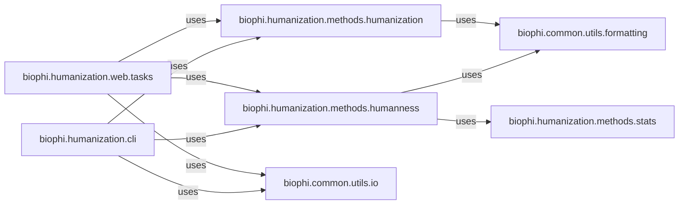

## Details

The Antibody Analysis Core is the central computational engine within the project for all antibody-related analyses. Its primary purpose is to provide robust and accurate algorithms for antibody humanization (e.g., Sapiens humanization, CDR grafting) and the calculation of humanness scores, which involves detailed comparisons against germline sequences and statistical analysis.

### biophi.humanization.methods.humanization
This component encapsulates the algorithms and logic for various antibody humanization strategies, including Sapiens humanization and CDR grafting. It also manages the specific parameters required for each humanization method.

**Related Classes/Methods**:

- <a href="https://github.com/Merck/BioPhi/biophi/humanization/methods/humanization.py#L1-L1" target="_blank" rel="noopener noreferrer">`biophi.humanization.methods.humanization` (1:1)</a>

### biophi.humanization.methods.humanness
This component is responsible for calculating antibody humanness scores. It implements the core logic for comparing antibody sequences against germline sequences and often relies on statistical methods for its computations.

**Related Classes/Methods**:

- <a href="https://github.com/Merck/BioPhi/biophi/humanization/methods/humanness.py#L1-L1" target="_blank" rel="noopener noreferrer">`biophi.humanization.methods.humanness` (1:1)</a>

### biophi.humanization.methods.stats
This component provides a suite of statistical analysis functions. It primarily supports the biophi.humanization.methods.humanness component by offering necessary statistical tools for humanness score calculations and other analytical tasks.

**Related Classes/Methods**:

- <a href="https://github.com/Merck/BioPhi/biophi/humanization/methods/stats.py#L1-L1" target="_blank" rel="noopener noreferrer">`biophi.humanization.methods.stats` (1:1)</a>

### biophi.common.utils.io
This utility component handles the input and output operations for antibody-related data. It ensures consistent data parsing and serialization across different parts of the system, facilitating data exchange with the core analysis components.

**Related Classes/Methods**:

- <a href="https://github.com/Merck/BioPhi/biophi/common/utils/io.py#L1-L1" target="_blank" rel="noopener noreferrer">`biophi.common.utils.io` (1:1)</a>

### biophi.common.utils.formatting
This utility component provides functions for consistent formatting of output data. It is used by various components to present analysis results in a standardized and readable manner.

**Related Classes/Methods**:

- <a href="https://github.com/Merck/BioPhi/biophi/common/utils/formatting.py#L1-L1" target="_blank" rel="noopener noreferrer">`biophi.common.utils.formatting` (1:1)</a>

### biophi.humanization.web.tasks
This component defines asynchronous tasks for web-based antibody humanization and humanness calculations. It acts as an intermediary, orchestrating calls to the core analysis logic based on requests from the web interface.

**Related Classes/Methods**:

- <a href="https://github.com/Merck/BioPhi/biophi/humanization/web/tasks.py#L1-L1" target="_blank" rel="noopener noreferrer">`biophi.humanization.web.tasks` (1:1)</a>

### biophi.humanization.cli
This component provides command-line interface tools, allowing users to directly interact with the antibody analysis functionalities (humanization and humanness calculations) from the terminal.

**Related Classes/Methods**:

- <a href="https://github.com/Merck/BioPhi/biophi/humanization/cli/oasis.py#L18-L95" target="_blank" rel="noopener noreferrer">`biophi.humanization.cli.oasis` (18:95)</a>
- <a href="https://github.com/Merck/BioPhi/biophi/humanization/cli/sapiens.py#L32-L123" target="_blank" rel="noopener noreferrer">`biophi.humanization.cli.sapiens` (32:123)</a>

### [FAQ](https://github.com/CodeBoarding/GeneratedOnBoardings/tree/main?tab=readme-ov-file#faq)