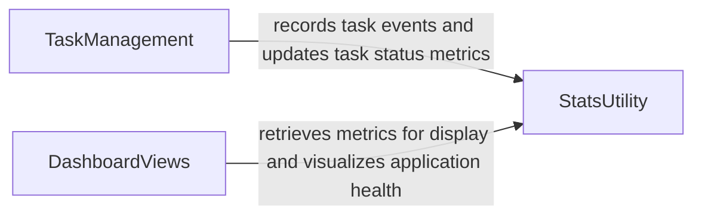

## Details

This component is designed to collect, process, and present crucial application events and operational metrics, providing insights into system health, user behavior, and task execution. It forms the foundation for debugging, performance analysis, and understanding overall application usage patterns.

### StatsUtility
This utility is responsible for the core logic of collecting and aggregating statistical data within the application. It likely provides methods for incrementing counters, recording events, and potentially calculating metrics like averages or rates.

**Related Classes/Methods**:

- `StatsUtility` (1:1)

### TaskManagement
This component handles the execution and status tracking of asynchronous tasks within the application. It is crucial for monitoring as it provides the means to record the start, completion, and potential failure of tasks, which are key operational metrics.

**Related Classes/Methods**:

- `TaskManagement` (1:1)

### DashboardViews
This component is responsible for rendering the user interface elements that display the collected application metrics and monitoring data. It acts as the presentation layer, making the raw data accessible and understandable to users or administrators.

**Related Classes/Methods**:

- `DashboardViews` (1:1)

### [FAQ](https://github.com/CodeBoarding/GeneratedOnBoardings/tree/main?tab=readme-ov-file#faq)