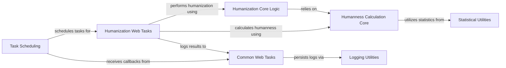

## Component Details

This component is responsible for defining, scheduling, and managing the execution of long-running tasks, such as antibody humanization and humanness calculations, typically in a background process. It also handles the logging of task results and failures, utilizing schedulers like Celery for distributed task execution.

### Humanization Web Tasks
Defines and manages asynchronous tasks specifically for antibody humanization and humanness calculations, including handling task results and preparing data for export. These tasks are designed to be executed in a background process, often managed by a task scheduler.

**Related Classes/Methods**:

- <a href="https://github.com/Merck/BioPhi/blob/master/biophi/humanization/web/tasks.py#L31-L42" target="_blank" rel="noopener noreferrer">`BioPhi.biophi.humanization.web.tasks.HumanizeAntibodyTaskResult.to_series` (31:42)</a>
- <a href="https://github.com/Merck/BioPhi/blob/master/biophi/humanization/web/tasks.py#L69-L88" target="_blank" rel="noopener noreferrer">`BioPhi.biophi.humanization.web.tasks.HumanizeAntibodyTaskResult.to_sheets` (69:88)</a>
- <a href="https://github.com/Merck/BioPhi/blob/master/biophi/humanization/web/tasks.py#L90-L98" target="_blank" rel="noopener noreferrer">`BioPhi.biophi.humanization.web.tasks.HumanizeAntibodyTaskResult.get_export_name` (90:98)</a>
- <a href="https://github.com/Merck/BioPhi/blob/master/biophi/humanization/web/tasks.py#L100-L110" target="_blank" rel="noopener noreferrer">`BioPhi.biophi.humanization.web.tasks.HumanizeAntibodyTaskResult.get_humanized_records` (100:110)</a>
- <a href="https://github.com/Merck/BioPhi/blob/master/biophi/humanization/web/tasks.py#L122-L170" target="_blank" rel="noopener noreferrer">`BioPhi.biophi.humanization.web.tasks.humanize_antibody_task` (122:170)</a>
- <a href="https://github.com/Merck/BioPhi/blob/master/biophi/humanization/web/tasks.py#L174-L204" target="_blank" rel="noopener noreferrer">`BioPhi.biophi.humanization.web.tasks.mutate_humanized_antibody_task` (174:204)</a>
- <a href="https://github.com/Merck/BioPhi/blob/master/biophi/humanization/web/tasks.py#L219-L243" target="_blank" rel="noopener noreferrer">`BioPhi.biophi.humanization.web.tasks.HumannessTaskResult.to_series` (219:243)</a>
- <a href="https://github.com/Merck/BioPhi/blob/master/biophi/humanization/web/tasks.py#L259-L275" target="_blank" rel="noopener noreferrer">`BioPhi.biophi.humanization.web.tasks.HumannessTaskResult.to_sheets` (259:275)</a>
- <a href="https://github.com/Merck/BioPhi/blob/master/biophi/humanization/web/tasks.py#L286-L311" target="_blank" rel="noopener noreferrer">`BioPhi.biophi.humanization.web.tasks.humanness_task` (286:311)</a>
- <a href="https://github.com/Merck/BioPhi/blob/master/biophi/humanization/web/tasks.py#L16-L19" target="_blank" rel="noopener noreferrer">`BioPhi.biophi.humanization.web.tasks.HumanizeAntibodyTaskError` (16:19)</a>
- <a href="https://github.com/Merck/BioPhi/blob/master/biophi/humanization/web/tasks.py#L207-L210" target="_blank" rel="noopener noreferrer">`BioPhi.biophi.humanization.web.tasks.HumannessTaskError` (207:210)</a>

### Task Scheduling
Manages the execution and status tracking of asynchronous tasks, offering different scheduling backends (e.g., Celery, in-memory). It provides an interface for submitting tasks and retrieving their results.

**Related Classes/Methods**:

- <a href="https://github.com/Merck/BioPhi/blob/master/biophi/common/utils/scheduler.py#L46-L89" target="_blank" rel="noopener noreferrer">`BioPhi.biophi.common.utils.scheduler.CeleryScheduler` (46:89)</a>
- <a href="https://github.com/Merck/BioPhi/blob/master/biophi/common/utils/scheduler.py#L92-L135" target="_blank" rel="noopener noreferrer">`BioPhi.biophi.common.utils.scheduler.SimpleInMemoryScheduler` (92:135)</a>
- <a href="https://github.com/Merck/BioPhi/blob/master/biophi/common/utils/scheduler.py#L138-L164" target="_blank" rel="noopener noreferrer">`BioPhi.biophi.common.utils.scheduler.NotInitializedScheduler` (138:164)</a>
- <a href="https://github.com/Merck/BioPhi/blob/master/biophi/common/utils/scheduler.py#L7-L8" target="_blank" rel="noopener noreferrer">`BioPhi.biophi.common.utils.scheduler.TaskNotFoundError` (7:8)</a>
- <a href="https://github.com/Merck/BioPhi/blob/master/biophi/common/utils/scheduler.py#L178-L185" target="_blank" rel="noopener noreferrer">`BioPhi.biophi.common.utils.scheduler.use_scheduler` (178:185)</a>
- <a href="https://github.com/Merck/BioPhi/blob/master/biophi/common/utils/scheduler.py#L48-L52" target="_blank" rel="noopener noreferrer">`BioPhi.biophi.common.utils.scheduler.CeleryScheduler.get_celery_group_result` (48:52)</a>
- <a href="https://github.com/Merck/BioPhi/blob/master/biophi/common/utils/scheduler.py#L54-L63" target="_blank" rel="noopener noreferrer">`BioPhi.biophi.common.utils.scheduler.CeleryScheduler.get_result` (54:63)</a>
- <a href="https://github.com/Merck/BioPhi/blob/master/biophi/common/utils/scheduler.py#L65-L66" target="_blank" rel="noopener noreferrer">`BioPhi.biophi.common.utils.scheduler.CeleryScheduler.get_result_task_id` (65:66)</a>
- <a href="https://github.com/Merck/BioPhi/blob/master/biophi/common/utils/scheduler.py#L68-L69" target="_blank" rel="noopener noreferrer">`BioPhi.biophi.common.utils.scheduler.CeleryScheduler.get_results` (68:69)</a>
- <a href="https://github.com/Merck/BioPhi/blob/master/biophi/common/utils/scheduler.py#L71-L72" target="_blank" rel="noopener noreferrer">`BioPhi.biophi.common.utils.scheduler.CeleryScheduler.get_results_len` (71:72)</a>
- <a href="https://github.com/Merck/BioPhi/blob/master/biophi/common/utils/scheduler.py#L74-L75" target="_blank" rel="noopener noreferrer">`BioPhi.biophi.common.utils.scheduler.CeleryScheduler.are_results_ready` (74:75)</a>
- <a href="https://github.com/Merck/BioPhi/blob/master/biophi/common/utils/scheduler.py#L77-L80" target="_blank" rel="noopener noreferrer">`BioPhi.biophi.common.utils.scheduler.CeleryScheduler.get_results_progress` (77:80)</a>
- <a href="https://github.com/Merck/BioPhi/blob/master/biophi/common/utils/scheduler.py#L102-L108" target="_blank" rel="noopener noreferrer">`BioPhi.biophi.common.utils.scheduler.SimpleInMemoryScheduler.get_result` (102:108)</a>
- <a href="https://github.com/Merck/BioPhi/blob/master/biophi/common/utils/scheduler.py#L110-L112" target="_blank" rel="noopener noreferrer">`BioPhi.biophi.common.utils.scheduler.SimpleInMemoryScheduler.get_result_task_id` (110:112)</a>
- <a href="https://github.com/Merck/BioPhi/blob/master/biophi/common/utils/scheduler.py#L114-L116" target="_blank" rel="noopener noreferrer">`BioPhi.biophi.common.utils.scheduler.SimpleInMemoryScheduler.get_results` (114:116)</a>
- <a href="https://github.com/Merck/BioPhi/blob/master/biophi/common/utils/scheduler.py#L118-L119" target="_blank" rel="noopener noreferrer">`BioPhi.biophi.common.utils.scheduler.SimpleInMemoryScheduler.get_results_len` (118:119)</a>
- <a href="https://github.com/Merck/BioPhi/blob/master/biophi/common/utils/scheduler.py#L128-L129" target="_blank" rel="noopener noreferrer">`BioPhi.biophi.common.utils.scheduler.SimpleInMemoryScheduler.schedule_task` (128:129)</a>
- <a href="https://github.com/Merck/BioPhi/blob/master/biophi/common/utils/scheduler.py#L131-L135" target="_blank" rel="noopener noreferrer">`BioPhi.biophi.common.utils.scheduler.SimpleInMemoryScheduler.schedule_tasks` (131:135)</a>
- <a href="https://github.com/Merck/BioPhi/blob/master/biophi/common/utils/scheduler.py#L95-L100" target="_blank" rel="noopener noreferrer">`BioPhi.biophi.common.utils.scheduler.SimpleInMemoryScheduler.save_result` (95:100)</a>
- <a href="https://github.com/Merck/BioPhi/blob/master/biophi/common/utils/scheduler.py#L142-L143" target="_blank" rel="noopener noreferrer">`BioPhi.biophi.common.utils.scheduler.NotInitializedScheduler.get_result_task_id` (142:143)</a>
- <a href="https://github.com/Merck/BioPhi/blob/master/biophi/common/utils/scheduler.py#L145-L146" target="_blank" rel="noopener noreferrer">`BioPhi.biophi.common.utils.scheduler.NotInitializedScheduler.get_results` (145:146)</a>
- <a href="https://github.com/Merck/BioPhi/blob/master/biophi/common/utils/scheduler.py#L148-L149" target="_blank" rel="noopener noreferrer">`BioPhi.biophi.common.utils.scheduler.NotInitializedScheduler.are_results_ready` (148:149)</a>
- <a href="https://github.com/Merck/BioPhi/blob/master/biophi/common/utils/scheduler.py#L151-L152" target="_blank" rel="noopener noreferrer">`BioPhi.biophi.common.utils.scheduler.NotInitializedScheduler.get_results_progress` (151:152)</a>
- <a href="https://github.com/Merck/BioPhi/blob/master/biophi/common/utils/scheduler.py#L154-L155" target="_blank" rel="noopener noreferrer">`BioPhi.biophi.common.utils.scheduler.NotInitializedScheduler.schedule_task` (154:155)</a>
- <a href="https://github.com/Merck/BioPhi/blob/master/biophi/common/utils/scheduler.py#L157-L158" target="_blank" rel="noopener noreferrer">`BioPhi.biophi.common.utils.scheduler.NotInitializedScheduler.schedule_tasks` (157:158)</a>
- <a href="https://github.com/Merck/BioPhi/blob/master/biophi/common/utils/scheduler.py#L160-L161" target="_blank" rel="noopener noreferrer">`BioPhi.biophi.common.utils.scheduler.NotInitializedScheduler.get_result` (160:161)</a>
- <a href="https://github.com/Merck/BioPhi/blob/master/biophi/common/utils/scheduler.py#L163-L164" target="_blank" rel="noopener noreferrer">`BioPhi.biophi.common.utils.scheduler.NotInitializedScheduler.get_results_len` (163:164)</a>
- <a href="https://github.com/Merck/BioPhi/blob/master/biophi/common/utils/scheduler.py#L139-L140" target="_blank" rel="noopener noreferrer">`BioPhi.biophi.common.utils.scheduler.NotInitializedScheduler.throw` (139:140)</a>

### Common Web Tasks
General web-related tasks, specifically for logging the outcomes (success or failure) of web-initiated processes. These tasks act as callbacks for scheduled operations.

**Related Classes/Methods**:

- <a href="https://github.com/Merck/BioPhi/blob/master/biophi/common/web/tasks.py#L38-L42" target="_blank" rel="noopener noreferrer">`BioPhi.biophi.common.web.tasks.log_task_postrun` (38:42)</a>
- <a href="https://github.com/Merck/BioPhi/blob/master/biophi/common/web/tasks.py#L46-L49" target="_blank" rel="noopener noreferrer">`BioPhi.biophi.common.web.tasks.log_task_failure` (46:49)</a>

### Logging Utilities
Provides a centralized mechanism for logging task results and other operational data within the BioPhi system, interacting with a database for persistence.

**Related Classes/Methods**:

- <a href="https://github.com/Merck/BioPhi/blob/master/biophi/common/utils/stats.py#L44-L53" target="_blank" rel="noopener noreferrer">`BioPhi.biophi.common.utils.stats.log_task_result` (44:53)</a>
- <a href="https://github.com/Merck/BioPhi/blob/master/biophi/common/utils/stats.py#L69-L98" target="_blank" rel="noopener noreferrer">`BioPhi.biophi.common.utils.stats.log_data` (69:98)</a>
- <a href="https://github.com/Merck/BioPhi/blob/master/biophi/common/utils/stats.py#L104-L114" target="_blank" rel="noopener noreferrer">`BioPhi.biophi.common.utils.stats.get_engine` (104:114)</a>

### Humanization Core Logic
Implements the primary algorithms for humanizing antibody sequences, including Sapiens prediction and CDR grafting techniques.

**Related Classes/Methods**:

- <a href="https://github.com/Merck/BioPhi/blob/master/biophi/humanization/methods/humanization.py#L18-L19" target="_blank" rel="noopener noreferrer">`biophi.humanization.methods.humanization.HumanizationParams.get_export_name` (18:19)</a>
- <a href="https://github.com/Merck/BioPhi/blob/master/biophi/humanization/methods/humanization.py#L157-L161" target="_blank" rel="noopener noreferrer">`biophi.humanization.methods.humanization.humanize_antibody` (157:161)</a>
- <a href="https://github.com/Merck/BioPhi/blob/master/biophi/humanization/methods/humanization.py#L120-L154" target="_blank" rel="noopener noreferrer">`BioPhi.biophi.humanization.methods.humanization.AntibodyHumanization` (120:154)</a>
- <a href="https://github.com/Merck/BioPhi/blob/master/biophi/humanization/methods/humanization.py#L164-L174" target="_blank" rel="noopener noreferrer">`BioPhi.biophi.humanization.methods.humanization.humanize_chain` (164:174)</a>
- <a href="https://github.com/Merck/BioPhi/blob/master/biophi/humanization/methods/humanization.py#L206-L245" target="_blank" rel="noopener noreferrer">`BioPhi.biophi.humanization.methods.humanization.sapiens_humanize_chain` (206:245)</a>
- <a href="https://github.com/Merck/BioPhi/blob/master/biophi/humanization/methods/humanization.py#L177-L203" target="_blank" rel="noopener noreferrer">`BioPhi.biophi.humanization.methods.humanization.cdr_grafting_humanize_chain` (177:203)</a>
- <a href="https://github.com/Merck/BioPhi/blob/master/biophi/humanization/methods/humanization.py#L23-L37" target="_blank" rel="noopener noreferrer">`BioPhi.biophi.humanization.methods.humanization.SapiensHumanizationParams` (23:37)</a>
- <a href="https://github.com/Merck/BioPhi/blob/master/biophi/humanization/methods/humanization.py#L248-L256" target="_blank" rel="noopener noreferrer">`BioPhi.biophi.humanization.methods.humanization.sapiens_predict_chain` (248:256)</a>
- <a href="https://github.com/Merck/BioPhi/blob/master/biophi/humanization/methods/humanization.py#L77-L116" target="_blank" rel="noopener noreferrer">`BioPhi.biophi.humanization.methods.humanization.ChainHumanization` (77:116)</a>

### Humanness Calculation Core
Contains the fundamental algorithms and data models for assessing the humanness of antibodies and their individual chains, including peptide analysis and OASis metrics.

**Related Classes/Methods**:

- <a href="https://github.com/Merck/BioPhi/blob/master/biophi/humanization/methods/humanness.py#L205-L210" target="_blank" rel="noopener noreferrer">`biophi.humanization.methods.humanness.AntibodyHumanness.get_oasis_percentile` (205:210)</a>
- <a href="https://github.com/Merck/BioPhi/blob/master/biophi/humanization/methods/humanness.py#L202-L203" target="_blank" rel="noopener noreferrer">`biophi.humanization.methods.humanness.AntibodyHumanness.get_oasis_identity` (202:203)</a>
- <a href="https://github.com/Merck/BioPhi/blob/master/biophi/humanization/methods/humanness.py#L231-L233" target="_blank" rel="noopener noreferrer">`biophi.humanization.methods.humanness.AntibodyHumanness.get_num_nonhuman_peptides` (231:233)</a>
- <a href="https://github.com/Merck/BioPhi/blob/master/biophi/humanization/methods/humanness.py#L171-L178" target="_blank" rel="noopener noreferrer">`biophi.humanization.methods.humanness.ChainHumanness.to_sequence_dataframe` (171:178)</a>
- <a href="https://github.com/Merck/BioPhi/blob/master/biophi/humanization/methods/humanness.py#L243-L254" target="_blank" rel="noopener noreferrer">`biophi.humanization.methods.humanness.AntibodyHumanness.get_germline_content` (243:254)</a>
- <a href="https://github.com/Merck/BioPhi/blob/master/biophi/humanization/methods/humanness.py#L91-L96" target="_blank" rel="noopener noreferrer">`biophi.humanization.methods.humanness.ChainHumanness.get_oasis_percentile` (91:96)</a>
- <a href="https://github.com/Merck/BioPhi/blob/master/biophi/humanization/methods/humanness.py#L88-L89" target="_blank" rel="noopener noreferrer">`biophi.humanization.methods.humanness.ChainHumanness.get_oasis_identity` (88:89)</a>
- <a href="https://github.com/Merck/BioPhi/blob/master/biophi/humanization/methods/humanness.py#L109-L110" target="_blank" rel="noopener noreferrer">`biophi.humanization.methods.humanness.ChainHumanness.get_num_nonhuman_peptides` (109:110)</a>
- <a href="https://github.com/Merck/BioPhi/blob/master/biophi/humanization/methods/humanness.py#L180-L181" target="_blank" rel="noopener noreferrer">`biophi.humanization.methods.humanness.ChainHumanness.get_germline_content` (180:181)</a>
- <a href="https://github.com/Merck/BioPhi/blob/master/biophi/humanization/methods/humanness.py#L106-L107" target="_blank" rel="noopener noreferrer">`BioPhi.biophi.humanization.methods.humanness.ChainHumanness.get_num_human_peptides` (106:107)</a>
- <a href="https://github.com/Merck/BioPhi/blob/master/biophi/humanization/methods/humanness.py#L112-L113" target="_blank" rel="noopener noreferrer">`BioPhi.biophi.humanization.methods.humanness.ChainHumanness.get_num_peptides` (112:113)</a>
- <a href="https://github.com/Merck/BioPhi/blob/master/biophi/humanization/methods/humanness.py#L227-L229" target="_blank" rel="noopener noreferrer">`BioPhi.biophi.humanization.methods.humanness.AntibodyHumanness.get_num_human_peptides` (227:229)</a>
- <a href="https://github.com/Merck/BioPhi/blob/master/biophi/humanization/methods/humanness.py#L224-L225" target="_blank" rel="noopener noreferrer">`BioPhi.biophi.humanization.methods.humanness.AntibodyHumanness.get_num_peptides` (224:225)</a>
- <a href="https://github.com/Merck/BioPhi/blob/master/biophi/humanization/methods/humanness.py#L198-L254" target="_blank" rel="noopener noreferrer">`BioPhi.biophi.humanization.methods.humanness.AntibodyHumanness` (198:254)</a>
- <a href="https://github.com/Merck/BioPhi/blob/master/biophi/humanization/methods/humanness.py#L272-L276" target="_blank" rel="noopener noreferrer">`BioPhi.biophi.humanization.methods.humanness.get_antibody_humanness` (272:276)</a>
- <a href="https://github.com/Merck/BioPhi/blob/master/biophi/humanization/methods/humanness.py#L318-L342" target="_blank" rel="noopener noreferrer">`BioPhi.biophi.humanization.methods.humanness.get_chain_humanness` (318:342)</a>
- <a href="https://github.com/Merck/BioPhi/blob/master/biophi/humanization/methods/humanness.py#L279-L315" target="_blank" rel="noopener noreferrer">`BioPhi.biophi.humanization.methods.humanness.get_chain_oasis_peptides` (279:315)</a>
- <a href="https://github.com/Merck/BioPhi/blob/master/biophi/humanization/methods/humanness.py#L257-L269" target="_blank" rel="noopener noreferrer">`BioPhi.biophi.humanization.methods.humanness.chop_seq_peptides` (257:269)</a>
- <a href="https://github.com/Merck/BioPhi/blob/master/biophi/humanization/methods/humanness.py#L37-L55" target="_blank" rel="noopener noreferrer">`BioPhi.biophi.humanization.methods.humanness.PeptideHumanness` (37:55)</a>
- <a href="https://github.com/Merck/BioPhi/blob/master/biophi/humanization/methods/humanness.py#L354-L366" target="_blank" rel="noopener noreferrer">`BioPhi.biophi.humanization.methods.humanness.get_oas_hits` (354:366)</a>
- <a href="https://github.com/Merck/BioPhi/blob/master/biophi/humanization/methods/humanness.py#L345-L351" target="_blank" rel="noopener noreferrer">`BioPhi.biophi.humanization.methods.humanness.parse_peptide_humanness` (345:351)</a>
- <a href="https://github.com/Merck/BioPhi/blob/master/biophi/humanization/methods/humanness.py#L59-L194" target="_blank" rel="noopener noreferrer">`BioPhi.biophi.humanization.methods.humanness.ChainHumanness` (59:194)</a>

### Statistical Utilities
Provides general statistical functions used across the BioPhi project, specifically for percentile calculations.

**Related Classes/Methods**:

- <a href="https://github.com/Merck/BioPhi/blob/master/biophi/humanization/methods/stats.py#L21-L39" target="_blank" rel="noopener noreferrer">`biophi.humanization.methods.stats.get_oasis_percentile` (21:39)</a>

### [FAQ](https://github.com/CodeBoarding/GeneratedOnBoardings/tree/main?tab=readme-ov-file#faq)