```mermaid
graph LR
    biophi_common_utils_scheduler_Scheduler["biophi.common.utils.scheduler.Scheduler"]
    biophi_common_utils_scheduler_CeleryScheduler["biophi.common.utils.scheduler.CeleryScheduler"]
    biophi_common_utils_scheduler_SimpleInMemoryScheduler["biophi.common.utils.scheduler.SimpleInMemoryScheduler"]
    biophi_common_utils_scheduler_SchedulerProxy["biophi.common.utils.scheduler.SchedulerProxy"]
    biophi_common_web_tasks_celery["biophi.common.web.tasks.celery"]
    biophi_humanization_web_tasks_humanize_antibody_task["biophi.humanization.web.tasks.humanize_antibody_task"]
    biophi_humanization_web_tasks_mutate_humanized_antibody_task["biophi.humanization.web.tasks.mutate_humanized_antibody_task"]
    biophi_humanization_web_tasks_HumanizeAntibodyTaskResult["biophi.humanization.web.tasks.HumanizeAntibodyTaskResult"]
    biophi_humanization_methods_humanization["biophi.humanization.methods.humanization"]
    biophi_humanization_methods_humanness["biophi.humanization.methods.humanness"]
    biophi_common_utils_scheduler_CeleryScheduler -- "implements" --> biophi_common_utils_scheduler_Scheduler
    biophi_common_utils_scheduler_CeleryScheduler -- "interacts_with" --> biophi_common_web_tasks_celery
    biophi_common_utils_scheduler_SimpleInMemoryScheduler -- "implements" --> biophi_common_utils_scheduler_Scheduler
    biophi_common_utils_scheduler_SchedulerProxy -- "proxies" --> biophi_common_utils_scheduler_Scheduler
    biophi_common_utils_scheduler_SchedulerProxy -- "schedules" --> biophi_humanization_web_tasks_humanize_antibody_task
    biophi_common_web_tasks_celery -- "registers" --> biophi_humanization_web_tasks_humanize_antibody_task
    biophi_common_web_tasks_celery -- "registers" --> biophi_humanization_web_tasks_mutate_humanized_antibody_task
    biophi_humanization_web_tasks_humanize_antibody_task -- "uses" --> biophi_humanization_methods_humanization
    biophi_humanization_web_tasks_humanize_antibody_task -- "uses" --> biophi_humanization_methods_humanness
    biophi_humanization_web_tasks_mutate_humanized_antibody_task -- "uses" --> biophi_humanization_methods_humanness
    biophi_humanization_web_tasks_HumanizeAntibodyTaskResult -- "returned_by" --> biophi_humanization_web_tasks_humanize_antibody_task
```

## Details

The Asynchronous Task Management subsystem is designed to efficiently handle long-running computational tasks, such as antibody humanization and humanness analysis, ensuring the responsiveness of the application, particularly in a web environment. It achieves this through a flexible, pluggable architecture that supports both in-memory synchronous execution for development and robust asynchronous processing via Celery for production.

### biophi.common.utils.scheduler.Scheduler
An abstract base class that defines the standardized interface for task scheduling and result retrieval. It establishes the contract for all concrete scheduler implementations, enabling a pluggable architecture.

**Related Classes/Methods**: _None_

### biophi.common.utils.scheduler.CeleryScheduler
A concrete implementation of the Scheduler interface that integrates with Celery for asynchronous task execution. This is the primary scheduler used in production environments for scalable and robust task processing.

**Related Classes/Methods**:

- <a href="https://github.com/Merck/BioPhi/biophi/common/utils/scheduler.py#L11-L43" target="_blank" rel="noopener noreferrer">`biophi.common.utils.scheduler.Scheduler` (11:43)</a>

### biophi.common.utils.scheduler.SimpleInMemoryScheduler
Another concrete implementation of the Scheduler interface, designed for synchronous, in-memory task processing. It is primarily used for local development, testing, and environments where asynchronous overhead is not desired.

**Related Classes/Methods**:

- <a href="https://github.com/Merck/BioPhi/biophi/common/utils/scheduler.py#L11-L43" target="_blank" rel="noopener noreferrer">`biophi.common.utils.scheduler.Scheduler` (11:43)</a>

### biophi.common.utils.scheduler.SchedulerProxy
A proxy class that dynamically routes task scheduling requests to the appropriate Scheduler implementation (e.g., CeleryScheduler or SimpleInMemoryScheduler) based on runtime configuration.

**Related Classes/Methods**:

- <a href="https://github.com/Merck/BioPhi/biophi/common/utils/scheduler.py#L11-L43" target="_blank" rel="noopener noreferrer">`biophi.common.utils.scheduler.Scheduler` (11:43)</a>
- <a href="https://github.com/Merck/BioPhi/biophi/common/utils/scheduler.py#L46-L89" target="_blank" rel="noopener noreferrer">`biophi.common.utils.scheduler.CeleryScheduler` (46:89)</a>
- <a href="https://github.com/Merck/BioPhi/biophi/common/utils/scheduler.py#L92-L135" target="_blank" rel="noopener noreferrer">`biophi.common.utils.scheduler.SimpleInMemoryScheduler` (92:135)</a>

### biophi.common.web.tasks.celery
The central Celery application instance. It acts as the message broker and task dispatcher, responsible for registering tasks, queuing them, and distributing them to worker processes for execution.

**Related Classes/Methods**: _None_

### biophi.humanization.web.tasks.humanize_antibody_task
A specific Celery task responsible for orchestrating the complex antibody humanization process, including calling the core humanization and humanness calculation algorithms.

**Related Classes/Methods**:

- <a href="https://github.com/Merck/BioPhi/biophi/humanization/methods/humanization.py#L0-L0" target="_blank" rel="noopener noreferrer">`biophi.humanization.methods.humanization` (0:0)</a>
- <a href="https://github.com/Merck/BioPhi/biophi/humanization/methods/humanness.py#L0-L0" target="_blank" rel="noopener noreferrer">`biophi.humanization.methods.humanness` (0:0)</a>

### biophi.humanization.web.tasks.mutate_humanized_antibody_task
Another specific Celery task that handles the mutation of a humanized antibody at a given position and recalculates its humanness score.

**Related Classes/Methods**:

- <a href="https://github.com/Merck/BioPhi/biophi/humanization/methods/humanness.py#L0-L0" target="_blank" rel="noopener noreferrer">`biophi.humanization.methods.humanness` (0:0)</a>

### biophi.humanization.web.tasks.HumanizeAntibodyTaskResult
A dataclass that encapsulates the comprehensive results of an antibody humanization task, including humanization details, parental and humanized humanness scores, input parameters, and OASis parameters.

**Related Classes/Methods**: _None_

### biophi.humanization.methods.humanization
This module contains the core antibody humanization algorithm and related parameters. It provides the computational logic that the humanize_antibody_task executes.

**Related Classes/Methods**: _None_

### biophi.humanization.methods.humanness
This module contains functions for calculating humanness scores and related parameters. It is utilized by both humanize_antibody_task and mutate_humanized_antibody_task.

**Related Classes/Methods**: _None_

### [FAQ](https://github.com/CodeBoarding/GeneratedOnBoardings/tree/main?tab=readme-ov-file#faq)