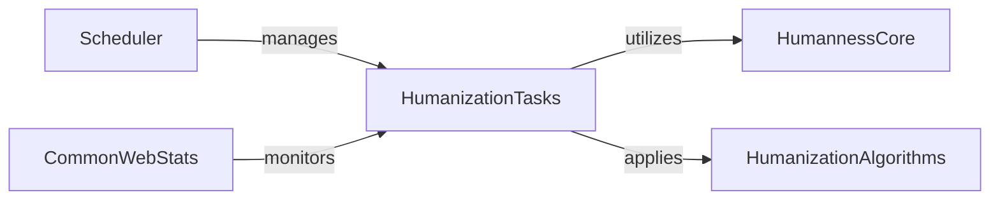

## Component Details

The Background Task Processing subsystem is responsible for asynchronously executing long-running and computationally intensive tasks, primarily related to antibody humanization and humanness calculations. It leverages a scheduler, such as Celery, to offload these operations from the main application thread, thereby ensuring the responsiveness of the web interface and efficient resource utilization. The core tasks involve applying humanization algorithms and calculating humanness metrics, with results being managed and monitored for reporting and analysis.

### HumanizationTasks
Manages the asynchronous execution and result handling for antibody humanization and humanness evaluation tasks. It defines the data structures for task results and errors and orchestrates the application of humanization algorithms and humanness calculations.

**Related Classes/Methods**:

- <a href="https://github.com/Merck/BioPhi/blob/master/biophi/humanization/web/tasks.py#L17-L20" target="_blank" rel="noopener noreferrer">`biophi.humanization.web.tasks:HumanizeAntibodyTaskError` (17:20)</a>
- <a href="https://github.com/Merck/BioPhi/blob/master/biophi/humanization/web/tasks.py#L24-L119" target="_blank" rel="noopener noreferrer">`biophi.humanization.web.tasks:HumanizeAntibodyTaskResult` (24:119)</a>
- <a href="https://github.com/Merck/BioPhi/blob/master/biophi/humanization/web/tasks.py#L123-L171" target="_blank" rel="noopener noreferrer">`biophi.humanization.web.tasks:humanize_antibody_task` (123:171)</a>
- <a href="https://github.com/Merck/BioPhi/blob/master/biophi/humanization/web/tasks.py#L175-L205" target="_blank" rel="noopener noreferrer">`biophi.humanization.web.tasks:mutate_humanized_antibody_task` (175:205)</a>
- <a href="https://github.com/Merck/BioPhi/blob/master/biophi/humanization/web/tasks.py#L208-L211" target="_blank" rel="noopener noreferrer">`biophi.humanization.web.tasks:HumannessTaskError` (208:211)</a>
- <a href="https://github.com/Merck/BioPhi/blob/master/biophi/humanization/web/tasks.py#L215-L284" target="_blank" rel="noopener noreferrer">`biophi.humanization.web.tasks:HumannessTaskResult` (215:284)</a>
- <a href="https://github.com/Merck/BioPhi/blob/master/biophi/humanization/web/tasks.py#L287-L312" target="_blank" rel="noopener noreferrer">`biophi.humanization.web.tasks:humanness_task` (287:312)</a>

### HumannessCore
Provides the core logic and data models for calculating and representing antibody and chain humanness, including OASis-based metrics and germline content.

**Related Classes/Methods**:

- <a href="https://github.com/Merck/BioPhi/blob/master/biophi/humanization/methods/humanness.py#L24-L34" target="_blank" rel="noopener noreferrer">`biophi.humanization.methods.humanness:OASisParams` (24:34)</a>
- <a href="https://github.com/Merck/BioPhi/blob/master/biophi/humanization/methods/humanness.py#L38-L56" target="_blank" rel="noopener noreferrer">`biophi.humanization.methods.humanness:PeptideHumanness` (38:56)</a>
- <a href="https://github.com/Merck/BioPhi/blob/master/biophi/humanization/methods/humanness.py#L60-L195" target="_blank" rel="noopener noreferrer">`biophi.humanization.methods.humanness:ChainHumanness` (60:195)</a>
- <a href="https://github.com/Merck/BioPhi/blob/master/biophi/humanization/methods/humanness.py#L199-L255" target="_blank" rel="noopener noreferrer">`biophi.humanization.methods.humanness:AntibodyHumanness` (199:255)</a>
- <a href="https://github.com/Merck/BioPhi/blob/master/biophi/humanization/methods/humanness.py#L273-L277" target="_blank" rel="noopener noreferrer">`biophi.humanization.methods.humanness:get_antibody_humanness` (273:277)</a>
- <a href="https://github.com/Merck/BioPhi/blob/master/biophi/humanization/methods/humanness.py#L319-L343" target="_blank" rel="noopener noreferrer">`biophi.humanization.methods.humanness:get_chain_humanness` (319:343)</a>
- `biophi.humanization.methods.humanness:get_oasis_percentile` (full file reference)
- `biophi.humanization.methods.humanness:get_germline_family_residue_frequency` (full file reference)
- `biophi.humanization.methods.humanness:get_chain_type_residue_frequency` (full file reference)

### HumanizationAlgorithms
Implements various antibody humanization methods, including Sapiens (deep learning-based) and CDR Grafting, and defines parameters for these methods.

**Related Classes/Methods**:

- <a href="https://github.com/Merck/BioPhi/blob/master/biophi/humanization/methods/humanization.py#L14-L20" target="_blank" rel="noopener noreferrer">`biophi.humanization.methods.humanization:HumanizationParams` (14:20)</a>
- <a href="https://github.com/Merck/BioPhi/blob/master/biophi/humanization/methods/humanization.py#L24-L38" target="_blank" rel="noopener noreferrer">`biophi.humanization.methods.humanization:SapiensHumanizationParams` (24:38)</a>
- <a href="https://github.com/Merck/BioPhi/blob/master/biophi/humanization/methods/humanization.py#L42-L60" target="_blank" rel="noopener noreferrer">`biophi.humanization.methods.humanization:CDRGraftingHumanizationParams` (42:60)</a>
- <a href="https://github.com/Merck/BioPhi/blob/master/biophi/humanization/methods/humanization.py#L64-L68" target="_blank" rel="noopener noreferrer">`biophi.humanization.methods.humanization:ManualHumanizationParams` (64:68)</a>
- <a href="https://github.com/Merck/BioPhi/blob/master/biophi/humanization/methods/humanization.py#L78-L117" target="_blank" rel="noopener noreferrer">`biophi.humanization.methods.humanization:ChainHumanization` (78:117)</a>
- <a href="https://github.com/Merck/BioPhi/blob/master/biophi/humanization/methods/humanization.py#L121-L155" target="_blank" rel="noopener noreferrer">`biophi.humanization.methods.humanization:AntibodyHumanization` (121:155)</a>
- <a href="https://github.com/Merck/BioPhi/blob/master/biophi/humanization/methods/humanization.py#L158-L162" target="_blank" rel="noopener noreferrer">`biophi.humanization.methods.humanization:humanize_antibody` (158:162)</a>
- <a href="https://github.com/Merck/BioPhi/blob/master/biophi/humanization/methods/humanization.py#L165-L175" target="_blank" rel="noopener noreferrer">`biophi.humanization.methods.humanization:humanize_chain` (165:175)</a>
- <a href="https://github.com/Merck/BioPhi/blob/master/biophi/humanization/methods/humanization.py#L178-L204" target="_blank" rel="noopener noreferrer">`biophi.humanization.methods.humanization:cdr_grafting_humanize_chain` (178:204)</a>
- <a href="https://github.com/Merck/BioPhi/blob/master/biophi/humanization/methods/humanization.py#L207-L246" target="_blank" rel="noopener noreferrer">`biophi.humanization.methods.humanization:sapiens_humanize_chain` (207:246)</a>
- <a href="https://github.com/Merck/BioPhi/blob/master/biophi/humanization/methods/humanization.py#L249-L257" target="_blank" rel="noopener noreferrer">`biophi.humanization.methods.humanization:sapiens_predict_chain` (249:257)</a>

### Scheduler
Provides an abstraction for scheduling and managing asynchronous tasks, with concrete implementations for distributed (Celery) and in-memory schedulers.

**Related Classes/Methods**:

- <a href="https://github.com/Merck/BioPhi/blob/master/biophi/common/utils/scheduler.py#L12-L44" target="_blank" rel="noopener noreferrer">`biophi.common.utils.scheduler:Scheduler` (12:44)</a>
- <a href="https://github.com/Merck/BioPhi/blob/master/biophi/common/utils/scheduler.py#L47-L90" target="_blank" rel="noopener noreferrer">`biophi.common.utils.scheduler:CeleryScheduler` (47:90)</a>
- <a href="https://github.com/Merck/BioPhi/blob/master/biophi/common/utils/scheduler.py#L93-L136" target="_blank" rel="noopener noreferrer">`biophi.common.utils.scheduler:SimpleInMemoryScheduler` (93:136)</a>
- <a href="https://github.com/Merck/BioPhi/blob/master/biophi/common/utils/scheduler.py#L139-L165" target="_blank" rel="noopener noreferrer">`biophi.common.utils.scheduler:NotInitializedScheduler` (139:165)</a>
- <a href="https://github.com/Merck/BioPhi/blob/master/biophi/common/utils/scheduler.py#L179-L186" target="_blank" rel="noopener noreferrer">`biophi.common.utils.scheduler:use_scheduler` (179:186)</a>
- <a href="https://github.com/Merck/BioPhi/blob/master/biophi/common/utils/scheduler.py#L8-L9" target="_blank" rel="noopener noreferrer">`biophi.common.utils.scheduler:TaskNotFoundError` (8:9)</a>

### CommonWebStats
Contains utilities for Celery task integration, logging task results, and general web-related functionalities, including monitoring task outcomes and submissions.

**Related Classes/Methods**:

- `biophi.common.web.tasks:celery` (full file reference)
- <a href="https://github.com/Merck/BioPhi/blob/master/biophi/common/web/tasks.py#L39-L43" target="_blank" rel="noopener noreferrer">`biophi.common.web.tasks:log_task_postrun` (39:43)</a>
- <a href="https://github.com/Merck/BioPhi/blob/master/biophi/common/web/tasks.py#L47-L50" target="_blank" rel="noopener noreferrer">`biophi.common.web.tasks:log_task_failure` (47:50)</a>
- <a href="https://github.com/Merck/BioPhi/blob/master/biophi/common/utils/stats.py#L45-L54" target="_blank" rel="noopener noreferrer">`biophi.common.utils.stats:log_task_result` (45:54)</a>
- <a href="https://github.com/Merck/BioPhi/blob/master/biophi/common/utils/stats.py#L25-L42" target="_blank" rel="noopener noreferrer">`biophi.common.utils.stats:log_submission` (25:42)</a>
- <a href="https://github.com/Merck/BioPhi/blob/master/biophi/common/utils/stats.py#L57-L67" target="_blank" rel="noopener noreferrer">`biophi.common.utils.stats:log_access` (57:67)</a>

### [FAQ](https://github.com/CodeBoarding/GeneratedOnBoardings/tree/main?tab=readme-ov-file#faq)