```mermaid
graph LR
    CLI_Core["CLI Core"]
    Formatting_Utilities["Formatting Utilities"]
    Task_Scheduling["Task Scheduling"]
    Statistics_Logging["Statistics & Logging"]
    Antibody_Data_IO["Antibody Data IO"]
    Sequence_Utilities["Sequence Utilities"]
    Common_Web_Interface["Common Web Interface"]
    Humanization_CLI["Humanization CLI"]
    Humanization_Web_Interface["Humanization Web Interface"]
    Humanization_Core_Logic["Humanization Core Logic"]
    CLI_Core -- "initializes with" --> Task_Scheduling
    CLI_Core -- "displays using" --> Formatting_Utilities
    Antibody_Data_IO -- "logs data via" --> Statistics_Logging
    Antibody_Data_IO -- "validates sequences using" --> Sequence_Utilities
    Common_Web_Interface -- "retrieves statistics from" --> Statistics_Logging
    Common_Web_Interface -- "logs task results via" --> Statistics_Logging
    Humanization_CLI -- "processes input using" --> Antibody_Data_IO
    Humanization_CLI -- "iterates sequences using" --> Sequence_Utilities
    Humanization_CLI -- "performs humanization with" --> Humanization_Core_Logic
    Humanization_Web_Interface -- "handles input via" --> Antibody_Data_IO
    Humanization_Web_Interface -- "exports results using" --> Antibody_Data_IO
    Humanization_Web_Interface -- "performs humanization with" --> Humanization_Core_Logic
    Humanization_Core_Logic -- "generates filenames using" --> Formatting_Utilities
    Humanization_Core_Logic -- "utilizes" --> Sequence_Utilities
    Task_Scheduling -- "manages tasks for" --> CLI_Core
    Task_Scheduling -- "manages tasks for" --> Common_Web_Interface
    Statistics_Logging -- "receives data from" --> Antibody_Data_IO
    Statistics_Logging -- "provides data to" --> Common_Web_Interface
```

## Component Details

Provides foundational utilities for input/output operations, including parsing antibody files (FASTA, PDB), handling sequence data, and managing data structures. It also offers general system utilities such as logging, statistics tracking, and text formatting, supporting robust data handling, monitoring, and consistent information presentation across the application.

### CLI Core
Handles the main command-line interface operations, including web interface initialization and general CLI output formatting.

**Related Classes/Methods**:

- <a href="https://github.com/Merck/BioPhi/blob/master/biophi/common/cli/web.py#L10-L21" target="_blank" rel="noopener noreferrer">`biophi.common.cli.web:web` (10:21)</a>
- <a href="https://github.com/Merck/BioPhi/blob/master/biophi/common/cli/main.py#L9-L22" target="_blank" rel="noopener noreferrer">`biophi.common.cli.main.MainGroup:__call__` (9:22)</a>

### Formatting Utilities
Provides utility functions for formatting output, such as displaying logos, spacers, and generating valid filenames.

**Related Classes/Methods**:

- <a href="https://github.com/Merck/BioPhi/blob/master/biophi/common/utils/formatting.py#L11-L24" target="_blank" rel="noopener noreferrer">`biophi.common.utils.formatting.logo` (11:24)</a>
- <a href="https://github.com/Merck/BioPhi/blob/master/biophi/common/utils/formatting.py#L7-L8" target="_blank" rel="noopener noreferrer">`biophi.common.utils.formatting.spacer` (7:8)</a>
- <a href="https://github.com/Merck/BioPhi/blob/master/biophi/common/utils/formatting.py#L57-L59" target="_blank" rel="noopener noreferrer">`biophi.common.utils.formatting.get_valid_filename` (57:59)</a>
- <a href="https://github.com/Merck/BioPhi/blob/master/biophi/common/utils/formatting.py#L62-L64" target="_blank" rel="noopener noreferrer">`biophi.common.utils.formatting:human_size` (62:64)</a>

### Task Scheduling
Manages the scheduling and retrieval of asynchronous tasks, supporting both Celery and in-memory implementations. It also defines exceptions for task management.

**Related Classes/Methods**:

- <a href="https://github.com/Merck/BioPhi/blob/master/biophi/common/utils/scheduler.py#L179-L186" target="_blank" rel="noopener noreferrer">`biophi.common.utils.scheduler.use_scheduler` (179:186)</a>
- <a href="https://github.com/Merck/BioPhi/blob/master/biophi/common/utils/scheduler.py#L47-L90" target="_blank" rel="noopener noreferrer">`biophi.common.utils.scheduler.CeleryScheduler` (47:90)</a>
- <a href="https://github.com/Merck/BioPhi/blob/master/biophi/common/utils/scheduler.py#L93-L136" target="_blank" rel="noopener noreferrer">`biophi.common.utils.scheduler.SimpleInMemoryScheduler` (93:136)</a>
- <a href="https://github.com/Merck/BioPhi/blob/master/biophi/common/utils/scheduler.py#L139-L165" target="_blank" rel="noopener noreferrer">`biophi.common.utils.scheduler.NotInitializedScheduler` (139:165)</a>
- <a href="https://github.com/Merck/BioPhi/blob/master/biophi/common/utils/scheduler.py#L8-L9" target="_blank" rel="noopener noreferrer">`biophi.common.utils.scheduler.TaskNotFoundError` (8:9)</a>

### Statistics & Logging
Responsible for collecting and logging various application statistics, including submissions, task results, and access information.

**Related Classes/Methods**:

- <a href="https://github.com/Merck/BioPhi/blob/master/biophi/common/utils/stats.py#L13-L22" target="_blank" rel="noopener noreferrer">`biophi.common.utils.stats:get_stats` (13:22)</a>
- <a href="https://github.com/Merck/BioPhi/blob/master/biophi/common/utils/stats.py#L25-L42" target="_blank" rel="noopener noreferrer">`biophi.common.utils.stats:log_submission` (25:42)</a>
- <a href="https://github.com/Merck/BioPhi/blob/master/biophi/common/utils/stats.py#L45-L54" target="_blank" rel="noopener noreferrer">`biophi.common.utils.stats:log_task_result` (45:54)</a>
- <a href="https://github.com/Merck/BioPhi/blob/master/biophi/common/utils/stats.py#L57-L67" target="_blank" rel="noopener noreferrer">`biophi.common.utils.stats:log_access` (57:67)</a>
- <a href="https://github.com/Merck/BioPhi/blob/master/biophi/common/utils/stats.py#L70-L99" target="_blank" rel="noopener noreferrer">`biophi.common.utils.stats:log_data` (70:99)</a>
- <a href="https://github.com/Merck/BioPhi/blob/master/biophi/common/utils/stats.py#L105-L115" target="_blank" rel="noopener noreferrer">`biophi.common.utils.stats.get_engine` (105:115)</a>

### Antibody Data IO
Handles the input and output operations related to antibody data, including parsing PDB files, managing antibody input objects, and reading/writing various file formats.

**Related Classes/Methods**:

- <a href="https://github.com/Merck/BioPhi/blob/master/biophi/common/utils/io.py#L27-L54" target="_blank" rel="noopener noreferrer">`biophi.common.utils.io.AntibodyPDB` (27:54)</a>
- <a href="https://github.com/Merck/BioPhi/blob/master/biophi/common/utils/io.py#L58-L109" target="_blank" rel="noopener noreferrer">`biophi.common.utils.io.AntibodyInput` (58:109)</a>
- <a href="https://github.com/Merck/BioPhi/blob/master/biophi/common/utils/io.py#L112-L167" target="_blank" rel="noopener noreferrer">`biophi.common.utils.io:read_antibody_input_request` (112:167)</a>
- <a href="https://github.com/Merck/BioPhi/blob/master/biophi/common/utils/io.py#L212-L254" target="_blank" rel="noopener noreferrer">`biophi.common.utils.io:pair_antibody_records` (212:254)</a>
- <a href="https://github.com/Merck/BioPhi/blob/master/biophi/common/utils/io.py#L257-L266" target="_blank" rel="noopener noreferrer">`biophi.common.utils.io:parse_antibody_pdb_ids` (257:266)</a>
- <a href="https://github.com/Merck/BioPhi/blob/master/biophi/common/utils/io.py#L269-L291" target="_blank" rel="noopener noreferrer">`biophi.common.utils.io:parse_antibody_inputs` (269:291)</a>
- <a href="https://github.com/Merck/BioPhi/blob/master/biophi/common/utils/io.py#L307-L345" target="_blank" rel="noopener noreferrer">`biophi.common.utils.io:parse_antibody_files` (307:345)</a>
- <a href="https://github.com/Merck/BioPhi/blob/master/biophi/common/utils/io.py#L382-L386" target="_blank" rel="noopener noreferrer">`biophi.common.utils.io:send_fasta` (382:386)</a>
- <a href="https://github.com/Merck/BioPhi/blob/master/biophi/common/utils/io.py#L463-L471" target="_blank" rel="noopener noreferrer">`biophi.common.utils.io:write_sheets` (463:471)</a>
- <a href="https://github.com/Merck/BioPhi/blob/master/biophi/common/utils/io.py#L474-L486" target="_blank" rel="noopener noreferrer">`biophi.common.utils.io:send_excel` (474:486)</a>
- <a href="https://github.com/Merck/BioPhi/blob/master/biophi/common/utils/io.py#L170-L178" target="_blank" rel="noopener noreferrer">`biophi.common.utils.io.convert_pdb_positions` (170:178)</a>
- <a href="https://github.com/Merck/BioPhi/blob/master/biophi/common/utils/io.py#L201-L209" target="_blank" rel="noopener noreferrer">`biophi.common.utils.io.clean_antibody_name` (201:209)</a>
- <a href="https://github.com/Merck/BioPhi/blob/master/biophi/common/utils/io.py#L294-L304" target="_blank" rel="noopener noreferrer">`biophi.common.utils.io.read_file_contents` (294:304)</a>
- <a href="https://github.com/Merck/BioPhi/blob/master/biophi/common/utils/io.py#L181-L198" target="_blank" rel="noopener noreferrer">`biophi.common.utils.io.clean_extension` (181:198)</a>
- <a href="https://github.com/Merck/BioPhi/blob/master/biophi/common/utils/io.py#L389-L411" target="_blank" rel="noopener noreferrer">`biophi.common.utils.io.shorten_sheet_names` (389:411)</a>
- <a href="https://github.com/Merck/BioPhi/blob/master/biophi/common/utils/io.py#L489-L495" target="_blank" rel="noopener noreferrer">`biophi.common.utils.io.sanitize_excel_sheet_name` (489:495)</a>
- <a href="https://github.com/Merck/BioPhi/blob/master/biophi/common/utils/io.py#L414-L460" target="_blank" rel="noopener noreferrer">`biophi.common.utils.io.write_sheet` (414:460)</a>
- <a href="https://github.com/Merck/BioPhi/blob/master/biophi/common/utils/io.py#L366-L379" target="_blank" rel="noopener noreferrer">`biophi.common.utils.io.send_text` (366:379)</a>

### Sequence Utilities
Provides general utility functions for sequence manipulation and validation, such as checking for valid amino acid sequences, downloading PDBs, and parsing FASTA files.

**Related Classes/Methods**:

- <a href="https://github.com/Merck/BioPhi/blob/master/biophi/common/utils/seq.py#L27-L28" target="_blank" rel="noopener noreferrer">`biophi.common.utils.seq.is_valid_amino_acid_sequence` (27:28)</a>
- <a href="https://github.com/Merck/BioPhi/blob/master/biophi/common/utils/seq.py#L86-L87" target="_blank" rel="noopener noreferrer">`biophi.common.utils.seq.download_pdb` (86:87)</a>
- <a href="https://github.com/Merck/BioPhi/blob/master/biophi/common/utils/seq.py#L90-L100" target="_blank" rel="noopener noreferrer">`biophi.common.utils.seq.looks_like_antibody_heavy_chain` (90:100)</a>
- <a href="https://github.com/Merck/BioPhi/blob/master/biophi/common/utils/seq.py#L18-L24" target="_blank" rel="noopener noreferrer">`biophi.common.utils.seq.sanitize_sequence` (18:24)</a>
- <a href="https://github.com/Merck/BioPhi/blob/master/biophi/common/utils/seq.py#L106-L109" target="_blank" rel="noopener noreferrer">`biophi.common.utils.seq.looks_like_dna` (106:109)</a>
- <a href="https://github.com/Merck/BioPhi/blob/master/biophi/common/utils/seq.py#L31-L40" target="_blank" rel="noopener noreferrer">`biophi.common.utils.seq.parse_plaintext_records` (31:40)</a>
- <a href="https://github.com/Merck/BioPhi/blob/master/biophi/common/utils/seq.py#L52-L71" target="_blank" rel="noopener noreferrer">`biophi.common.utils.seq:iterate_single_fasta` (52:71)</a>
- <a href="https://github.com/Merck/BioPhi/blob/master/biophi/common/utils/seq.py#L74-L83" target="_blank" rel="noopener noreferrer">`biophi.common.utils.seq:iterate_fasta` (74:83)</a>
- <a href="https://github.com/Merck/BioPhi/blob/master/biophi/common/utils/seq.py#L127-L133" target="_blank" rel="noopener noreferrer">`biophi.common.utils.seq:validate_dna` (127:133)</a>
- <a href="https://github.com/Merck/BioPhi/blob/master/biophi/common/utils/seq.py#L136-L144" target="_blank" rel="noopener noreferrer">`biophi.common.utils.seq:validate_protein` (136:144)</a>
- <a href="https://github.com/Merck/BioPhi/blob/master/biophi/common/utils/seq.py#L43-L49" target="_blank" rel="noopener noreferrer">`biophi.common.utils.seq.iterate_fasta_index` (43:49)</a>
- <a href="https://github.com/Merck/BioPhi/blob/master/biophi/common/utils/seq.py#L121-L124" target="_blank" rel="noopener noreferrer">`biophi.common.utils.seq.looks_like_protein` (121:124)</a>

### Common Web Interface
Contains the web views and background tasks common to the BioPhi application, including statistics display and task logging.

**Related Classes/Methods**:

- <a href="https://github.com/Merck/BioPhi/blob/master/biophi/common/web/views.py#L91-L101" target="_blank" rel="noopener noreferrer">`biophi.common.web.views:stats` (91:101)</a>
- <a href="https://github.com/Merck/BioPhi/blob/master/biophi/common/web/tasks.py#L39-L43" target="_blank" rel="noopener noreferrer">`biophi.common.web.tasks:log_task_postrun` (39:43)</a>
- <a href="https://github.com/Merck/BioPhi/blob/master/biophi/common/web/tasks.py#L47-L50" target="_blank" rel="noopener noreferrer">`biophi.common.web.tasks:log_task_failure` (47:50)</a>

### Humanization CLI
Implements the command-line interface for antibody humanization functionalities, including OASIS and Sapiens methods.

**Related Classes/Methods**:

- <a href="https://github.com/Merck/BioPhi/blob/master/biophi/humanization/cli/oasis.py#L19-L96" target="_blank" rel="noopener noreferrer">`biophi.humanization.cli.oasis:oasis` (19:96)</a>
- <a href="https://github.com/Merck/BioPhi/blob/master/biophi/humanization/cli/sapiens.py#L33-L124" target="_blank" rel="noopener noreferrer">`biophi.humanization.cli.sapiens:sapiens` (33:124)</a>
- <a href="https://github.com/Merck/BioPhi/blob/master/biophi/humanization/cli/sapiens.py#L140-L183" target="_blank" rel="noopener noreferrer">`biophi.humanization.cli.sapiens:sapiens_scores_only` (140:183)</a>
- <a href="https://github.com/Merck/BioPhi/blob/master/biophi/humanization/cli/sapiens.py#L186-L212" target="_blank" rel="noopener noreferrer">`biophi.humanization.cli.sapiens:sapiens_fasta_only` (186:212)</a>
- <a href="https://github.com/Merck/BioPhi/blob/master/biophi/humanization/cli/sapiens.py#L215-L281" target="_blank" rel="noopener noreferrer">`biophi.humanization.cli.sapiens:sapiens_full` (215:281)</a>

### Humanization Web Interface
Provides the web views for antibody humanization, handling input requests, and exporting results in various formats.

**Related Classes/Methods**:

- <a href="https://github.com/Merck/BioPhi/blob/master/biophi/humanization/web/views.py#L97-L160" target="_blank" rel="noopener noreferrer">`biophi.humanization.web.views:humanize_post` (97:160)</a>
- <a href="https://github.com/Merck/BioPhi/blob/master/biophi/humanization/web/views.py#L222-L229" target="_blank" rel="noopener noreferrer">`biophi.humanization.web.views:humanize_detail_export_humanized_fasta` (222:229)</a>
- <a href="https://github.com/Merck/BioPhi/blob/master/biophi/humanization/web/views.py#L233-L239" target="_blank" rel="noopener noreferrer">`biophi.humanization.web.views:humanize_detail_export_alignment` (233:239)</a>
- <a href="https://github.com/Merck/BioPhi/blob/master/biophi/humanization/web/views.py#L243-L252" target="_blank" rel="noopener noreferrer">`biophi.humanization.web.views:humanize_detail_export_oasis_table` (243:252)</a>
- <a href="https://github.com/Merck/BioPhi/blob/master/biophi/humanization/web/views.py#L256-L260" target="_blank" rel="noopener noreferrer">`biophi.humanization.web.views:humanize_batch_export_humanized_fasta` (256:260)</a>
- <a href="https://github.com/Merck/BioPhi/blob/master/biophi/humanization/web/views.py#L264-L269" target="_blank" rel="noopener noreferrer">`biophi.humanization.web.views:humanize_batch_export_alignments` (264:269)</a>
- <a href="https://github.com/Merck/BioPhi/blob/master/biophi/humanization/web/views.py#L273-L281" target="_blank" rel="noopener noreferrer">`biophi.humanization.web.views:humanize_batch_export_table` (273:281)</a>
- <a href="https://github.com/Merck/BioPhi/blob/master/biophi/humanization/web/views.py#L333-L361" target="_blank" rel="noopener noreferrer">`biophi.humanization.web.views:humanness_post` (333:361)</a>
- <a href="https://github.com/Merck/BioPhi/blob/master/biophi/humanization/web/views.py#L411-L416" target="_blank" rel="noopener noreferrer">`biophi.humanization.web.views:humanness_export_oasis_table` (411:416)</a>
- <a href="https://github.com/Merck/BioPhi/blob/master/biophi/humanization/web/views.py#L420-L427" target="_blank" rel="noopener noreferrer">`biophi.humanization.web.views:humanness_detail_export_oasis_table` (420:427)</a>

### Humanization Core Logic
Contains the core methods and statistical models for calculating humanness scores and performing humanization, including CDR grafting parameters.

**Related Classes/Methods**:

- <a href="https://github.com/Merck/BioPhi/blob/master/biophi/humanization/methods/humanness.py#L92-L97" target="_blank" rel="noopener noreferrer">`biophi.humanization.methods.humanness.ChainHumanness:get_oasis_percentile` (92:97)</a>
- <a href="https://github.com/Merck/BioPhi/blob/master/biophi/humanization/methods/humanness.py#L206-L211" target="_blank" rel="noopener noreferrer">`biophi.humanization.methods.humanness.AntibodyHumanness:get_oasis_percentile` (206:211)</a>
- <a href="https://github.com/Merck/BioPhi/blob/master/biophi/humanization/methods/humanness.py#L319-L343" target="_blank" rel="noopener noreferrer">`biophi.humanization.methods.humanness:get_chain_humanness` (319:343)</a>
- `biophi.humanization.methods.stats.get_oasis_percentile` (full file reference)
- `biophi.humanization.methods.stats.get_germline_family_residue_frequency` (full file reference)
- `biophi.humanization.methods.stats.get_chain_type_residue_frequency` (full file reference)
- <a href="https://github.com/Merck/BioPhi/blob/master/biophi/humanization/methods/humanization.py#L49-L60" target="_blank" rel="noopener noreferrer">`biophi.humanization.methods.humanization.CDRGraftingHumanizationParams:get_export_name` (49:60)</a>

### [FAQ](https://github.com/CodeBoarding/GeneratedOnBoardings/tree/main?tab=readme-ov-file#faq)