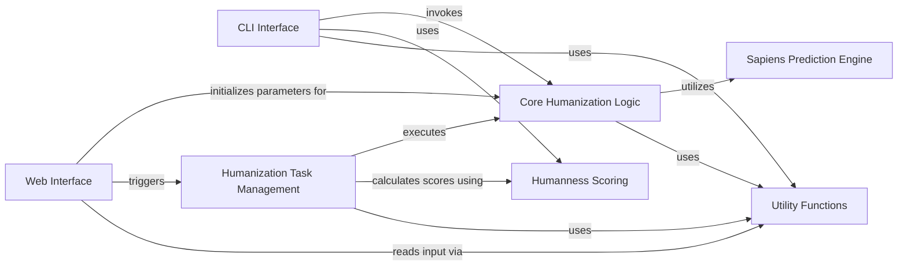

## Component Details

The BioPhi antibody humanization system provides both command-line and web interfaces for transforming non-human antibody sequences into human-like sequences. It orchestrates asynchronous humanization tasks, leveraging core algorithms like Sapiens deep learning and CDR Grafting, and includes functionalities for humanness scoring and general utility operations.

### CLI Interface
This component provides command-line interfaces for antibody humanization, allowing users to interactively humanize sequences, get scores, or generate FASTA outputs. It primarily invokes the core humanization methods.

**Related Classes/Methods**:

- <a href="https://github.com/Merck/BioPhi/blob/master/biophi/humanization/cli/sapiens.py#L127-L137" target="_blank" rel="noopener noreferrer">`biophi.humanization.cli.sapiens:sapiens_interactive` (127:137)</a>
- <a href="https://github.com/Merck/BioPhi/blob/master/biophi/humanization/cli/sapiens.py#L140-L183" target="_blank" rel="noopener noreferrer">`biophi.humanization.cli.sapiens:sapiens_scores_only` (140:183)</a>
- <a href="https://github.com/Merck/BioPhi/blob/master/biophi/humanization/cli/sapiens.py#L186-L212" target="_blank" rel="noopener noreferrer">`biophi.humanization.cli.sapiens:sapiens_fasta_only` (186:212)</a>

### Web Interface
This component handles web-based requests for antibody humanization. It manages GET and POST requests, retrieves germline lists, and initializes various humanization parameters based on user input.

**Related Classes/Methods**:

- <a href="https://github.com/Merck/BioPhi/blob/master/biophi/humanization/web/views.py#L38-L93" target="_blank" rel="noopener noreferrer">`biophi.humanization.web.views:humanize_get` (38:93)</a>
- <a href="https://github.com/Merck/BioPhi/blob/master/biophi/humanization/web/views.py#L97-L160" target="_blank" rel="noopener noreferrer">`biophi.humanization.web.views:humanize_post` (97:160)</a>
- <a href="https://github.com/Merck/BioPhi/blob/master/biophi/humanization/web/views.py#L285-L302" target="_blank" rel="noopener noreferrer">`biophi.humanization.web.views:designer_get` (285:302)</a>
- <a href="https://github.com/Merck/BioPhi/blob/master/biophi/humanization/web/views.py#L28-L34" target="_blank" rel="noopener noreferrer">`biophi.humanization.web.views._get_germline_lists` (28:34)</a>

### Humanization Task Management
This component is responsible for orchestrating asynchronous humanization tasks, particularly for the web interface. It initiates the core humanization process, handles task results, and calculates humanness scores.

**Related Classes/Methods**:

- <a href="https://github.com/Merck/BioPhi/blob/master/biophi/humanization/web/tasks.py#L123-L171" target="_blank" rel="noopener noreferrer">`biophi.humanization.web.tasks:humanize_antibody_task` (123:171)</a>
- <a href="https://github.com/Merck/BioPhi/blob/master/biophi/humanization/web/tasks.py#L24-L119" target="_blank" rel="noopener noreferrer">`biophi.humanization.web.tasks.HumanizeAntibodyTaskResult` (24:119)</a>
- <a href="https://github.com/Merck/BioPhi/blob/master/biophi/humanization/web/tasks.py#L91-L99" target="_blank" rel="noopener noreferrer">`biophi.humanization.web.tasks.HumanizeAntibodyTaskResult:get_export_name` (91:99)</a>
- <a href="https://github.com/Merck/BioPhi/blob/master/biophi/humanization/web/tasks.py#L17-L20" target="_blank" rel="noopener noreferrer">`biophi.humanization.web.tasks.HumanizeAntibodyTaskError` (17:20)</a>

### Core Humanization Logic
This component encapsulates the primary algorithms and methods for antibody humanization, including the Sapiens deep learning model and CDR Grafting techniques. It defines the parameters and processes for transforming non-human antibody sequences into human-like sequences, focusing on sequence modification and optimization.

**Related Classes/Methods**:

- <a href="https://github.com/Merck/BioPhi/blob/master/biophi/humanization/methods/humanization.py#L14-L20" target="_blank" rel="noopener noreferrer">`biophi.humanization.methods.humanization.HumanizationParams` (14:20)</a>
- <a href="https://github.com/Merck/BioPhi/blob/master/biophi/humanization/methods/humanization.py#L24-L38" target="_blank" rel="noopener noreferrer">`biophi.humanization.methods.humanization.SapiensHumanizationParams` (24:38)</a>
- <a href="https://github.com/Merck/BioPhi/blob/master/biophi/humanization/methods/humanization.py#L42-L60" target="_blank" rel="noopener noreferrer">`biophi.humanization.methods.humanization.CDRGraftingHumanizationParams` (42:60)</a>
- <a href="https://github.com/Merck/BioPhi/blob/master/biophi/humanization/methods/humanization.py#L64-L68" target="_blank" rel="noopener noreferrer">`biophi.humanization.methods.humanization.ManualHumanizationParams` (64:68)</a>
- <a href="https://github.com/Merck/BioPhi/blob/master/biophi/humanization/methods/humanization.py#L72-L74" target="_blank" rel="noopener noreferrer">`biophi.humanization.methods.humanization.HumanizedResidueAnnot` (72:74)</a>
- <a href="https://github.com/Merck/BioPhi/blob/master/biophi/humanization/methods/humanization.py#L78-L117" target="_blank" rel="noopener noreferrer">`biophi.humanization.methods.humanization.ChainHumanization` (78:117)</a>
- <a href="https://github.com/Merck/BioPhi/blob/master/biophi/humanization/methods/humanization.py#L95-L97" target="_blank" rel="noopener noreferrer">`biophi.humanization.methods.humanization.ChainHumanization.get_alignment_string` (95:97)</a>
- <a href="https://github.com/Merck/BioPhi/blob/master/biophi/humanization/methods/humanization.py#L110-L117" target="_blank" rel="noopener noreferrer">`biophi.humanization.methods.humanization.ChainHumanization.to_score_dataframe` (110:117)</a>
- <a href="https://github.com/Merck/BioPhi/blob/master/biophi/humanization/methods/humanization.py#L121-L155" target="_blank" rel="noopener noreferrer">`biophi.humanization.methods.humanization.AntibodyHumanization` (121:155)</a>
- <a href="https://github.com/Merck/BioPhi/blob/master/biophi/humanization/methods/humanization.py#L141-L147" target="_blank" rel="noopener noreferrer">`biophi.humanization.methods.humanization.AntibodyHumanization.get_alignment_string` (141:147)</a>
- <a href="https://github.com/Merck/BioPhi/blob/master/biophi/humanization/methods/humanization.py#L149-L155" target="_blank" rel="noopener noreferrer">`biophi.humanization.methods.humanization.AntibodyHumanization.to_score_dataframe` (149:155)</a>
- <a href="https://github.com/Merck/BioPhi/blob/master/biophi/humanization/methods/humanization.py#L158-L162" target="_blank" rel="noopener noreferrer">`biophi.humanization.methods.humanization:humanize_antibody` (158:162)</a>
- <a href="https://github.com/Merck/BioPhi/blob/master/biophi/humanization/methods/humanization.py#L165-L175" target="_blank" rel="noopener noreferrer">`biophi.humanization.methods.humanization:humanize_chain` (165:175)</a>
- <a href="https://github.com/Merck/BioPhi/blob/master/biophi/humanization/methods/humanization.py#L178-L204" target="_blank" rel="noopener noreferrer">`biophi.humanization.methods.humanization:cdr_grafting_humanize_chain` (178:204)</a>
- <a href="https://github.com/Merck/BioPhi/blob/master/biophi/humanization/methods/humanization.py#L207-L246" target="_blank" rel="noopener noreferrer">`biophi.humanization.methods.humanization:sapiens_humanize_chain` (207:246)</a>

### Humanness Scoring
This component is responsible for calculating the humanness scores of antibodies, often used as a metric to evaluate the success of the humanization process.

**Related Classes/Methods**:

- <a href="https://github.com/Merck/BioPhi/blob/master/biophi/humanization/methods/humanness.py#L24-L34" target="_blank" rel="noopener noreferrer">`biophi.humanization.methods.humanness.OASisParams` (24:34)</a>
- <a href="https://github.com/Merck/BioPhi/blob/master/biophi/humanization/methods/humanness.py#L273-L277" target="_blank" rel="noopener noreferrer">`biophi.humanization.methods.humanness.get_antibody_humanness` (273:277)</a>

### Utility Functions
This component provides common utility functions used across the BioPhi system, including input/output operations and string formatting for filenames.

**Related Classes/Methods**:

- <a href="https://github.com/Merck/BioPhi/blob/master/biophi/common/utils/io.py#L112-L167" target="_blank" rel="noopener noreferrer">`biophi.common.utils.io.read_antibody_input_request` (112:167)</a>
- <a href="https://github.com/Merck/BioPhi/blob/master/biophi/common/utils/formatting.py#L57-L59" target="_blank" rel="noopener noreferrer">`biophi.common.utils.formatting.get_valid_filename` (57:59)</a>

### Sapiens Prediction Engine
This component represents the external Sapiens library, which is used to predict scores for antibody sequences, forming a crucial part of the Sapiens humanization method.

**Related Classes/Methods**:

- <a href="https://github.com/Merck/BioPhi/blob/master/biophi/humanization/methods/humanization.py#L249-L257" target="_blank" rel="noopener noreferrer">`biophi.humanization.methods.humanization:sapiens_predict_chain` (249:257)</a>

### [FAQ](https://github.com/CodeBoarding/GeneratedOnBoardings/tree/main?tab=readme-ov-file#faq)