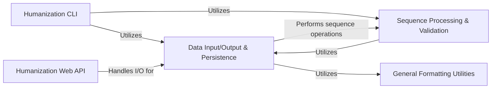

## Component Details

This architecture describes the core components responsible for data handling, sequence processing, and user interaction within the BioPhi project, specifically focusing on humanization tasks. It encompasses modules for reading and writing various data formats, validating and manipulating biological sequences, and exposing these functionalities through both command-line and web-based interfaces. The central flow involves inputting antibody data, processing its sequences, and outputting results in desired formats, with clear separation of concerns for I/O, sequence utilities, and application interfaces.

### Humanization CLI
This component provides command-line interfaces for various humanization tasks, including OASIS and SAPIENS score calculations and FASTA generation. It interacts with IO utilities for file parsing and writing.

**Related Classes/Methods**:

- <a href="https://github.com/Merck/BioPhi/blob/master/biophi/humanization/cli/oasis.py#L18-L95" target="_blank" rel="noopener noreferrer">`BioPhi.biophi.humanization.cli.oasis.oasis` (18:95)</a>
- <a href="https://github.com/Merck/BioPhi/blob/master/biophi/humanization/cli/sapiens.py#L139-L182" target="_blank" rel="noopener noreferrer">`BioPhi.biophi.humanization.cli.sapiens.sapiens_scores_only` (139:182)</a>
- <a href="https://github.com/Merck/BioPhi/blob/master/biophi/humanization/cli/sapiens.py#L185-L211" target="_blank" rel="noopener noreferrer">`BioPhi.biophi.humanization.cli.sapiens.sapiens_fasta_only` (185:211)</a>
- <a href="https://github.com/Merck/BioPhi/blob/master/biophi/humanization/cli/sapiens.py#L214-L280" target="_blank" rel="noopener noreferrer">`BioPhi.biophi.humanization.cli.sapiens.sapiens_full` (214:280)</a>

### Humanization Web API
This component exposes web-based API endpoints for humanization and humanness analysis, handling requests and providing various export formats (FASTA, alignment, Excel tables). It relies on IO utilities for data input and output.

**Related Classes/Methods**:

- <a href="https://github.com/Merck/BioPhi/blob/master/biophi/humanization/web/views.py#L96-L159" target="_blank" rel="noopener noreferrer">`BioPhi.biophi.humanization.web.views.humanize_post` (96:159)</a>
- <a href="https://github.com/Merck/BioPhi/blob/master/biophi/humanization/web/views.py#L221-L228" target="_blank" rel="noopener noreferrer">`BioPhi.biophi.humanization.web.views.humanize_detail_export_humanized_fasta` (221:228)</a>
- <a href="https://github.com/Merck/BioPhi/blob/master/biophi/humanization/web/views.py#L232-L238" target="_blank" rel="noopener noreferrer">`BioPhi.biophi.humanization.web.views.humanize_detail_export_alignment` (232:238)</a>
- <a href="https://github.com/Merck/BioPhi/blob/master/biophi/humanization/web/views.py#L242-L251" target="_blank" rel="noopener noreferrer">`BioPhi.biophi.humanization.web.views.humanize_detail_export_oasis_table` (242:251)</a>
- <a href="https://github.com/Merck/BioPhi/blob/master/biophi/humanization/web/views.py#L255-L259" target="_blank" rel="noopener noreferrer">`BioPhi.biophi.humanization.web.views.humanize_batch_export_humanized_fasta` (255:259)</a>
- <a href="https://github.com/Merck/BioPhi/blob/master/biophi/humanization/web/views.py#L263-L268" target="_blank" rel="noopener noreferrer">`BioPhi.biophi.humanization.web.views.humanize_batch_export_alignments` (263:268)</a>
- <a href="https://github.com/Merck/BioPhi/blob/master/biophi/humanization/web/views.py#L272-L280" target="_blank" rel="noopener noreferrer">`BioPhi.biophi.humanization.web.views.humanize_batch_export_table` (272:280)</a>
- <a href="https://github.com/Merck/BioPhi/blob/master/biophi/humanization/web/views.py#L332-L360" target="_blank" rel="noopener noreferrer">`BioPhi.biophi.humanization.web.views.humanness_post` (332:360)</a>
- <a href="https://github.com/Merck/BioPhi/blob/master/biophi/humanization/web/views.py#L410-L415" target="_blank" rel="noopener noreferrer">`BioPhi.biophi.humanization.web.views.humanness_export_oasis_table` (410:415)</a>
- <a href="https://github.com/Merck/BioPhi/blob/master/biophi/humanization/web/views.py#L419-L426" target="_blank" rel="noopener noreferrer">`BioPhi.biophi.humanization.web.views.humanness_detail_export_oasis_table` (419:426)</a>

### Data Input/Output & Persistence
This component manages all data persistence and transfer operations, including reading antibody input from various sources (files, PDB IDs, requests), parsing sequences, and writing/sending results in different formats (sheets, FASTA, text, Excel). It also defines the core data structures for representing antibody-related information.

**Related Classes/Methods**:

- <a href="https://github.com/Merck/BioPhi/blob/master/biophi/common/utils/io.py#L306-L344" target="_blank" rel="noopener noreferrer">`BioPhi.biophi.common.utils.io.parse_antibody_files` (306:344)</a>
- <a href="https://github.com/Merck/BioPhi/blob/master/biophi/common/utils/io.py#L462-L470" target="_blank" rel="noopener noreferrer">`BioPhi.biophi.common.utils.io.write_sheets` (462:470)</a>
- <a href="https://github.com/Merck/BioPhi/blob/master/biophi/common/utils/io.py#L381-L385" target="_blank" rel="noopener noreferrer">`BioPhi.biophi.common.utils.io.send_fasta` (381:385)</a>
- <a href="https://github.com/Merck/BioPhi/blob/master/biophi/common/utils/io.py#L365-L378" target="_blank" rel="noopener noreferrer">`BioPhi.biophi.common.utils.io.send_text` (365:378)</a>
- <a href="https://github.com/Merck/BioPhi/blob/master/biophi/common/utils/io.py#L473-L485" target="_blank" rel="noopener noreferrer">`BioPhi.biophi.common.utils.io.send_excel` (473:485)</a>
- <a href="https://github.com/Merck/BioPhi/blob/master/biophi/common/utils/io.py#L26-L53" target="_blank" rel="noopener noreferrer">`BioPhi.biophi.common.utils.io.AntibodyPDB` (26:53)</a>
- <a href="https://github.com/Merck/BioPhi/blob/master/biophi/common/utils/io.py#L35-L37" target="_blank" rel="noopener noreferrer">`BioPhi.biophi.common.utils.io.AntibodyPDB.get_heavy_pdb_chain` (35:37)</a>
- <a href="https://github.com/Merck/BioPhi/blob/master/biophi/common/utils/io.py#L39-L41" target="_blank" rel="noopener noreferrer">`BioPhi.biophi.common.utils.io.AntibodyPDB.get_light_pdb_chain` (39:41)</a>
- <a href="https://github.com/Merck/BioPhi/blob/master/biophi/common/utils/io.py#L31-L33" target="_blank" rel="noopener noreferrer">`BioPhi.biophi.common.utils.io.AntibodyPDB.get_model` (31:33)</a>
- <a href="https://github.com/Merck/BioPhi/blob/master/biophi/common/utils/io.py#L49-L50" target="_blank" rel="noopener noreferrer">`BioPhi.biophi.common.utils.io.AntibodyPDB.convert_heavy_positions` (49:50)</a>
- <a href="https://github.com/Merck/BioPhi/blob/master/biophi/common/utils/io.py#L52-L53" target="_blank" rel="noopener noreferrer">`BioPhi.biophi.common.utils.io.AntibodyPDB.convert_light_positions` (52:53)</a>
- <a href="https://github.com/Merck/BioPhi/blob/master/biophi/common/utils/io.py#L169-L177" target="_blank" rel="noopener noreferrer">`BioPhi.biophi.common.utils.io.convert_pdb_positions` (169:177)</a>
- <a href="https://github.com/Merck/BioPhi/blob/master/biophi/common/utils/io.py#L57-L108" target="_blank" rel="noopener noreferrer">`BioPhi.biophi.common.utils.io.AntibodyInput` (57:108)</a>
- <a href="https://github.com/Merck/BioPhi/blob/master/biophi/common/utils/io.py#L63-L69" target="_blank" rel="noopener noreferrer">`BioPhi.biophi.common.utils.io.AntibodyInput.__post_init__` (63:69)</a>
- <a href="https://github.com/Merck/BioPhi/blob/master/biophi/common/utils/io.py#L72-L73" target="_blank" rel="noopener noreferrer">`BioPhi.biophi.common.utils.io.AntibodyInput.safe_name` (72:73)</a>
- <a href="https://github.com/Merck/BioPhi/blob/master/biophi/common/utils/io.py#L76-L78" target="_blank" rel="noopener noreferrer">`BioPhi.biophi.common.utils.io.AntibodyInput.from_pdb_id` (76:78)</a>
- <a href="https://github.com/Merck/BioPhi/blob/master/biophi/common/utils/io.py#L81-L108" target="_blank" rel="noopener noreferrer">`BioPhi.biophi.common.utils.io.AntibodyInput.from_pdb_data` (81:108)</a>
- <a href="https://github.com/Merck/BioPhi/blob/master/biophi/common/utils/io.py#L111-L166" target="_blank" rel="noopener noreferrer">`BioPhi.biophi.common.utils.io.read_antibody_input_request` (111:166)</a>
- <a href="https://github.com/Merck/BioPhi/blob/master/biophi/common/utils/io.py#L211-L253" target="_blank" rel="noopener noreferrer">`BioPhi.biophi.common.utils.io.pair_antibody_records` (211:253)</a>
- <a href="https://github.com/Merck/BioPhi/blob/master/biophi/common/utils/io.py#L200-L208" target="_blank" rel="noopener noreferrer">`BioPhi.biophi.common.utils.io.clean_antibody_name` (200:208)</a>
- <a href="https://github.com/Merck/BioPhi/blob/master/biophi/common/utils/io.py#L256-L265" target="_blank" rel="noopener noreferrer">`BioPhi.biophi.common.utils.io.parse_antibody_pdb_ids` (256:265)</a>
- <a href="https://github.com/Merck/BioPhi/blob/master/biophi/common/utils/io.py#L268-L290" target="_blank" rel="noopener noreferrer">`BioPhi.biophi.common.utils.io.parse_antibody_inputs` (268:290)</a>
- <a href="https://github.com/Merck/BioPhi/blob/master/biophi/common/utils/io.py#L293-L303" target="_blank" rel="noopener noreferrer">`BioPhi.biophi.common.utils.io.read_file_contents` (293:303)</a>
- <a href="https://github.com/Merck/BioPhi/blob/master/biophi/common/utils/io.py#L180-L197" target="_blank" rel="noopener noreferrer">`BioPhi.biophi.common.utils.io.clean_extension` (180:197)</a>
- <a href="https://github.com/Merck/BioPhi/blob/master/biophi/common/utils/io.py#L388-L410" target="_blank" rel="noopener noreferrer">`BioPhi.biophi.common.utils.io.shorten_sheet_names` (388:410)</a>
- <a href="https://github.com/Merck/BioPhi/blob/master/biophi/common/utils/io.py#L488-L494" target="_blank" rel="noopener noreferrer">`BioPhi.biophi.common.utils.io.sanitize_excel_sheet_name` (488:494)</a>
- <a href="https://github.com/Merck/BioPhi/blob/master/biophi/common/utils/io.py#L413-L459" target="_blank" rel="noopener noreferrer">`BioPhi.biophi.common.utils.io.write_sheet` (413:459)</a>

### Sequence Processing & Validation
This component provides utility functions for common sequence-related operations such as iteration, validation, sanitization, and identification of sequence types (e.g., DNA, protein, antibody chains). It also handles PDB downloading.

**Related Classes/Methods**:

- <a href="https://github.com/Merck/BioPhi/blob/master/biophi/common/utils/seq.py#L73-L82" target="_blank" rel="noopener noreferrer">`BioPhi.biophi.common.utils.seq.iterate_fasta` (73:82)</a>
- <a href="https://github.com/Merck/BioPhi/blob/master/biophi/common/utils/seq.py#L51-L70" target="_blank" rel="noopener noreferrer">`BioPhi.biophi.common.utils.seq.iterate_single_fasta` (51:70)</a>
- <a href="https://github.com/Merck/BioPhi/blob/master/biophi/common/utils/seq.py#L42-L48" target="_blank" rel="noopener noreferrer">`BioPhi.biophi.common.utils.seq.iterate_fasta_index` (42:48)</a>
- <a href="https://github.com/Merck/BioPhi/blob/master/biophi/common/utils/seq.py#L26-L27" target="_blank" rel="noopener noreferrer">`BioPhi.biophi.common.utils.seq.is_valid_amino_acid_sequence` (26:27)</a>
- <a href="https://github.com/Merck/BioPhi/blob/master/biophi/common/utils/seq.py#L17-L23" target="_blank" rel="noopener noreferrer">`BioPhi.biophi.common.utils.seq.sanitize_sequence` (17:23)</a>
- <a href="https://github.com/Merck/BioPhi/blob/master/biophi/common/utils/seq.py#L89-L99" target="_blank" rel="noopener noreferrer">`BioPhi.biophi.common.utils.seq.looks_like_antibody_heavy_chain` (89:99)</a>
- <a href="https://github.com/Merck/BioPhi/blob/master/biophi/common/utils/seq.py#L105-L108" target="_blank" rel="noopener noreferrer">`BioPhi.biophi.common.utils.seq.looks_like_dna` (105:108)</a>
- <a href="https://github.com/Merck/BioPhi/blob/master/biophi/common/utils/seq.py#L120-L123" target="_blank" rel="noopener noreferrer">`BioPhi.biophi.common.utils.seq.looks_like_protein` (120:123)</a>
- <a href="https://github.com/Merck/BioPhi/blob/master/biophi/common/utils/seq.py#L126-L132" target="_blank" rel="noopener noreferrer">`BioPhi.biophi.common.utils.seq.validate_dna` (126:132)</a>
- <a href="https://github.com/Merck/BioPhi/blob/master/biophi/common/utils/seq.py#L135-L143" target="_blank" rel="noopener noreferrer">`BioPhi.biophi.common.utils.seq.validate_protein` (135:143)</a>
- <a href="https://github.com/Merck/BioPhi/blob/master/biophi/common/utils/seq.py#L85-L86" target="_blank" rel="noopener noreferrer">`BioPhi.biophi.common.utils.seq.download_pdb` (85:86)</a>
- <a href="https://github.com/Merck/BioPhi/blob/master/biophi/common/utils/seq.py#L30-L39" target="_blank" rel="noopener noreferrer">`BioPhi.biophi.common.utils.seq.parse_plaintext_records` (30:39)</a>

### General Formatting Utilities
This component offers general utility functions for formatting strings, particularly for creating valid filenames.

**Related Classes/Methods**:

- <a href="https://github.com/Merck/BioPhi/blob/master/biophi/common/utils/formatting.py#L56-L58" target="_blank" rel="noopener noreferrer">`BioPhi.biophi.common.utils.formatting.get_valid_filename` (56:58)</a>

### [FAQ](https://github.com/CodeBoarding/GeneratedOnBoardings/tree/main?tab=readme-ov-file#faq)