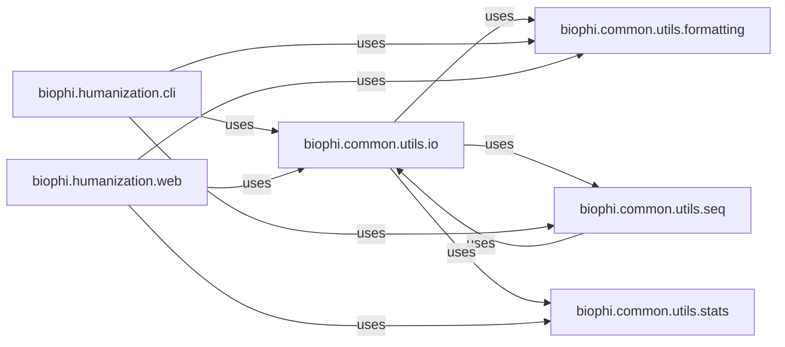

## Details

This section provides a detailed overview of the Data Management & Utilities subsystem within the biophi project. This subsystem is crucial for handling all aspects of data, from input/output operations to sequence manipulation, formatting, and statistical analysis.

### biophi.common.utils.io
Manages input/output operations, including reading and writing biological sequence data. It acts as the primary gateway for all data entering and leaving the system, ensuring data integrity and accessibility.

**Related Classes/Methods**:

- <a href="https://github.com/Merck/BioPhi/biophi/common/utils/io.py#L1-L9999" target="_blank" rel="noopener noreferrer">`biophi.common.utils.io` (1:9999)</a>

### biophi.common.utils.seq
Provides core functionalities for manipulating and processing biological sequences. This component is essential for any sequence-based application, offering utilities for tasks like sequence parsing, validation, and transformation.

**Related Classes/Methods**:

- <a href="https://github.com/Merck/BioPhi/biophi/common/utils/seq.py#L1-L9999" target="_blank" rel="noopener noreferrer">`biophi.common.utils.seq` (1:9999)</a>

### biophi.common.utils.formatting
Offers general utilities for data formatting. This is crucial for maintaining consistent data representation across the application and ensuring interoperability with various data standards and external systems.

**Related Classes/Methods**:

- <a href="https://github.com/Merck/BioPhi/biophi/common/utils/formatting.py#L1-L9999" target="_blank" rel="noopener noreferrer">`biophi.common.utils.formatting` (1:9999)</a>

### biophi.common.utils.stats
Contains statistical functions used for data analysis and validation. It provides the necessary statistical tools to derive meaningful insights from biological data and ensure data quality and reliability.

**Related Classes/Methods**:

- <a href="https://github.com/Merck/BioPhi/biophi/common/utils/stats.py#L1-L9999" target="_blank" rel="noopener noreferrer">`biophi.common.utils.stats` (1:9999)</a>

### biophi.humanization.cli
Represents the command-line interface tools within the humanization module. These tools heavily rely on the Data Management & Utilities components for processing user input, performing sequence operations, and presenting results.

**Related Classes/Methods**:

- `biophi.humanization.cli` (1:9999)

### biophi.humanization.web
Represents the web-based components and views within the humanization module. Similar to the CLI tools, these components utilize the Data Management & Utilities for handling data submitted via web forms, processing it, and displaying formatted outputs.

**Related Classes/Methods**:

- `biophi.humanization.web` (1:9999)

### [FAQ](https://github.com/CodeBoarding/GeneratedOnBoardings/tree/main?tab=readme-ov-file#faq)