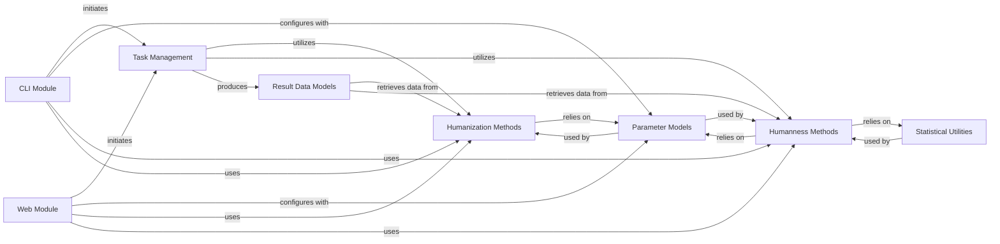

## Component Details

The Humanization & Humanness Core component of BioPhi serves as the central engine for antibody engineering, encompassing both the modification of antibody sequences to enhance their human-like properties and the quantitative assessment of their 'humanness'. It integrates sophisticated algorithms like Sapiens and CDR Grafting for humanization, and the OASis method for humanness evaluation. This core system defines the necessary input parameters and structures the analytical results, performing the intricate sequence manipulations and calculations that underpin the BioPhi platform's capabilities in antibody design and optimization.

### CLI Module
Provides command-line interfaces for initiating humanization and humanness evaluation tasks, allowing users to interact with the BioPhi system directly from the terminal.

**Related Classes/Methods**:

- <a href="https://github.com/Merck/BioPhi/blob/master/biophi/humanization/cli/oasis.py#L18-L95" target="_blank" rel="noopener noreferrer">`biophi.humanization.cli.oasis.oasis` (18:95)</a>
- <a href="https://github.com/Merck/BioPhi/blob/master/biophi/humanization/cli/sapiens.py#L32-L123" target="_blank" rel="noopener noreferrer">`biophi.humanization.cli.sapiens.sapiens` (32:123)</a>
- <a href="https://github.com/Merck/BioPhi/blob/master/biophi/humanization/cli/sapiens.py#L126-L136" target="_blank" rel="noopener noreferrer">`biophi.humanization.cli.sapiens.sapiens_interactive` (126:136)</a>
- <a href="https://github.com/Merck/BioPhi/blob/master/biophi/humanization/cli/sapiens.py#L139-L182" target="_blank" rel="noopener noreferrer">`biophi.humanization.cli.sapiens.sapiens_scores_only` (139:182)</a>
- <a href="https://github.com/Merck/BioPhi/blob/master/biophi/humanization/cli/sapiens.py#L185-L211" target="_blank" rel="noopener noreferrer">`biophi.humanization.cli.sapiens.sapiens_fasta_only` (185:211)</a>
- <a href="https://github.com/Merck/BioPhi/blob/master/biophi/humanization/cli/sapiens.py#L214-L280" target="_blank" rel="noopener noreferrer">`biophi.humanization.cli.sapiens.sapiens_full` (214:280)</a>
- <a href="https://github.com/Merck/BioPhi/blob/master/biophi/humanization/cli/oasis.py#L98-L103" target="_blank" rel="noopener noreferrer">`biophi.humanization.cli.oasis.humanness_task_wrapper` (98:103)</a>

### Web Module
Manages web-based interactions, handling HTTP requests and responses for humanization and humanness services, providing a graphical user interface for BioPhi functionalities.

**Related Classes/Methods**:

- <a href="https://github.com/Merck/BioPhi/blob/master/biophi/humanization/web/views.py#L37-L92" target="_blank" rel="noopener noreferrer">`biophi.humanization.web.views.humanize_get` (37:92)</a>
- <a href="https://github.com/Merck/BioPhi/blob/master/biophi/humanization/web/views.py#L96-L159" target="_blank" rel="noopener noreferrer">`biophi.humanization.web.views.humanize_post` (96:159)</a>
- <a href="https://github.com/Merck/BioPhi/blob/master/biophi/humanization/web/views.py#L332-L360" target="_blank" rel="noopener noreferrer">`biophi.humanization.web.views.humanness_post` (332:360)</a>
- <a href="https://github.com/Merck/BioPhi/blob/master/biophi/humanization/web/views.py#L410-L415" target="_blank" rel="noopener noreferrer">`biophi.humanization.web.views.humanness_export_oasis_table` (410:415)</a>

### Humanization Methods
Encapsulates the core algorithms and logic for performing antibody humanization, including methods like Sapiens and CDR Grafting, which modify antibody sequences to be more human-like.

**Related Classes/Methods**:

- <a href="https://github.com/Merck/BioPhi/blob/master/biophi/humanization/methods/humanization.py#L120-L154" target="_blank" rel="noopener noreferrer">`BioPhi.biophi.humanization.methods.humanization.AntibodyHumanization` (120:154)</a>
- <a href="https://github.com/Merck/BioPhi/blob/master/biophi/humanization/methods/humanization.py#L140-L146" target="_blank" rel="noopener noreferrer">`BioPhi.biophi.humanization.methods.humanization.AntibodyHumanization.get_alignment_string` (140:146)</a>
- <a href="https://github.com/Merck/BioPhi/blob/master/biophi/humanization/methods/humanization.py#L148-L154" target="_blank" rel="noopener noreferrer">`BioPhi.biophi.humanization.methods.humanization.AntibodyHumanization.to_score_dataframe` (148:154)</a>
- <a href="https://github.com/Merck/BioPhi/blob/master/biophi/humanization/methods/humanization.py#L77-L116" target="_blank" rel="noopener noreferrer">`BioPhi.biophi.humanization.methods.humanization.ChainHumanization` (77:116)</a>
- <a href="https://github.com/Merck/BioPhi/blob/master/biophi/humanization/methods/humanization.py#L109-L116" target="_blank" rel="noopener noreferrer">`BioPhi.biophi.humanization.methods.humanization.ChainHumanization.to_score_dataframe` (109:116)</a>
- <a href="https://github.com/Merck/BioPhi/blob/master/biophi/humanization/methods/humanization.py#L94-L96" target="_blank" rel="noopener noreferrer">`BioPhi.biophi.humanization.methods.humanization.ChainHumanization.get_alignment_string` (94:96)</a>
- <a href="https://github.com/Merck/BioPhi/blob/master/biophi/humanization/methods/humanization.py#L157-L161" target="_blank" rel="noopener noreferrer">`BioPhi.biophi.humanization.methods.humanization.humanize_antibody` (157:161)</a>
- <a href="https://github.com/Merck/BioPhi/blob/master/biophi/humanization/methods/humanization.py#L164-L174" target="_blank" rel="noopener noreferrer">`BioPhi.biophi.humanization.methods.humanization.humanize_chain` (164:174)</a>
- <a href="https://github.com/Merck/BioPhi/blob/master/biophi/humanization/methods/humanization.py#L177-L203" target="_blank" rel="noopener noreferrer">`BioPhi.biophi.humanization.methods.humanization.cdr_grafting_humanize_chain` (177:203)</a>
- <a href="https://github.com/Merck/BioPhi/blob/master/biophi/humanization/methods/humanization.py#L206-L245" target="_blank" rel="noopener noreferrer">`BioPhi.biophi.humanization.methods.humanization.sapiens_humanize_chain` (206:245)</a>
- <a href="https://github.com/Merck/BioPhi/blob/master/biophi/humanization/methods/humanization.py#L248-L256" target="_blank" rel="noopener noreferrer">`BioPhi.biophi.humanization.methods.humanization.sapiens_predict_chain` (248:256)</a>

### Humanness Methods
Provides functionalities for evaluating the humanness of antibodies and individual chains, primarily utilizing the OASis method to score sequences based on their similarity to human antibody repertoires.

**Related Classes/Methods**:

- <a href="https://github.com/Merck/BioPhi/blob/master/biophi/humanization/methods/humanness.py#L59-L194" target="_blank" rel="noopener noreferrer">`BioPhi.biophi.humanization.methods.humanness.ChainHumanness` (59:194)</a>
- <a href="https://github.com/Merck/BioPhi/blob/master/biophi/humanization/methods/humanness.py#L75-L86" target="_blank" rel="noopener noreferrer">`BioPhi.biophi.humanization.methods.humanness.ChainHumanness.get_oasis_curve` (75:86)</a>
- <a href="https://github.com/Merck/BioPhi/blob/master/biophi/humanization/methods/humanness.py#L88-L89" target="_blank" rel="noopener noreferrer">`BioPhi.biophi.humanization.methods.humanness.ChainHumanness.get_oasis_identity` (88:89)</a>
- <a href="https://github.com/Merck/BioPhi/blob/master/biophi/humanization/methods/humanness.py#L91-L96" target="_blank" rel="noopener noreferrer">`BioPhi.biophi.humanization.methods.humanness.ChainHumanness.get_oasis_percentile` (91:96)</a>
- <a href="https://github.com/Merck/BioPhi/blob/master/biophi/humanization/methods/humanness.py#L118-L124" target="_blank" rel="noopener noreferrer">`BioPhi.biophi.humanization.methods.humanness.ChainHumanness.get_peptide` (118:124)</a>
- <a href="https://github.com/Merck/BioPhi/blob/master/biophi/humanization/methods/humanness.py#L115-L116" target="_blank" rel="noopener noreferrer">`BioPhi.biophi.humanization.methods.humanness.ChainHumanness.has_position` (115:116)</a>
- <a href="https://github.com/Merck/BioPhi/blob/master/biophi/humanization/methods/humanness.py#L131-L142" target="_blank" rel="noopener noreferrer">`BioPhi.biophi.humanization.methods.humanness.ChainHumanness.get_positional_humanness` (131:142)</a>
- <a href="https://github.com/Merck/BioPhi/blob/master/biophi/humanization/methods/humanness.py#L144-L168" target="_blank" rel="noopener noreferrer">`BioPhi.biophi.humanization.methods.humanness.ChainHumanness.to_peptide_dataframe` (144:168)</a>
- <a href="https://github.com/Merck/BioPhi/blob/master/biophi/humanization/methods/humanness.py#L102-L104" target="_blank" rel="noopener noreferrer">`BioPhi.biophi.humanization.methods.humanness.ChainHumanness.get_j_germline_chains` (102:104)</a>
- <a href="https://github.com/Merck/BioPhi/blob/master/biophi/humanization/methods/humanness.py#L98-L100" target="_blank" rel="noopener noreferrer">`BioPhi.biophi.humanization.methods.humanness.ChainHumanness.get_v_germline_chains` (98:100)</a>
- <a href="https://github.com/Merck/BioPhi/blob/master/biophi/humanization/methods/humanness.py#L106-L107" target="_blank" rel="noopener noreferrer">`BioPhi.biophi.humanization.methods.humanness.ChainHumanness.get_num_human_peptides` (106:107)</a>
- <a href="https://github.com/Merck/BioPhi/blob/master/biophi/humanization/methods/humanness.py#L112-L113" target="_blank" rel="noopener noreferrer">`BioPhi.biophi.humanization.methods.humanness.ChainHumanness.get_num_peptides` (112:113)</a>
- <a href="https://github.com/Merck/BioPhi/blob/master/biophi/humanization/methods/humanness.py#L109-L110" target="_blank" rel="noopener noreferrer">`BioPhi.biophi.humanization.methods.humanness.ChainHumanness.get_num_nonhuman_peptides` (109:110)</a>
- <a href="https://github.com/Merck/BioPhi/blob/master/biophi/humanization/methods/humanness.py#L180-L181" target="_blank" rel="noopener noreferrer">`BioPhi.biophi.humanization.methods.humanness.ChainHumanness.get_germline_content` (180:181)</a>
- <a href="https://github.com/Merck/BioPhi/blob/master/biophi/humanization/methods/humanness.py#L198-L254" target="_blank" rel="noopener noreferrer">`BioPhi.biophi.humanization.methods.humanness.AntibodyHumanness` (198:254)</a>
- <a href="https://github.com/Merck/BioPhi/blob/master/biophi/humanization/methods/humanness.py#L202-L203" target="_blank" rel="noopener noreferrer">`BioPhi.biophi.humanization.methods.humanness.AntibodyHumanness.get_oasis_identity` (202:203)</a>
- <a href="https://github.com/Merck/BioPhi/blob/master/biophi/humanization/methods/humanness.py#L205-L210" target="_blank" rel="noopener noreferrer">`BioPhi.biophi.humanization.methods.humanness.AntibodyHumanness.get_oasis_percentile` (205:210)</a>
- <a href="https://github.com/Merck/BioPhi/blob/master/biophi/humanization/methods/humanness.py#L212-L222" target="_blank" rel="noopener noreferrer">`BioPhi.biophi.humanization.methods.humanness.AntibodyHumanness.get_oasis_curve` (212:222)</a>
- <a href="https://github.com/Merck/BioPhi/blob/master/biophi/humanization/methods/humanness.py#L224-L225" target="_blank" rel="noopener noreferrer">`BioPhi.biophi.humanization.methods.humanness.AntibodyHumanness.get_num_peptides` (224:225)</a>
- <a href="https://github.com/Merck/BioPhi/blob/master/biophi/humanization/methods/humanness.py#L227-L229" target="_blank" rel="noopener noreferrer">`BioPhi.biophi.humanization.methods.humanness.AntibodyHumanness.get_num_human_peptides` (227:229)</a>
- <a href="https://github.com/Merck/BioPhi/blob/master/biophi/humanization/methods/humanness.py#L231-L233" target="_blank" rel="noopener noreferrer">`BioPhi.biophi.humanization.methods.humanness.AntibodyHumanness.get_num_nonhuman_peptides` (231:233)</a>
- <a href="https://github.com/Merck/BioPhi/blob/master/biophi/humanization/methods/humanness.py#L235-L241" target="_blank" rel="noopener noreferrer">`BioPhi.biophi.humanization.methods.humanness.AntibodyHumanness.to_peptide_dataframe` (235:241)</a>
- <a href="https://github.com/Merck/BioPhi/blob/master/biophi/humanization/methods/humanness.py#L272-L276" target="_blank" rel="noopener noreferrer">`BioPhi.biophi.humanization.methods.humanness.get_antibody_humanness` (272:276)</a>
- <a href="https://github.com/Merck/BioPhi/blob/master/biophi/humanization/methods/humanness.py#L279-L315" target="_blank" rel="noopener noreferrer">`BioPhi.biophi.humanization.methods.humanness.get_chain_oasis_peptides` (279:315)</a>
- <a href="https://github.com/Merck/BioPhi/blob/master/biophi/humanization/methods/humanness.py#L257-L269" target="_blank" rel="noopener noreferrer">`BioPhi.biophi.humanization.methods.humanness.chop_seq_peptides` (257:269)</a>
- <a href="https://github.com/Merck/BioPhi/blob/master/biophi/humanization/methods/humanness.py#L37-L55" target="_blank" rel="noopener noreferrer">`BioPhi.biophi.humanization.methods.humanness.PeptideHumanness` (37:55)</a>
- <a href="https://github.com/Merck/BioPhi/blob/master/biophi/humanization/methods/humanness.py#L354-L366" target="_blank" rel="noopener noreferrer">`BioPhi.biophi.humanization.methods.humanness.get_oas_hits` (354:366)</a>
- <a href="https://github.com/Merck/BioPhi/blob/master/biophi/humanization/methods/humanness.py#L345-L351" target="_blank" rel="noopener noreferrer">`BioPhi.biophi.humanization.methods.humanness.parse_peptide_humanness` (345:351)</a>
- <a href="https://github.com/Merck/BioPhi/blob/master/biophi/humanization/methods/humanness.py#L171-L178" target="_blank" rel="noopener noreferrer">`BioPhi.biophi.humanization.methods.humanness.ChainHumanness.to_sequence_dataframe` (171:178)</a>

### Task Management
Defines and orchestrates asynchronous background tasks for processing computationally intensive humanization and humanness requests, ensuring non-blocking operations for user interfaces.

**Related Classes/Methods**:

- <a href="https://github.com/Merck/BioPhi/blob/master/biophi/humanization/web/tasks.py#L122-L170" target="_blank" rel="noopener noreferrer">`biophi.humanization.web.tasks.humanize_antibody_task` (122:170)</a>
- <a href="https://github.com/Merck/BioPhi/blob/master/biophi/humanization/web/tasks.py#L286-L311" target="_blank" rel="noopener noreferrer">`biophi.humanization.web.tasks.humanness_task` (286:311)</a>
- <a href="https://github.com/Merck/BioPhi/blob/master/biophi/humanization/web/tasks.py#L174-L204" target="_blank" rel="noopener noreferrer">`biophi.humanization.web.tasks.mutate_humanized_antibody_task` (174:204)</a>

### Result Data Models
Contains data structures that hold the comprehensive results of humanization and humanness analyses, providing methods for data serialization, aggregation, and export into various formats.

**Related Classes/Methods**:

- <a href="https://github.com/Merck/BioPhi/blob/master/biophi/humanization/web/tasks.py#L246-L247" target="_blank" rel="noopener noreferrer">`BioPhi.biophi.humanization.web.tasks.HumannessTaskResult.to_overview_dataframe` (246:247)</a>
- <a href="https://github.com/Merck/BioPhi/blob/master/biophi/humanization/web/tasks.py#L250-L256" target="_blank" rel="noopener noreferrer">`BioPhi.biophi.humanization.web.tasks.HumannessTaskResult.to_oasis_curve_dataframe` (250:256)</a>
- <a href="https://github.com/Merck/BioPhi/blob/master/biophi/humanization/web/tasks.py#L45-L46" target="_blank" rel="noopener noreferrer">`BioPhi.biophi.humanization.web.tasks.HumanizeAntibodyTaskResult.to_overview_dataframe` (45:46)</a>
- <a href="https://github.com/Merck/BioPhi/blob/master/biophi/humanization/web/tasks.py#L49-L66" target="_blank" rel="noopener noreferrer">`BioPhi.biophi.humanization.web.tasks.HumanizeAntibodyTaskResult.to_oasis_curve_dataframe` (49:66)</a>
- <a href="https://github.com/Merck/BioPhi/blob/master/biophi/humanization/web/tasks.py#L23-L118" target="_blank" rel="noopener noreferrer">`biophi.humanization.web.tasks.HumanizeAntibodyTaskResult` (23:118)</a>
- <a href="https://github.com/Merck/BioPhi/blob/master/biophi/humanization/web/tasks.py#L214-L283" target="_blank" rel="noopener noreferrer">`biophi.humanization.web.tasks.HumannessTaskResult` (214:283)</a>

### Parameter Models
Classes defining the various parameters and configurations required for humanization and humanness calculations, ensuring consistent and validated input for the core methods.

**Related Classes/Methods**:

- <a href="https://github.com/Merck/BioPhi/blob/master/biophi/humanization/methods/humanization.py#L23-L37" target="_blank" rel="noopener noreferrer">`BioPhi.biophi.humanization.methods.humanization.SapiensHumanizationParams` (23:37)</a>
- <a href="https://github.com/Merck/BioPhi/blob/master/biophi/humanization/methods/humanization.py#L41-L59" target="_blank" rel="noopener noreferrer">`BioPhi.biophi.humanization.methods.humanization.CDRGraftingHumanizationParams` (41:59)</a>
- <a href="https://github.com/Merck/BioPhi/blob/master/biophi/humanization/methods/humanization.py#L63-L67" target="_blank" rel="noopener noreferrer">`BioPhi.biophi.humanization.methods.humanization.ManualHumanizationParams` (63:67)</a>
- <a href="https://github.com/Merck/BioPhi/blob/master/biophi/humanization/methods/humanization.py#L48-L59" target="_blank" rel="noopener noreferrer">`BioPhi.biophi.humanization.methods.humanization.CDRGraftingHumanizationParams.get_export_name` (48:59)</a>
- <a href="https://github.com/Merck/BioPhi/blob/master/biophi/humanization/methods/humanization.py#L18-L19" target="_blank" rel="noopener noreferrer">`BioPhi.biophi.humanization.methods.humanization.HumanizationParams.get_export_name` (18:19)</a>
- <a href="https://github.com/Merck/BioPhi/blob/master/biophi/humanization/methods/humanization.py#L13-L19" target="_blank" rel="noopener noreferrer">`BioPhi.biophi.humanization.methods.humanization.HumanizationParams` (13:19)</a>
- <a href="https://github.com/Merck/BioPhi/blob/master/biophi/humanization/methods/humanness.py#L23-L33" target="_blank" rel="noopener noreferrer">`BioPhi.biophi.humanization.methods.humanness.OASisParams` (23:33)</a>

### Statistical Utilities
Provides helper functions for statistical calculations, particularly those related to OASis humanness scoring and germline frequency analysis, supporting the quantitative evaluation of antibody sequences.

**Related Classes/Methods**:

- <a href="https://github.com/Merck/BioPhi/blob/master/biophi/humanization/methods/stats.py#L21-L39" target="_blank" rel="noopener noreferrer">`biophi.humanization.methods.stats.get_oasis_percentile` (21:39)</a>
- <a href="https://github.com/Merck/BioPhi/blob/master/biophi/humanization/methods/stats.py#L5-L8" target="_blank" rel="noopener noreferrer">`biophi.humanization.methods.stats.get_germline_family_residue_frequency` (5:8)</a>
- <a href="https://github.com/Merck/BioPhi/blob/master/biophi/humanization/methods/stats.py#L11-L13" target="_blank" rel="noopener noreferrer">`biophi.humanization.methods.stats.get_chain_type_residue_frequency` (11:13)</a>
- <a href="https://github.com/Merck/BioPhi/blob/master/biophi/humanization/methods/stats.py#L16-L18" target="_blank" rel="noopener noreferrer">`biophi.humanization.methods.stats._get_frequency` (16:18)</a>

### [FAQ](https://github.com/CodeBoarding/GeneratedOnBoardings/tree/main?tab=readme-ov-file#faq)