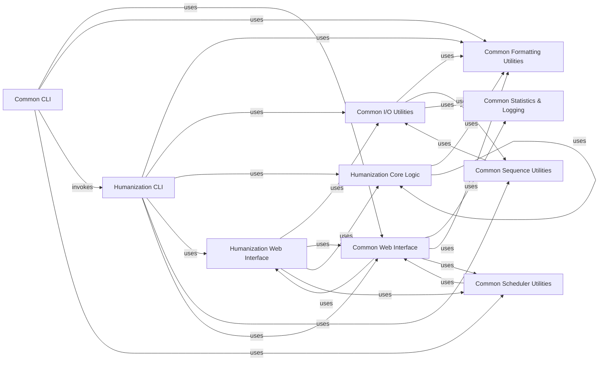

## Component Details

This graph illustrates the architecture of the BioPhi project, focusing on its command-line interfaces, core humanization logic, and common utilities. The main flow involves the Common CLI acting as the central entry point, which can invoke the Humanization CLI for specific humanization tasks. Both CLI components heavily rely on Common Formatting Utilities for consistent output. The Humanization CLI further interacts with the Humanization Core Logic to perform the actual humanization calculations and also utilizes Common I/O Utilities for input processing and Common Sequence Utilities for sequence manipulation. Both CLI components and the Humanization Web Interface leverage Common Statistics & Logging for tracking usage and task results, and Common Scheduler Utilities for task management. The Common Web Interface serves as a foundational layer for web-based functionalities, interacting with both Common Statistics & Logging and the Humanization Web Interface. The overall purpose is to provide a robust and modular system for antibody humanization, with clear separation of concerns between CLI, core logic, and utility functions, while also supporting web-based interactions and comprehensive logging.

### Humanization CLI
This component provides command-line interfaces for humanization tasks, specifically for 'oasis' and 'sapiens' methods. It serves as the entry point for users to initiate humanization processes.

**Related Classes/Methods**:

- <a href="https://github.com/Merck/BioPhi/blob/master/biophi/humanization/cli/oasis.py#L18-L95" target="_blank" rel="noopener noreferrer">`biophi.humanization.cli.oasis.oasis` (18:95)</a>
- <a href="https://github.com/Merck/BioPhi/blob/master/biophi/humanization/cli/sapiens.py#L32-L123" target="_blank" rel="noopener noreferrer">`biophi.humanization.cli.sapiens.sapiens` (32:123)</a>

### Humanization Core Logic
This component encapsulates the core algorithms and statistical methods for antibody humanization and humanness calculation. It includes functions for calculating residue frequencies, determining humanness percentiles, and managing humanization parameters.

**Related Classes/Methods**:

- <a href="https://github.com/Merck/BioPhi/blob/master/biophi/humanization/methods/stats.py#L5-L8" target="_blank" rel="noopener noreferrer">`biophi.humanization.methods.stats.get_germline_family_residue_frequency` (5:8)</a>
- <a href="https://github.com/Merck/BioPhi/blob/master/biophi/humanization/methods/stats.py#L11-L13" target="_blank" rel="noopener noreferrer">`biophi.humanization.methods.stats.get_chain_type_residue_frequency` (11:13)</a>
- <a href="https://github.com/Merck/BioPhi/blob/master/biophi/humanization/methods/stats.py#L16-L18" target="_blank" rel="noopener noreferrer">`biophi.humanization.methods.stats._get_frequency` (16:18)</a>
- <a href="https://github.com/Merck/BioPhi/blob/master/biophi/humanization/methods/humanness.py#L91-L96" target="_blank" rel="noopener noreferrer">`biophi.humanization.methods.humanness.ChainHumanness.get_oasis_percentile` (91:96)</a>
- <a href="https://github.com/Merck/BioPhi/blob/master/biophi/humanization/methods/humanness.py#L205-L210" target="_blank" rel="noopener noreferrer">`biophi.humanization.methods.humanness.AntibodyHumanness.get_oasis_percentile` (205:210)</a>
- <a href="https://github.com/Merck/BioPhi/blob/master/biophi/humanization/methods/stats.py#L21-L39" target="_blank" rel="noopener noreferrer">`biophi.humanization.methods.stats.get_oasis_percentile` (21:39)</a>
- <a href="https://github.com/Merck/BioPhi/blob/master/biophi/humanization/methods/humanness.py#L318-L342" target="_blank" rel="noopener noreferrer">`biophi.humanization.methods.humanness.get_chain_humanness` (318:342)</a>
- <a href="https://github.com/Merck/BioPhi/blob/master/biophi/humanization/methods/humanization.py#L48-L59" target="_blank" rel="noopener noreferrer">`biophi.humanization.methods.humanization.CDRGraftingHumanizationParams.get_export_name` (48:59)</a>

### Common CLI
This component handles general command-line interface functionalities for the BioPhi project, including the main entry point and web-related CLI commands.

**Related Classes/Methods**:

- <a href="https://github.com/Merck/BioPhi/blob/master/biophi/common/cli/web.py#L9-L20" target="_blank" rel="noopener noreferrer">`biophi.common.cli.web.web` (9:20)</a>
- <a href="https://github.com/Merck/BioPhi/blob/master/biophi/common/cli/main.py#L8-L21" target="_blank" rel="noopener noreferrer">`biophi.common.cli.main.MainGroup.__call__` (8:21)</a>

### Common Formatting Utilities
This component provides general utility functions for formatting output, such as generating logos, spacers, and valid filenames. These utilities are used across different parts of the BioPhi system for consistent presentation.

**Related Classes/Methods**:

- <a href="https://github.com/Merck/BioPhi/blob/master/biophi/common/utils/formatting.py#L10-L23" target="_blank" rel="noopener noreferrer">`biophi.common.utils.formatting.logo` (10:23)</a>
- <a href="https://github.com/Merck/BioPhi/blob/master/biophi/common/utils/formatting.py#L6-L7" target="_blank" rel="noopener noreferrer">`biophi.common.utils.formatting.spacer` (6:7)</a>
- <a href="https://github.com/Merck/BioPhi/blob/master/biophi/common/utils/formatting.py#L61-L63" target="_blank" rel="noopener noreferrer">`biophi.common.utils.formatting.human_size` (61:63)</a>
- <a href="https://github.com/Merck/BioPhi/blob/master/biophi/common/utils/formatting.py#L56-L58" target="_blank" rel="noopener noreferrer">`biophi.common.utils.formatting.get_valid_filename` (56:58)</a>

### Common Statistics & Logging
This component is responsible for collecting and logging statistical data related to system usage and task execution. It provides functions for getting statistics, logging submissions, task results, and general data, often interacting with a backend engine for data persistence.

**Related Classes/Methods**:

- <a href="https://github.com/Merck/BioPhi/blob/master/biophi/common/utils/stats.py#L12-L21" target="_blank" rel="noopener noreferrer">`biophi.common.utils.stats.get_stats` (12:21)</a>
- <a href="https://github.com/Merck/BioPhi/blob/master/biophi/common/utils/stats.py#L24-L41" target="_blank" rel="noopener noreferrer">`biophi.common.utils.stats.log_submission` (24:41)</a>
- <a href="https://github.com/Merck/BioPhi/blob/master/biophi/common/utils/stats.py#L44-L53" target="_blank" rel="noopener noreferrer">`biophi.common.utils.stats.log_task_result` (44:53)</a>
- <a href="https://github.com/Merck/BioPhi/blob/master/biophi/common/utils/stats.py#L56-L66" target="_blank" rel="noopener noreferrer">`biophi.common.utils.stats.log_access` (56:66)</a>
- <a href="https://github.com/Merck/BioPhi/blob/master/biophi/common/utils/stats.py#L69-L98" target="_blank" rel="noopener noreferrer">`biophi.common.utils.stats.log_data` (69:98)</a>
- <a href="https://github.com/Merck/BioPhi/blob/master/biophi/common/utils/stats.py#L104-L114" target="_blank" rel="noopener noreferrer">`biophi.common.utils.stats.get_engine` (104:114)</a>

### Common I/O Utilities
This component handles input/output operations, particularly for antibody-related data. It includes functions for safely naming files and reading antibody input requests.

**Related Classes/Methods**:

- <a href="https://github.com/Merck/BioPhi/blob/master/biophi/common/utils/io.py#L72-L73" target="_blank" rel="noopener noreferrer">`biophi.common.utils.io.AntibodyInput.safe_name` (72:73)</a>
- <a href="https://github.com/Merck/BioPhi/blob/master/biophi/common/utils/io.py#L111-L166" target="_blank" rel="noopener noreferrer">`biophi.common.utils.io.read_antibody_input_request` (111:166)</a>

### Common Web Interface
This component manages the web-based views and background tasks for the common functionalities of BioPhi.

**Related Classes/Methods**:

- <a href="https://github.com/Merck/BioPhi/blob/master/biophi/common/web/views.py#L90-L100" target="_blank" rel="noopener noreferrer">`biophi.common.web.views.stats` (90:100)</a>
- <a href="https://github.com/Merck/BioPhi/blob/master/biophi/common/web/tasks.py#L38-L42" target="_blank" rel="noopener noreferrer">`biophi.common.web.tasks.log_task_postrun` (38:42)</a>
- <a href="https://github.com/Merck/BioPhi/blob/master/biophi/common/web/tasks.py#L46-L49" target="_blank" rel="noopener noreferrer">`biophi.common.web.tasks.log_task_failure` (46:49)</a>

### Common Scheduler Utilities
This component provides utilities for scheduling tasks, likely integrating with a task queue system like Celery.

**Related Classes/Methods**:

- `biophi.common.utils.scheduler` (full file reference)

### Common Sequence Utilities
This component provides utility functions for sequence manipulation and processing.

**Related Classes/Methods**:

- `biophi.common.utils.seq` (full file reference)

### Humanization Web Interface
This component manages web-based views and background tasks specifically for humanization functionalities.

**Related Classes/Methods**:

- `biophi.humanization.web.tasks` (full file reference)
- `biophi.humanization.web.views` (full file reference)

### [FAQ](https://github.com/CodeBoarding/GeneratedOnBoardings/tree/main?tab=readme-ov-file#faq)