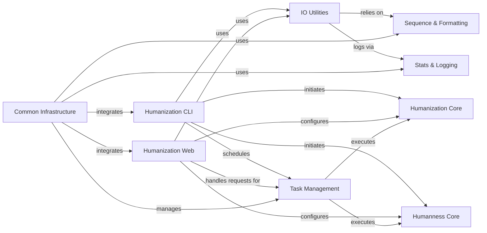

## Component Details

This component provides the primary interaction points for users, encompassing both command-line interfaces (CLI) for direct tool execution (OASis, Sapiens) and the web-based interface for broader accessibility. It handles user input, displays results, and orchestrates the initiation of core BioPhi functionalities.

### Humanization CLI
Provides command-line tools for users to perform antibody humanization (Sapiens) and humanness evaluation (OASis). It parses command-line arguments, loads input files, and orchestrates the execution of the core humanization and humanness logic.

**Related Classes/Methods**:

- <a href="https://github.com/Merck/BioPhi/blob/master/biophi/humanization/cli/oasis.py#L19-L96" target="_blank" rel="noopener noreferrer">`biophi.humanization.cli.oasis` (19:96)</a>
- <a href="https://github.com/Merck/BioPhi/blob/master/biophi/humanization/cli/sapiens.py#L33-L124" target="_blank" rel="noopener noreferrer">`biophi.humanization.cli.sapiens` (33:124)</a>

### Humanization Web
Implements the web-based user interface for BioPhi's humanization features. It handles HTTP requests, renders templates, processes form submissions, and interacts with the asynchronous task management system to perform humanization and humanness analysis.

**Related Classes/Methods**:

- `biophi.humanization.web.views` (full file reference)

### Common Infrastructure
Provides foundational components for both the command-line and web interfaces, including the main CLI group, Flask application setup, and scheduler integration.

**Related Classes/Methods**:

- <a href="https://github.com/Merck/BioPhi/blob/master/biophi/common/cli/web.py#L10-L21" target="_blank" rel="noopener noreferrer">`biophi.common.cli.web` (10:21)</a>
- <a href="https://github.com/Merck/BioPhi/blob/master/biophi/common/cli/main.py#L8-L22" target="_blank" rel="noopener noreferrer">`biophi.common.cli.main.MainGroup` (8:22)</a>
- `biophi.common.web.views` (full file reference)
- `biophi.common.utils.scheduler` (full file reference)

### Humanization Core
Contains the fundamental algorithms and data structures for performing antibody humanization, including Sapiens and CDR Grafting methods. It defines parameters for humanization and provides functions to humanize individual chains or entire antibodies.

**Related Classes/Methods**:

- `biophi.humanization.methods.humanization` (full file reference)

### Humanness Core
Provides the core functionality for evaluating antibody humanness, primarily through the OASis method. It interacts with an OAS peptide database to determine the humanness of antibody sequences.

**Related Classes/Methods**:

- `biophi.humanization.methods.humanness` (full file reference)

### Task Management
Manages the execution of long-running humanization and humanness analysis tasks asynchronously, typically using Celery. It defines task results and provides methods for scheduling and retrieving task outcomes.

**Related Classes/Methods**:

- `biophi.humanization.web.tasks` (full file reference)
- `biophi.common.web.tasks` (full file reference)

### IO Utilities
A collection of utility functions for handling various input and output operations, including parsing antibody sequence files (FASTA, PDB), reading web requests, and sending data as FASTA, text, or Excel files.

**Related Classes/Methods**:

- `biophi.common.utils.io` (full file reference)

### Sequence & Formatting
Contains general utility functions for sequence manipulation (validation, sanitization, parsing FASTA/PDB) and formatting output (logos, valid filenames, human-readable sizes).

**Related Classes/Methods**:

- `biophi.common.utils.seq` (full file reference)
- `biophi.common.utils.formatting` (full file reference)

### Stats & Logging
Manages the collection and storage of application statistics and logs, including submission details, task results, and access logs.

**Related Classes/Methods**:

- `biophi.common.utils.stats` (full file reference)

### [FAQ](https://github.com/CodeBoarding/GeneratedOnBoardings/tree/main?tab=readme-ov-file#faq)