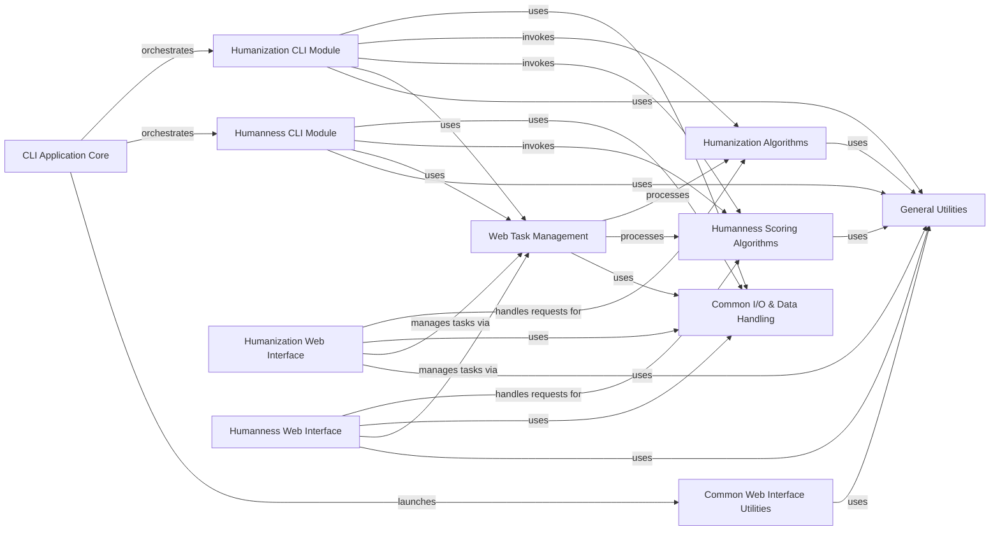

## Component Details

This component provides both command-line and web-based interfaces for BioPhi's functionalities. It handles user input, displays results, and manages file exports for both CLI and web users. It acts as the primary interaction point for users.

### CLI Application Core
This component serves as the main entry point for command-line operations, orchestrating calls to specific CLI modules for humanization and humanness scoring. It handles overall CLI application flow and common CLI functionalities, including the ability to launch the web application.

**Related Classes/Methods**:

- <a href="https://github.com/Merck/BioPhi/blob/master/biophi/common/cli/main.py#L8-L21" target="_blank" rel="noopener noreferrer">`BioPhi.biophi.common.cli.main.MainGroup.__call__` (8:21)</a>
- <a href="https://github.com/Merck/BioPhi/blob/master/biophi/common/cli/web.py#L9-L20" target="_blank" rel="noopener noreferrer">`BioPhi.biophi.common.cli.web.web` (9:20)</a>

### Humanization CLI Module
Manages command-line interface operations specifically for Sapiens humanization, handling input parsing, workflow execution, and result output for CLI users.

**Related Classes/Methods**:

- <a href="https://github.com/Merck/BioPhi/blob/master/biophi/humanization/cli/sapiens.py#L32-L123" target="_blank" rel="noopener noreferrer">`BioPhi.biophi.humanization.cli.sapiens.sapiens` (32:123)</a>
- <a href="https://github.com/Merck/BioPhi/blob/master/biophi/humanization/cli/sapiens.py#L126-L136" target="_blank" rel="noopener noreferrer">`BioPhi.biophi.humanization.cli.sapiens.sapiens_interactive` (126:136)</a>
- <a href="https://github.com/Merck/BioPhi/blob/master/biophi/humanization/cli/sapiens.py#L139-L182" target="_blank" rel="noopener noreferrer">`BioPhi.biophi.humanization.cli.sapiens.sapiens_scores_only` (139:182)</a>
- <a href="https://github.com/Merck/BioPhi/blob/master/biophi/humanization/cli/sapiens.py#L185-L211" target="_blank" rel="noopener noreferrer">`BioPhi.biophi.humanization.cli.sapiens.sapiens_fasta_only` (185:211)</a>
- <a href="https://github.com/Merck/BioPhi/blob/master/biophi/humanization/cli/sapiens.py#L214-L280" target="_blank" rel="noopener noreferrer">`BioPhi.biophi.humanization.cli.sapiens.sapiens_full` (214:280)</a>

### Humanness CLI Module
Manages command-line interface operations specifically for OASis humanness scoring, handling input parsing, workflow execution, and result output for CLI users.

**Related Classes/Methods**:

- <a href="https://github.com/Merck/BioPhi/blob/master/biophi/humanization/cli/oasis.py#L18-L95" target="_blank" rel="noopener noreferrer">`BioPhi.biophi.humanization.cli.oasis.oasis` (18:95)</a>
- <a href="https://github.com/Merck/BioPhi/blob/master/biophi/humanization/cli/oasis.py#L106-L118" target="_blank" rel="noopener noreferrer">`BioPhi.biophi.humanization.cli.oasis.show_unpaired_warning` (106:118)</a>
- <a href="https://github.com/Merck/BioPhi/blob/master/biophi/humanization/cli/oasis.py#L98-L103" target="_blank" rel="noopener noreferrer">`BioPhi.biophi.humanization.cli.oasis.humanness_task_wrapper` (98:103)</a>

### Humanization Web Interface
Provides the web-based user interface for humanization analysis, including handling GET/POST requests for humanization forms, displaying results, and managing data exports related to humanization.

**Related Classes/Methods**:

- <a href="https://github.com/Merck/BioPhi/blob/master/biophi/humanization/web/views.py#L37-L92" target="_blank" rel="noopener noreferrer">`BioPhi.biophi.humanization.web.views.humanize_get` (37:92)</a>
- <a href="https://github.com/Merck/BioPhi/blob/master/biophi/humanization/web/views.py#L27-L33" target="_blank" rel="noopener noreferrer">`BioPhi.biophi.humanization.web.views._get_germline_lists` (27:33)</a>
- <a href="https://github.com/Merck/BioPhi/blob/master/biophi/humanization/web/views.py#L96-L159" target="_blank" rel="noopener noreferrer">`BioPhi.biophi.humanization.web.views.humanize_post` (96:159)</a>
- <a href="https://github.com/Merck/BioPhi/blob/master/biophi/humanization/web/views.py#L221-L228" target="_blank" rel="noopener noreferrer">`BioPhi.biophi.humanization.web.views.humanize_detail_export_humanized_fasta` (221:228)</a>
- <a href="https://github.com/Merck/BioPhi/blob/master/biophi/humanization/web/views.py#L232-L238" target="_blank" rel="noopener noreferrer">`BioPhi.biophi.humanization.web.views.humanize_detail_export_alignment` (232:238)</a>
- <a href="https://github.com/Merck/BioPhi/blob/master/biophi/humanization/web/views.py#L242-L251" target="_blank" rel="noopener noreferrer">`BioPhi.biophi.humanization.web.views.humanize_detail_export_oasis_table` (242:251)</a>
- <a href="https://github.com/Merck/BioPhi/blob/master/biophi/humanization/web/views.py#L255-L259" target="_blank" rel="noopener noreferrer">`BioPhi.biophi.humanization.web.views.humanize_batch_export_humanized_fasta` (255:259)</a>
- <a href="https://github.com/Merck/BioPhi/blob/master/biophi/humanization/web/views.py#L263-L268" target="_blank" rel="noopener noreferrer">`BioPhi.biophi.humanization.web.views.humanize_batch_export_alignments` (263:268)</a>
- <a href="https://github.com/Merck/BioPhi/blob/master/biophi/humanization/web/views.py#L272-L280" target="_blank" rel="noopener noreferrer">`BioPhi.biophi.humanization.web.views.humanize_batch_export_table` (272:280)</a>
- <a href="https://github.com/Merck/BioPhi/blob/master/biophi/humanization/web/views.py#L284-L301" target="_blank" rel="noopener noreferrer">`BioPhi.biophi.humanization.web.views.designer_get` (284:301)</a>

### Humanness Web Interface
Provides the web-based user interface for humanness scoring, including handling GET/POST requests for humanness forms, displaying results, and managing data exports related to humanness.

**Related Classes/Methods**:

- <a href="https://github.com/Merck/BioPhi/blob/master/biophi/humanization/web/views.py#L332-L360" target="_blank" rel="noopener noreferrer">`BioPhi.biophi.humanization.web.views.humanness_post` (332:360)</a>
- <a href="https://github.com/Merck/BioPhi/blob/master/biophi/humanization/web/views.py#L410-L415" target="_blank" rel="noopener noreferrer">`BioPhi.biophi.humanization.web.views.humanness_export_oasis_table` (410:415)</a>
- <a href="https://github.com/Merck/BioPhi/blob/master/biophi/humanization/web/views.py#L419-L426" target="_blank" rel="noopener noreferrer">`BioPhi.biophi.humanization.web.views.humanness_detail_export_oasis_table` (419:426)</a>

### Common Web Interface Utilities
Provides general web-related functionalities such as displaying statistics, info icons, and other common UI elements across the web application.

**Related Classes/Methods**:

- <a href="https://github.com/Merck/BioPhi/blob/master/biophi/common/web/views.py#L90-L100" target="_blank" rel="noopener noreferrer">`BioPhi.biophi.common.web.views.stats` (90:100)</a>
- <a href="https://github.com/Merck/BioPhi/blob/master/biophi/common/web/views.py#L113-L116" target="_blank" rel="noopener noreferrer">`BioPhi.biophi.common.web.views.info_icon` (113:116)</a>
- <a href="https://github.com/Merck/BioPhi/blob/master/biophi/common/web/views.py#L107-L109" target="_blank" rel="noopener noreferrer">`BioPhi.biophi.common.web.views.icon` (107:109)</a>

### Humanization Algorithms
Contains the core computational logic for various antibody humanization methods (Sapiens, CDR Grafting, Manual) and the underlying chain humanization process.

**Related Classes/Methods**:

- <a href="https://github.com/Merck/BioPhi/blob/master/biophi/humanization/methods/humanization.py#L23-L37" target="_blank" rel="noopener noreferrer">`biophi.humanization.methods.humanization.SapiensHumanizationParams` (23:37)</a>
- <a href="https://github.com/Merck/BioPhi/blob/master/biophi/humanization/methods/humanization.py#L41-L59" target="_blank" rel="noopener noreferrer">`biophi.humanization.methods.humanization.CDRGraftingHumanizationParams` (41:59)</a>
- <a href="https://github.com/Merck/BioPhi/blob/master/biophi/humanization/methods/humanization.py#L63-L67" target="_blank" rel="noopener noreferrer">`biophi.humanization.methods.humanization.ManualHumanizationParams` (63:67)</a>
- <a href="https://github.com/Merck/BioPhi/blob/master/biophi/humanization/methods/humanization.py#L164-L174" target="_blank" rel="noopener noreferrer">`biophi.humanization.methods.humanization.humanize_chain` (164:174)</a>
- <a href="https://github.com/Merck/BioPhi/blob/master/biophi/humanization/methods/humanization.py#L109-L116" target="_blank" rel="noopener noreferrer">`biophi.humanization.methods.humanization.ChainHumanization.to_score_dataframe` (109:116)</a>

### Humanness Scoring Algorithms
Implements the algorithms and parameters specifically for calculating antibody humanness scores, primarily through the OASis method.

**Related Classes/Methods**:

- <a href="https://github.com/Merck/BioPhi/blob/master/biophi/humanization/methods/humanness.py#L23-L33" target="_blank" rel="noopener noreferrer">`biophi.humanization.methods.humanness.OASisParams` (23:33)</a>

### Common I/O & Data Handling
Provides a set of utility functions for managing input/output operations, including parsing files, reading requests, writing data to sheets, and sending various file formats as responses.

**Related Classes/Methods**:

- <a href="https://github.com/Merck/BioPhi/blob/master/biophi/common/utils/io.py#L306-L344" target="_blank" rel="noopener noreferrer">`biophi.common.utils.io.parse_antibody_files` (306:344)</a>
- <a href="https://github.com/Merck/BioPhi/blob/master/biophi/common/utils/io.py#L462-L470" target="_blank" rel="noopener noreferrer">`biophi.common.utils.io.write_sheets` (462:470)</a>
- <a href="https://github.com/Merck/BioPhi/blob/master/biophi/common/utils/io.py#L111-L166" target="_blank" rel="noopener noreferrer">`biophi.common.utils.io.read_antibody_input_request` (111:166)</a>
- <a href="https://github.com/Merck/BioPhi/blob/master/biophi/common/utils/io.py#L381-L385" target="_blank" rel="noopener noreferrer">`biophi.common.utils.io.send_fasta` (381:385)</a>
- <a href="https://github.com/Merck/BioPhi/blob/master/biophi/common/utils/io.py#L365-L378" target="_blank" rel="noopener noreferrer">`biophi.common.utils.io.send_text` (365:378)</a>
- <a href="https://github.com/Merck/BioPhi/blob/master/biophi/common/utils/io.py#L473-L485" target="_blank" rel="noopener noreferrer">`biophi.common.utils.io.send_excel` (473:485)</a>

### General Utilities
Offers general-purpose utility functions for formatting (e.g., logos, spacers), scheduling tasks, retrieving system statistics, and sequence manipulation, used across different parts of the application.

**Related Classes/Methods**:

- <a href="https://github.com/Merck/BioPhi/blob/master/biophi/common/utils/formatting.py#L10-L23" target="_blank" rel="noopener noreferrer">`biophi.common.utils.formatting.logo` (10:23)</a>
- <a href="https://github.com/Merck/BioPhi/blob/master/biophi/common/utils/scheduler.py#L178-L185" target="_blank" rel="noopener noreferrer">`biophi.common.utils.scheduler.use_scheduler` (178:185)</a>
- <a href="https://github.com/Merck/BioPhi/blob/master/biophi/common/utils/formatting.py#L6-L7" target="_blank" rel="noopener noreferrer">`biophi.common.utils.formatting.spacer` (6:7)</a>
- <a href="https://github.com/Merck/BioPhi/blob/master/biophi/common/utils/stats.py#L12-L21" target="_blank" rel="noopener noreferrer">`biophi.common.utils.stats.get_stats` (12:21)</a>
- <a href="https://github.com/Merck/BioPhi/blob/master/biophi/common/utils/seq.py#L73-L82" target="_blank" rel="noopener noreferrer">`biophi.common.utils.seq.iterate_fasta` (73:82)</a>

### Web Task Management
Manages the asynchronous execution and result handling of web-based humanization and humanness tasks, including converting task results into structured data for display or export.

**Related Classes/Methods**:

- <a href="https://github.com/Merck/BioPhi/blob/master/biophi/humanization/web/tasks.py#L259-L275" target="_blank" rel="noopener noreferrer">`biophi.humanization.web.tasks.HumannessTaskResult.to_sheets` (259:275)</a>
- <a href="https://github.com/Merck/BioPhi/blob/master/biophi/humanization/web/tasks.py#L69-L88" target="_blank" rel="noopener noreferrer">`biophi.humanization.web.tasks.HumanizeAntibodyTaskResult.to_sheets` (69:88)</a>
- <a href="https://github.com/Merck/BioPhi/blob/master/biophi/humanization/web/tasks.py#L286-L311" target="_blank" rel="noopener noreferrer">`biophi.humanization.web.tasks.humanness_task` (286:311)</a>
- `biophi.common.web.tasks` (full file reference)

### [FAQ](https://github.com/CodeBoarding/GeneratedOnBoardings/tree/main?tab=readme-ov-file#faq)