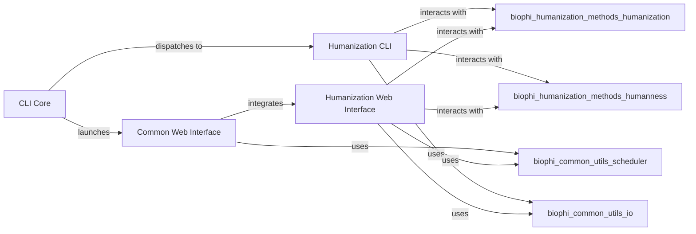

## Details

This component serves as the primary interface for users, managing both command-line interactions and the web application. It is responsible for handling initial user input and dispatching requests for processing or task initiation to the relevant backend components.

### CLI Core
Manages the core command-line interface functionalities, including the main entry point for the BioPhi application and the command to start the web server. It acts as a dispatcher for various CLI commands.

**Related Classes/Methods**:

- <a href="https://github.com/Merck/BioPhi/biophi/common/cli/main.py#L1-L1" target="_blank" rel="noopener noreferrer">`biophi/common/cli/main.py` (1:1)</a>
- <a href="https://github.com/Merck/BioPhi/biophi/common/cli/web.py#L1-L1" target="_blank" rel="noopener noreferrer">`biophi/common/cli/web.py` (1:1)</a>

### Humanization CLI
Provides command-line tools specifically designed for antibody humanization tasks, such as OASis and Sapiens. These tools allow users to perform humanization operations directly from the command line.

**Related Classes/Methods**:

- <a href="https://github.com/Merck/BioPhi/biophi/humanization/cli/oasis.py#L1-L1" target="_blank" rel="noopener noreferrer">`biophi/humanization/cli/oasis.py` (1:1)</a>
- <a href="https://github.com/Merck/BioPhi/biophi/humanization/cli/sapiens.py#L1-L1" target="_blank" rel="noopener noreferrer">`biophi/humanization/cli/sapiens.py` (1:1)</a>

### Common Web Interface
Manages the foundational elements of the web application, including common views, static assets (CSS, JS, images), and HTML templates. It provides the basic structure and shared functionalities for the web UI.

**Related Classes/Methods**:

- <a href="https://github.com/Merck/BioPhi/biophi/common/web/views.py#L1-L1" target="_blank" rel="noopener noreferrer">`biophi/common/web/views.py` (1:1)</a>
- `biophi/common/web/static/` (1:1)
- `biophi/common/web/templates/` (1:1)

### Humanization Web Interface
Provides the web-based user interface specifically for antibody humanization tasks. This includes forms for input, display of results, and interaction with the humanization methods through the web. It also handles web-initiated background tasks.

**Related Classes/Methods**:

- <a href="https://github.com/Merck/BioPhi/biophi/humanization/web/views.py#L1-L1" target="_blank" rel="noopener noreferrer">`biophi/humanization/web/views.py` (1:1)</a>
- `biophi/humanization/web/static/` (1:1)
- `biophi/humanization/web/templates/` (1:1)
- <a href="https://github.com/Merck/BioPhi/biophi/humanization/web/tasks.py#L1-L1" target="_blank" rel="noopener noreferrer">`biophi/humanization/web/tasks.py` (1:1)</a>

### [FAQ](https://github.com/CodeBoarding/GeneratedOnBoardings/tree/main?tab=readme-ov-file#faq)