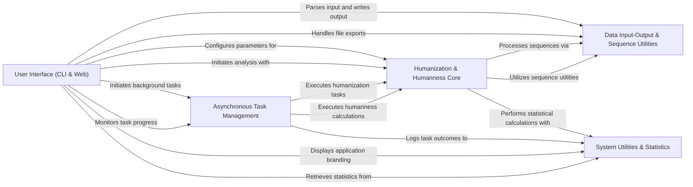

## Component Details

BioPhi is a software application designed for antibody humanization and humanness analysis. It provides both command-line and web-based interfaces for users to submit antibody sequences for processing. Long-running tasks like humanization and humanness calculations are managed asynchronously, leveraging core algorithms for Sapiens and OASis methods. The system handles diverse data input/output formats and utilizes a suite of general utilities for sequence processing, formatting, and statistics logging, ensuring efficient and robust operation.

### User Interface (CLI & Web)
This component provides both command-line and web-based interfaces for BioPhi's functionalities. It handles user input, displays results, and manages file exports for both CLI and web users. It acts as the primary interaction point for users.

**Related Classes/Methods**:

- <a href="https://github.com/Merck/BioPhi/blob/master/biophi/humanization/cli/oasis.py#L18-L95" target="_blank" rel="noopener noreferrer">`BioPhi.biophi.humanization.cli.oasis.oasis` (18:95)</a>
- <a href="https://github.com/Merck/BioPhi/blob/master/biophi/humanization/cli/oasis.py#L106-L118" target="_blank" rel="noopener noreferrer">`BioPhi.biophi.humanization.cli.oasis.show_unpaired_warning` (106:118)</a>
- <a href="https://github.com/Merck/BioPhi/blob/master/biophi/humanization/cli/oasis.py#L98-L103" target="_blank" rel="noopener noreferrer">`BioPhi.biophi.humanization.cli.oasis.humanness_task_wrapper` (98:103)</a>
- <a href="https://github.com/Merck/BioPhi/blob/master/biophi/humanization/cli/sapiens.py#L32-L123" target="_blank" rel="noopener noreferrer">`BioPhi.biophi.humanization.cli.sapiens.sapiens` (32:123)</a>
- <a href="https://github.com/Merck/BioPhi/blob/master/biophi/humanization/cli/sapiens.py#L126-L136" target="_blank" rel="noopener noreferrer">`BioPhi.biophi.humanization.cli.sapiens.sapiens_interactive` (126:136)</a>
- <a href="https://github.com/Merck/BioPhi/blob/master/biophi/humanization/cli/sapiens.py#L139-L182" target="_blank" rel="noopener noreferrer">`BioPhi.biophi.humanization.cli.sapiens.sapiens_scores_only` (139:182)</a>
- <a href="https://github.com/Merck/BioPhi/blob/master/biophi/humanization/cli/sapiens.py#L185-L211" target="_blank" rel="noopener noreferrer">`BioPhi.biophi.humanization.cli.sapiens.sapiens_fasta_only` (185:211)</a>
- <a href="https://github.com/Merck/BioPhi/blob/master/biophi/humanization/cli/sapiens.py#L214-L280" target="_blank" rel="noopener noreferrer">`BioPhi.biophi.humanization.cli.sapiens.sapiens_full` (214:280)</a>
- <a href="https://github.com/Merck/BioPhi/blob/master/biophi/common/cli/web.py#L9-L20" target="_blank" rel="noopener noreferrer">`BioPhi.biophi.common.cli.web.web` (9:20)</a>
- <a href="https://github.com/Merck/BioPhi/blob/master/biophi/common/cli/main.py#L8-L21" target="_blank" rel="noopener noreferrer">`BioPhi.biophi.common.cli.main.MainGroup.__call__` (8:21)</a>
- <a href="https://github.com/Merck/BioPhi/blob/master/biophi/humanization/web/views.py#L37-L92" target="_blank" rel="noopener noreferrer">`BioPhi.biophi.humanization.web.views.humanize_get` (37:92)</a>
- <a href="https://github.com/Merck/BioPhi/blob/master/biophi/humanization/web/views.py#L27-L33" target="_blank" rel="noopener noreferrer">`BioPhi.biophi.humanization.web.views._get_germline_lists` (27:33)</a>
- <a href="https://github.com/Merck/BioPhi/blob/master/biophi/humanization/web/views.py#L96-L159" target="_blank" rel="noopener noreferrer">`BioPhi.biophi.humanization.web.views.humanize_post` (96:159)</a>
- <a href="https://github.com/Merck/BioPhi/blob/master/biophi/humanization/web/views.py#L221-L228" target="_blank" rel="noopener noreferrer">`BioPhi.biophi.humanization.web.views.humanize_detail_export_humanized_fasta` (221:228)</a>
- <a href="https://github.com/Merck/BioPhi/blob/master/biophi/humanization/web/views.py#L232-L238" target="_blank" rel="noopener noreferrer">`BioPhi.biophi.humanization.web.views.humanize_detail_export_alignment` (232:238)</a>
- <a href="https://github.com/Merck/BioPhi/blob/master/biophi/humanization/web/views.py#L242-L251" target="_blank" rel="noopener noreferrer">`BioPhi.biophi.humanization.web.views.humanize_detail_export_oasis_table` (242:251)</a>
- <a href="https://github.com/Merck/BioPhi/blob/master/biophi/humanization/web/views.py#L255-L259" target="_blank" rel="noopener noreferrer">`BioPhi.biophi.humanization.web.views.humanize_batch_export_humanized_fasta` (255:259)</a>
- <a href="https://github.com/Merck/BioPhi/blob/master/biophi/humanization/web/views.py#L263-L268" target="_blank" rel="noopener noreferrer">`BioPhi.biophi.humanization.web.views.humanize_batch_export_alignments` (263:268)</a>
- <a href="https://github.com/Merck/BioPhi/blob/master/biophi/humanization/web/views.py#L272-L280" target="_blank" rel="noopener noreferrer">`BioPhi.biophi.humanization.web.views.humanize_batch_export_table` (272:280)</a>
- <a href="https://github.com/Merck/BioPhi/blob/master/biophi/humanization/web/views.py#L284-L301" target="_blank" rel="noopener noreferrer">`BioPhi.biophi.humanization.web.views.designer_get` (284:301)</a>
- <a href="https://github.com/Merck/BioPhi/blob/master/biophi/humanization/web/views.py#L332-L360" target="_blank" rel="noopener noreferrer">`BioPhi.biophi.humanization.web.views.humanness_post` (332:360)</a>
- <a href="https://github.com/Merck/BioPhi/blob/master/biophi/humanization/web/views.py#L410-L415" target="_blank" rel="noopener noreferrer">`BioPhi.biophi.humanization.web.views.humanness_export_oasis_table` (410:415)</a>
- <a href="https://github.com/Merck/BioPhi/blob/master/biophi/humanization/web/views.py#L419-L426" target="_blank" rel="noopener noreferrer">`BioPhi.biophi.humanization.web.views.humanness_detail_export_oasis_table` (419:426)</a>
- <a href="https://github.com/Merck/BioPhi/blob/master/biophi/common/web/views.py#L90-L100" target="_blank" rel="noopener noreferrer">`BioPhi.biophi.common.web.views.stats` (90:100)</a>
- <a href="https://github.com/Merck/BioPhi/blob/master/biophi/common/web/views.py#L113-L116" target="_blank" rel="noopener noreferrer">`BioPhi.biophi.common.web.views.info_icon` (113:116)</a>
- <a href="https://github.com/Merck/BioPhi/blob/master/biophi/common/web/views.py#L107-L109" target="_blank" rel="noopener noreferrer">`BioPhi.biophi.common.web.views.icon` (107:109)</a>

### Asynchronous Task Management
This component is responsible for defining, scheduling, and managing the execution of long-running tasks, such as antibody humanization and humanness calculations, typically in a background process. It also handles the logging of task results and failures, utilizing schedulers like Celery for distributed task execution.

**Related Classes/Methods**:

- <a href="https://github.com/Merck/BioPhi/blob/master/biophi/humanization/web/tasks.py#L31-L42" target="_blank" rel="noopener noreferrer">`BioPhi.biophi.humanization.web.tasks.HumanizeAntibodyTaskResult.to_series` (31:42)</a>
- <a href="https://github.com/Merck/BioPhi/blob/master/biophi/humanization/web/tasks.py#L69-L88" target="_blank" rel="noopener noreferrer">`BioPhi.biophi.humanization.web.tasks.HumanizeAntibodyTaskResult.to_sheets` (69:88)</a>
- <a href="https://github.com/Merck/BioPhi/blob/master/biophi/humanization/web/tasks.py#L90-L98" target="_blank" rel="noopener noreferrer">`BioPhi.biophi.humanization.web.tasks.HumanizeAntibodyTaskResult.get_export_name` (90:98)</a>
- <a href="https://github.com/Merck/BioPhi/blob/master/biophi/humanization/web/tasks.py#L100-L110" target="_blank" rel="noopener noreferrer">`BioPhi.biophi.humanization.web.tasks.HumanizeAntibodyTaskResult.get_humanized_records` (100:110)</a>
- <a href="https://github.com/Merck/BioPhi/blob/master/biophi/humanization/web/tasks.py#L122-L170" target="_blank" rel="noopener noreferrer">`BioPhi.biophi.humanization.web.tasks.humanize_antibody_task` (122:170)</a>
- <a href="https://github.com/Merck/BioPhi/blob/master/biophi/humanization/web/tasks.py#L174-L204" target="_blank" rel="noopener noreferrer">`BioPhi.biophi.humanization.web.tasks.mutate_humanized_antibody_task` (174:204)</a>
- <a href="https://github.com/Merck/BioPhi/blob/master/biophi/humanization/web/tasks.py#L219-L243" target="_blank" rel="noopener noreferrer">`BioPhi.biophi.humanization.web.tasks.HumannessTaskResult.to_series` (219:243)</a>
- <a href="https://github.com/Merck/BioPhi/blob/master/biophi/humanization/web/tasks.py#L259-L275" target="_blank" rel="noopener noreferrer">`BioPhi.biophi.humanization.web.tasks.HumannessTaskResult.to_sheets` (259:275)</a>
- <a href="https://github.com/Merck/BioPhi/blob/master/biophi/humanization/web/tasks.py#L286-L311" target="_blank" rel="noopener noreferrer">`BioPhi.biophi.humanization.web.tasks.humanness_task` (286:311)</a>
- <a href="https://github.com/Merck/BioPhi/blob/master/biophi/humanization/web/tasks.py#L16-L19" target="_blank" rel="noopener noreferrer">`BioPhi.biophi.humanization.web.tasks.HumanizeAntibodyTaskError` (16:19)</a>
- <a href="https://github.com/Merck/BioPhi/blob/master/biophi/humanization/web/tasks.py#L207-L210" target="_blank" rel="noopener noreferrer">`BioPhi.biophi.humanization.web.tasks.HumannessTaskError` (207:210)</a>
- <a href="https://github.com/Merck/BioPhi/blob/master/biophi/common/web/tasks.py#L38-L42" target="_blank" rel="noopener noreferrer">`BioPhi.biophi.common.web.tasks.log_task_postrun` (38:42)</a>
- <a href="https://github.com/Merck/BioPhi/blob/master/biophi/common/web/tasks.py#L46-L49" target="_blank" rel="noopener noreferrer">`BioPhi.biophi.common.web.tasks.log_task_failure` (46:49)</a>
- <a href="https://github.com/Merck/BioPhi/blob/master/biophi/common/utils/scheduler.py#L46-L89" target="_blank" rel="noopener noreferrer">`BioPhi.biophi.common.utils.scheduler.CeleryScheduler` (46:89)</a>
- <a href="https://github.com/Merck/BioPhi/blob/master/biophi/common/utils/scheduler.py#L92-L135" target="_blank" rel="noopener noreferrer">`BioPhi.biophi.common.utils.scheduler.SimpleInMemoryScheduler` (92:135)</a>
- <a href="https://github.com/Merck/BioPhi/blob/master/biophi/common/utils/scheduler.py#L138-L164" target="_blank" rel="noopener noreferrer">`BioPhi.biophi.common.utils.scheduler.NotInitializedScheduler` (138:164)</a>
- <a href="https://github.com/Merck/BioPhi/blob/master/biophi/common/utils/scheduler.py#L7-L8" target="_blank" rel="noopener noreferrer">`BioPhi.biophi.common.utils.scheduler.TaskNotFoundError` (7:8)</a>
- <a href="https://github.com/Merck/BioPhi/blob/master/biophi/common/utils/scheduler.py#L178-L185" target="_blank" rel="noopener noreferrer">`BioPhi.biophi.common.utils.scheduler.use_scheduler` (178:185)</a>
- <a href="https://github.com/Merck/BioPhi/blob/master/biophi/common/utils/scheduler.py#L48-L52" target="_blank" rel="noopener noreferrer">`BioPhi.biophi.common.utils.scheduler.CeleryScheduler.get_celery_group_result` (48:52)</a>
- <a href="https://github.com/Merck/BioPhi/blob/master/biophi/common/utils/scheduler.py#L54-L63" target="_blank" rel="noopener noreferrer">`BioPhi.biophi.common.utils.scheduler.CeleryScheduler.get_result` (54:63)</a>
- <a href="https://github.com/Merck/BioPhi/blob/master/biophi/common/utils/scheduler.py#L65-L66" target="_blank" rel="noopener noreferrer">`BioPhi.biophi.common.utils.scheduler.CeleryScheduler.get_result_task_id` (65:66)</a>
- <a href="https://github.com/Merck/BioPhi/blob/master/biophi/common/utils/scheduler.py#L68-L69" target="_blank" rel="noopener noreferrer">`BioPhi.biophi.common.utils.scheduler.CeleryScheduler.get_results` (68:69)</a>
- <a href="https://github.com/Merck/BioPhi/blob/master/biophi/common/utils/scheduler.py#L71-L72" target="_blank" rel="noopener noreferrer">`BioPhi.biophi.common.utils.scheduler.CeleryScheduler.get_results_len` (71:72)</a>
- <a href="https://github.com/Merck/BioPhi/blob/master/biophi/common/utils/scheduler.py#L74-L75" target="_blank" rel="noopener noreferrer">`BioPhi.biophi.common.utils.scheduler.CeleryScheduler.are_results_ready` (74:75)</a>
- <a href="https://github.com/Merck/BioPhi/blob/master/biophi/common/utils/scheduler.py#L77-L80" target="_blank" rel="noopener noreferrer">`BioPhi.biophi.common.utils.scheduler.CeleryScheduler.get_results_progress` (77:80)</a>
- <a href="https://github.com/Merck/BioPhi/blob/master/biophi/common/utils/scheduler.py#L102-L108" target="_blank" rel="noopener noreferrer">`BioPhi.biophi.common.utils.scheduler.SimpleInMemoryScheduler.get_result` (102:108)</a>
- <a href="https://github.com/Merck/BioPhi/blob/master/biophi/common/utils/scheduler.py#L110-L112" target="_blank" rel="noopener noreferrer">`BioPhi.biophi.common.utils.scheduler.SimpleInMemoryScheduler.get_result_task_id` (110:112)</a>
- <a href="https://github.com/Merck/BioPhi/blob/master/biophi/common/utils/scheduler.py#L114-L116" target="_blank" rel="noopener noreferrer">`BioPhi.biophi.common.utils.scheduler.SimpleInMemoryScheduler.get_results` (114:116)</a>
- <a href="https://github.com/Merck/BioPhi/blob/master/biophi/common/utils/scheduler.py#L118-L119" target="_blank" rel="noopener noreferrer">`BioPhi.biophi.common.utils.scheduler.SimpleInMemoryScheduler.get_results_len` (118:119)</a>
- <a href="https://github.com/Merck/BioPhi/blob/master/biophi/common/utils/scheduler.py#L128-L129" target="_blank" rel="noopener noreferrer">`BioPhi.biophi.common.utils.scheduler.SimpleInMemoryScheduler.schedule_task` (128:129)</a>
- <a href="https://github.com/Merck/BioPhi/blob/master/biophi/common/utils/scheduler.py#L131-L135" target="_blank" rel="noopener noreferrer">`BioPhi.biophi.common.utils.scheduler.SimpleInMemoryScheduler.schedule_tasks` (131:135)</a>
- <a href="https://github.com/Merck/BioPhi/blob/master/biophi/common/utils/scheduler.py#L95-L100" target="_blank" rel="noopener noreferrer">`BioPhi.biophi.common.utils.scheduler.SimpleInMemoryScheduler.save_result` (95:100)</a>
- <a href="https://github.com/Merck/BioPhi/blob/master/biophi/common/utils/scheduler.py#L142-L143" target="_blank" rel="noopener noreferrer">`BioPhi.biophi.common.utils.scheduler.NotInitializedScheduler.get_result_task_id` (142:143)</a>
- <a href="https://github.com/Merck/BioPhi/blob/master/biophi/common/utils/scheduler.py#L145-L146" target="_blank" rel="noopener noreferrer">`BioPhi.biophi.common.utils.scheduler.NotInitializedScheduler.get_results` (145:146)</a>
- <a href="https://github.com/Merck/BioPhi/blob/master/biophi/common/utils/scheduler.py#L148-L149" target="_blank" rel="noopener noreferrer">`BioPhi.biophi.common.utils.scheduler.NotInitializedScheduler.are_results_ready` (148:149)</a>
- <a href="https://github.com/Merck/BioPhi/blob/master/biophi/common/utils/scheduler.py#L151-L152" target="_blank" rel="noopener noreferrer">`BioPhi.biophi.common.utils.scheduler.NotInitializedScheduler.get_results_progress` (151:152)</a>
- <a href="https://github.com/Merck/BioPhi/blob/master/biophi/common/utils/scheduler.py#L154-L155" target="_blank" rel="noopener noreferrer">`BioPhi.biophi.common.utils.scheduler.NotInitializedScheduler.schedule_task` (154:155)</a>
- <a href="https://github.com/Merck/BioPhi/blob/master/biophi/common/utils/scheduler.py#L157-L158" target="_blank" rel="noopener noreferrer">`BioPhi.biophi.common.utils.scheduler.NotInitializedScheduler.schedule_tasks` (157:158)</a>
- <a href="https://github.com/Merck/BioPhi/blob/master/biophi/common/utils/scheduler.py#L160-L161" target="_blank" rel="noopener noreferrer">`BioPhi.biophi.common.utils.scheduler.NotInitializedScheduler.get_result` (160:161)</a>
- <a href="https://github.com/Merck/BioPhi/blob/master/biophi/common/utils/scheduler.py#L163-L164" target="_blank" rel="noopener noreferrer">`BioPhi.biophi.common.utils.scheduler.NotInitializedScheduler.get_results_len` (163:164)</a>
- <a href="https://github.com/Merck/BioPhi/blob/master/biophi/common/utils/scheduler.py#L139-L140" target="_blank" rel="noopener noreferrer">`BioPhi.biophi.common.utils.scheduler.NotInitializedScheduler.throw` (139:140)</a>

### Humanization & Humanness Core
This component encapsulates the core algorithms and logic for both humanizing antibody sequences (Sapiens, CDR Grafting) and assessing their 'humanness' (OASis method). It defines the parameters and results structures for these analyses and performs the actual sequence modifications and calculations.

**Related Classes/Methods**:

- <a href="https://github.com/Merck/BioPhi/blob/master/biophi/humanization/methods/humanization.py#L23-L37" target="_blank" rel="noopener noreferrer">`BioPhi.biophi.humanization.methods.humanization.SapiensHumanizationParams` (23:37)</a>
- <a href="https://github.com/Merck/BioPhi/blob/master/biophi/humanization/methods/humanization.py#L41-L59" target="_blank" rel="noopener noreferrer">`BioPhi.biophi.humanization.methods.humanization.CDRGraftingHumanizationParams` (41:59)</a>
- <a href="https://github.com/Merck/BioPhi/blob/master/biophi/humanization/methods/humanization.py#L63-L67" target="_blank" rel="noopener noreferrer">`BioPhi.biophi.humanization.methods.humanization.ManualHumanizationParams` (63:67)</a>
- <a href="https://github.com/Merck/BioPhi/blob/master/biophi/humanization/methods/humanization.py#L48-L59" target="_blank" rel="noopener noreferrer">`BioPhi.biophi.humanization.methods.humanization.CDRGraftingHumanizationParams.get_export_name` (48:59)</a>
- <a href="https://github.com/Merck/BioPhi/blob/master/biophi/humanization/methods/humanization.py#L120-L154" target="_blank" rel="noopener noreferrer">`BioPhi.biophi.humanization.methods.humanization.AntibodyHumanization` (120:154)</a>
- <a href="https://github.com/Merck/BioPhi/blob/master/biophi/humanization/methods/humanization.py#L140-L146" target="_blank" rel="noopener noreferrer">`BioPhi.biophi.humanization.methods.humanization.AntibodyHumanization.get_alignment_string` (140:146)</a>
- <a href="https://github.com/Merck/BioPhi/blob/master/biophi/humanization/methods/humanization.py#L148-L154" target="_blank" rel="noopener noreferrer">`BioPhi.biophi.humanization.methods.humanization.AntibodyHumanization.to_score_dataframe` (148:154)</a>
- <a href="https://github.com/Merck/BioPhi/blob/master/biophi/humanization/methods/humanization.py#L77-L116" target="_blank" rel="noopener noreferrer">`BioPhi.biophi.humanization.methods.humanization.ChainHumanization` (77:116)</a>
- <a href="https://github.com/Merck/BioPhi/blob/master/biophi/humanization/methods/humanization.py#L109-L116" target="_blank" rel="noopener noreferrer">`BioPhi.biophi.humanization.methods.humanization.ChainHumanization.to_score_dataframe` (109:116)</a>
- <a href="https://github.com/Merck/BioPhi/blob/master/biophi/humanization/methods/humanization.py#L94-L96" target="_blank" rel="noopener noreferrer">`BioPhi.biophi.humanization.methods.humanization.ChainHumanization.get_alignment_string` (94:96)</a>
- <a href="https://github.com/Merck/BioPhi/blob/master/biophi/humanization/methods/humanization.py#L157-L161" target="_blank" rel="noopener noreferrer">`BioPhi.biophi.humanization.methods.humanization.humanize_antibody` (157:161)</a>
- <a href="https://github.com/Merck/BioPhi/blob/master/biophi/humanization/methods/humanization.py#L164-L174" target="_blank" rel="noopener noreferrer">`BioPhi.biophi.humanization.methods.humanization.humanize_chain` (164:174)</a>
- <a href="https://github.com/Merck/BioPhi/blob/master/biophi/humanization/methods/humanization.py#L177-L203" target="_blank" rel="noopener noreferrer">`BioPhi.biophi.humanization.methods.humanization.cdr_grafting_humanize_chain` (177:203)</a>
- <a href="https://github.com/Merck/BioPhi/blob/master/biophi/humanization/methods/humanization.py#L206-L245" target="_blank" rel="noopener noreferrer">`BioPhi.biophi.humanization.methods.humanization.sapiens_humanize_chain` (206:245)</a>
- <a href="https://github.com/Merck/BioPhi/blob/master/biophi/humanization/methods/humanization.py#L248-L256" target="_blank" rel="noopener noreferrer">`BioPhi.biophi.humanization.methods.humanization.sapiens_predict_chain` (248:256)</a>
- <a href="https://github.com/Merck/BioPhi/blob/master/biophi/humanization/methods/humanization.py#L18-L19" target="_blank" rel="noopener noreferrer">`BioPhi.biophi.humanization.methods.humanization.HumanizationParams.get_export_name` (18:19)</a>
- <a href="https://github.com/Merck/BioPhi/blob/master/biophi/humanization/methods/humanness.py#L23-L33" target="_blank" rel="noopener noreferrer">`BioPhi.biophi.humanization.methods.humanness.OASisParams` (23:33)</a>
- <a href="https://github.com/Merck/BioPhi/blob/master/biophi/humanization/methods/humanness.py#L59-L194" target="_blank" rel="noopener noreferrer">`BioPhi.biophi.humanization.methods.humanness.ChainHumanness` (59:194)</a>
- <a href="https://github.com/Merck/BioPhi/blob/master/biophi/humanization/methods/humanness.py#L75-L86" target="_blank" rel="noopener noreferrer">`BioPhi.biophi.humanization.methods.humanness.ChainHumanness.get_oasis_curve` (75:86)</a>
- <a href="https://github.com/Merck/BioPhi/blob/master/biophi/humanization/methods/humanness.py#L88-L89" target="_blank" rel="noopener noreferrer">`BioPhi.biophi.humanization.methods.humanness.ChainHumanness.get_oasis_identity` (88:89)</a>
- <a href="https://github.com/Merck/BioPhi/blob/master/biophi/humanization/methods/humanness.py#L91-L96" target="_blank" rel="noopener noreferrer">`BioPhi.biophi.humanization.methods.humanness.ChainHumanness.get_oasis_percentile` (91:96)</a>
- <a href="https://github.com/Merck/BioPhi/blob/master/biophi/humanization/methods/humanness.py#L118-L124" target="_blank" rel="noopener noreferrer">`BioPhi.biophi.humanization.methods.humanness.ChainHumanness.get_peptide` (118:124)</a>
- <a href="https://github.com/Merck/BioPhi/blob/master/biophi/humanization/methods/humanness.py#L115-L116" target="_blank" rel="noopener noreferrer">`BioPhi.biophi.humanization.methods.humanness.ChainHumanness.has_position` (115:116)</a>
- <a href="https://github.com/Merck/BioPhi/blob/master/biophi/humanization/methods/humanness.py#L131-L142" target="_blank" rel="noopener noreferrer">`BioPhi.biophi.humanization.methods.humanness.ChainHumanness.get_positional_humanness` (131:142)</a>
- <a href="https://github.com/Merck/BioPhi/blob/master/biophi/humanization/methods/humanness.py#L144-L168" target="_blank" rel="noopener noreferrer">`BioPhi.biophi.humanization.methods.humanness.ChainHumanness.to_peptide_dataframe` (144:168)</a>
- <a href="https://github.com/Merck/BioPhi/blob/master/biophi/humanization/methods/humanness.py#L102-L104" target="_blank" rel="noopener noreferrer">`BioPhi.biophi.humanization.methods.humanness.ChainHumanness.get_j_germline_chains` (102:104)</a>
- <a href="https://github.com/Merck/BioPhi/blob/master/biophi/humanization/methods/humanness.py#L98-L100" target="_blank" rel="noopener noreferrer">`BioPhi.biophi.humanization.methods.humanness.ChainHumanness.get_v_germline_chains` (98:100)</a>
- <a href="https://github.com/Merck/BioPhi/blob/master/biophi/humanization/methods/humanness.py#L106-L107" target="_blank" rel="noopener noreferrer">`BioPhi.biophi.humanization.methods.humanness.ChainHumanness.get_num_human_peptides` (106:107)</a>
- <a href="https://github.com/Merck/BioPhi/blob/master/biophi/humanization/methods/humanness.py#L112-L113" target="_blank" rel="noopener noreferrer">`BioPhi.biophi.humanization.methods.humanness.ChainHumanness.get_num_peptides` (112:113)</a>
- <a href="https://github.com/Merck/BioPhi/blob/master/biophi/humanization/methods/humanness.py#L109-L110" target="_blank" rel="noopener noreferrer">`BioPhi.biophi.humanization.methods.humanness.ChainHumanness.get_num_nonhuman_peptides` (109:110)</a>
- <a href="https://github.com/Merck/BioPhi/blob/master/biophi/humanization/methods/humanness.py#L180-L181" target="_blank" rel="noopener noreferrer">`BioPhi.biophi.humanization.methods.humanness.ChainHumanness.get_germline_content` (180:181)</a>
- <a href="https://github.com/Merck/BioPhi/blob/master/biophi/humanization/methods/humanness.py#L198-L254" target="_blank" rel="noopener noreferrer">`BioPhi.biophi.humanization.methods.humanness.AntibodyHumanness` (198:254)</a>
- <a href="https://github.com/Merck/BioPhi/blob/master/biophi/humanization/methods/humanness.py#L202-L203" target="_blank" rel="noopener noreferrer">`BioPhi.biophi.humanization.methods.humanness.AntibodyHumanness.get_oasis_identity` (202:203)</a>
- <a href="https://github.com/Merck/BioPhi/blob/master/biophi/humanization/methods/humanness.py#L205-L210" target="_blank" rel="noopener noreferrer">`BioPhi.biophi.humanization.methods.humanness.AntibodyHumanness.get_oasis_percentile` (205:210)</a>
- <a href="https://github.com/Merck/BioPhi/blob/master/biophi/humanization/methods/humanness.py#L212-L222" target="_blank" rel="noopener noreferrer">`BioPhi.biophi.humanization.methods.humanness.AntibodyHumanness.get_oasis_curve` (212:222)</a>
- <a href="https://github.com/Merck/BioPhi/blob/master/biophi/humanization/methods/humanness.py#L224-L225" target="_blank" rel="noopener noreferrer">`BioPhi.biophi.humanization.methods.humanness.AntibodyHumanness.get_num_peptides` (224:225)</a>
- <a href="https://github.com/Merck/BioPhi/blob/master/biophi/humanization/methods/humanness.py#L227-L229" target="_blank" rel="noopener noreferrer">`BioPhi.biophi.humanization.methods.humanness.AntibodyHumanness.get_num_human_peptides` (227:229)</a>
- <a href="https://github.com/Merck/BioPhi/blob/master/biophi/humanization/methods/humanness.py#L231-L233" target="_blank" rel="noopener noreferrer">`BioPhi.biophi.humanization.methods.humanness.AntibodyHumanness.get_num_nonhuman_peptides` (231:233)</a>
- <a href="https://github.com/Merck/BioPhi/blob/master/biophi/humanization/methods/humanness.py#L235-L241" target="_blank" rel="noopener noreferrer">`BioPhi.biophi.humanization.methods.humanness.AntibodyHumanness.to_peptide_dataframe` (235:241)</a>
- <a href="https://github.com/Merck/BioPhi/blob/master/biophi/humanization/methods/humanness.py#L272-L276" target="_blank" rel="noopener noreferrer">`BioPhi.biophi.humanization.methods.humanness.get_antibody_humanness` (272:276)</a>
- <a href="https://github.com/Merck/BioPhi/blob/master/biophi/humanization/methods/humanness.py#L279-L315" target="_blank" rel="noopener noreferrer">`BioPhi.biophi.humanization.methods.humanness.get_chain_oasis_peptides` (279:315)</a>
- <a href="https://github.com/Merck/BioPhi/blob/master/biophi/humanization/methods/humanness.py#L257-L269" target="_blank" rel="noopener noreferrer">`BioPhi.biophi.humanization.methods.humanness.chop_seq_peptides` (257:269)</a>
- <a href="https://github.com/Merck/BioPhi/blob/master/biophi/humanization/methods/humanness.py#L37-L55" target="_blank" rel="noopener noreferrer">`BioPhi.biophi.humanization.methods.humanness.PeptideHumanness` (37:55)</a>
- <a href="https://github.com/Merck/BioPhi/blob/master/biophi/humanization/methods/humanness.py#L354-L366" target="_blank" rel="noopener noreferrer">`BioPhi.biophi.humanization.methods.humanness.get_oas_hits` (354:366)</a>
- <a href="https://github.com/Merck/BioPhi/blob/master/biophi/humanization/methods/humanness.py#L345-L351" target="_blank" rel="noopener noreferrer">`BioPhi.biophi.humanization.methods.humanness.parse_peptide_humanness` (345:351)</a>
- <a href="https://github.com/Merck/BioPhi/blob/master/biophi/humanization/methods/humanness.py#L171-L178" target="_blank" rel="noopener noreferrer">`BioPhi.biophi.humanization.methods.humanness.ChainHumanness.to_sequence_dataframe` (171:178)</a>
- <a href="https://github.com/Merck/BioPhi/blob/master/biophi/humanization/web/tasks.py#L246-L247" target="_blank" rel="noopener noreferrer">`BioPhi.biophi.humanization.web.tasks.HumannessTaskResult.to_overview_dataframe` (246:247)</a>
- <a href="https://github.com/Merck/BioPhi/blob/master/biophi/humanization/web/tasks.py#L250-L256" target="_blank" rel="noopener noreferrer">`BioPhi.biophi.humanization.web.tasks.HumannessTaskResult.to_oasis_curve_dataframe` (250:256)</a>
- <a href="https://github.com/Merck/BioPhi/blob/master/biophi/humanization/web/tasks.py#L45-L46" target="_blank" rel="noopener noreferrer">`BioPhi.biophi.humanization.web.tasks.HumanizeAntibodyTaskResult.to_overview_dataframe` (45:46)</a>
- <a href="https://github.com/Merck/BioPhi/blob/master/biophi/humanization/web/tasks.py#L49-L66" target="_blank" rel="noopener noreferrer">`BioPhi.biophi.humanization.web.tasks.HumanizeAntibodyTaskResult.to_oasis_curve_dataframe` (49:66)</a>

### Data Input-Output & Sequence Utilities
This component handles all data persistence and transfer operations, including reading antibody input from various sources (files, PDB IDs, requests), parsing sequences, and writing/sending results in different formats (sheets, FASTA, text, Excel). It also provides utility functions for common sequence-related operations like validation and sanitization.

**Related Classes/Methods**:

- <a href="https://github.com/Merck/BioPhi/blob/master/biophi/common/utils/io.py#L306-L344" target="_blank" rel="noopener noreferrer">`BioPhi.biophi.common.utils.io.parse_antibody_files` (306:344)</a>
- <a href="https://github.com/Merck/BioPhi/blob/master/biophi/common/utils/io.py#L462-L470" target="_blank" rel="noopener noreferrer">`BioPhi.biophi.common.utils.io.write_sheets` (462:470)</a>
- <a href="https://github.com/Merck/BioPhi/blob/master/biophi/common/utils/io.py#L381-L385" target="_blank" rel="noopener noreferrer">`BioPhi.biophi.common.utils.io.send_fasta` (381:385)</a>
- <a href="https://github.com/Merck/BioPhi/blob/master/biophi/common/utils/io.py#L365-L378" target="_blank" rel="noopener noreferrer">`BioPhi.biophi.common.utils.io.send_text` (365:378)</a>
- <a href="https://github.com/Merck/BioPhi/blob/master/biophi/common/utils/io.py#L473-L485" target="_blank" rel="noopener noreferrer">`BioPhi.biophi.common.utils.io.send_excel` (473:485)</a>
- <a href="https://github.com/Merck/BioPhi/blob/master/biophi/common/utils/io.py#L26-L53" target="_blank" rel="noopener noreferrer">`BioPhi.biophi.common.utils.io.AntibodyPDB` (26:53)</a>
- <a href="https://github.com/Merck/BioPhi/blob/master/biophi/common/utils/io.py#L35-L37" target="_blank" rel="noopener noreferrer">`BioPhi.biophi.common.utils.io.AntibodyPDB.get_heavy_pdb_chain` (35:37)</a>
- <a href="https://github.com/Merck/BioPhi/blob/master/biophi/common/utils/io.py#L39-L41" target="_blank" rel="noopener noreferrer">`BioPhi.biophi.common.utils.io.AntibodyPDB.get_light_pdb_chain` (39:41)</a>
- <a href="https://github.com/Merck/BioPhi/blob/master/biophi/common/utils/io.py#L31-L33" target="_blank" rel="noopener noreferrer">`BioPhi.biophi.common.utils.io.AntibodyPDB.get_model` (31:33)</a>
- <a href="https://github.com/Merck/BioPhi/blob/master/biophi/common/utils/io.py#L49-L50" target="_blank" rel="noopener noreferrer">`BioPhi.biophi.common.utils.io.AntibodyPDB.convert_heavy_positions` (49:50)</a>
- <a href="https://github.com/Merck/BioPhi/blob/master/biophi/common/utils/io.py#L52-L53" target="_blank" rel="noopener noreferrer">`BioPhi.biophi.common.utils.io.AntibodyPDB.convert_light_positions` (52:53)</a>
- <a href="https://github.com/Merck/BioPhi/blob/master/biophi/common/utils/io.py#L169-L177" target="_blank" rel="noopener noreferrer">`BioPhi.biophi.common.utils.io.convert_pdb_positions` (169:177)</a>
- <a href="https://github.com/Merck/BioPhi/blob/master/biophi/common/utils/io.py#L57-L108" target="_blank" rel="noopener noreferrer">`BioPhi.biophi.common.utils.io.AntibodyInput` (57:108)</a>
- <a href="https://github.com/Merck/BioPhi/blob/master/biophi/common/utils/io.py#L63-L69" target="_blank" rel="noopener noreferrer">`BioPhi.biophi.common.utils.io.AntibodyInput.__post_init__` (63:69)</a>
- <a href="https://github.com/Merck/BioPhi/blob/master/biophi/common/utils/io.py#L72-L73" target="_blank" rel="noopener noreferrer">`BioPhi.biophi.common.utils.io.AntibodyInput.safe_name` (72:73)</a>
- <a href="https://github.com/Merck/BioPhi/blob/master/biophi/common/utils/io.py#L76-L78" target="_blank" rel="noopener noreferrer">`BioPhi.biophi.common.utils.io.AntibodyInput.from_pdb_id` (76:78)</a>
- <a href="https://github.com/Merck/BioPhi/blob/master/biophi/common/utils/io.py#L81-L108" target="_blank" rel="noopener noreferrer">`BioPhi.biophi.common.utils.io.AntibodyInput.from_pdb_data` (81:108)</a>
- <a href="https://github.com/Merck/BioPhi/blob/master/biophi/common/utils/io.py#L111-L166" target="_blank" rel="noopener noreferrer">`BioPhi.biophi.common.utils.io.read_antibody_input_request` (111:166)</a>
- <a href="https://github.com/Merck/BioPhi/blob/master/biophi/common/utils/io.py#L211-L253" target="_blank" rel="noopener noreferrer">`BioPhi.biophi.common.utils.io.pair_antibody_records` (211:253)</a>
- <a href="https://github.com/Merck/BioPhi/blob/master/biophi/common/utils/io.py#L200-L208" target="_blank" rel="noopener noreferrer">`BioPhi.biophi.common.utils.io.clean_antibody_name` (200:208)</a>
- <a href="https://github.com/Merck/BioPhi/blob/master/biophi/common/utils/io.py#L256-L265" target="_blank" rel="noopener noreferrer">`BioPhi.biophi.common.utils.io.parse_antibody_pdb_ids` (256:265)</a>
- <a href="https://github.com/Merck/BioPhi/blob/master/biophi/common/utils/io.py#L268-L290" target="_blank" rel="noopener noreferrer">`BioPhi.biophi.common.utils.io.parse_antibody_inputs` (268:290)</a>
- <a href="https://github.com/Merck/BioPhi/blob/master/biophi/common/utils/io.py#L293-L303" target="_blank" rel="noopener noreferrer">`BioPhi.biophi.common.utils.io.read_file_contents` (293:303)</a>
- <a href="https://github.com/Merck/BioPhi/blob/master/biophi/common/utils/io.py#L180-L197" target="_blank" rel="noopener noreferrer">`BioPhi.biophi.common.utils.io.clean_extension` (180:197)</a>
- <a href="https://github.com/Merck/BioPhi/blob/master/biophi/common/utils/io.py#L388-L410" target="_blank" rel="noopener noreferrer">`BioPhi.biophi.common.utils.io.shorten_sheet_names` (388:410)</a>
- <a href="https://github.com/Merck/BioPhi/blob/master/biophi/common/utils/io.py#L488-L494" target="_blank" rel="noopener noreferrer">`BioPhi.biophi.common.utils.io.sanitize_excel_sheet_name` (488:494)</a>
- <a href="https://github.com/Merck/BioPhi/blob/master/biophi/common/utils/io.py#L413-L459" target="_blank" rel="noopener noreferrer">`BioPhi.biophi.common.utils.io.write_sheet` (413:459)</a>
- <a href="https://github.com/Merck/BioPhi/blob/master/biophi/common/utils/seq.py#L73-L82" target="_blank" rel="noopener noreferrer">`BioPhi.biophi.common.utils.seq.iterate_fasta` (73:82)</a>
- <a href="https://github.com/Merck/BioPhi/blob/master/biophi/common/utils/seq.py#L51-L70" target="_blank" rel="noopener noreferrer">`BioPhi.biophi.common.utils.seq.iterate_single_fasta` (51:70)</a>
- <a href="https://github.com/Merck/BioPhi/blob/master/biophi/common/utils/seq.py#L42-L48" target="_blank" rel="noopener noreferrer">`BioPhi.biophi.common.utils.seq.iterate_fasta_index` (42:48)</a>
- <a href="https://github.com/Merck/BioPhi/blob/master/biophi/common/utils/seq.py#L26-L27" target="_blank" rel="noopener noreferrer">`BioPhi.biophi.common.utils.seq.is_valid_amino_acid_sequence` (26:27)</a>
- <a href="https://github.com/Merck/BioPhi/blob/master/biophi/common/utils/seq.py#L17-L23" target="_blank" rel="noopener noreferrer">`BioPhi.biophi.common.utils.seq.sanitize_sequence` (17:23)</a>
- <a href="https://github.com/Merck/BioPhi/blob/master/biophi/common/utils/seq.py#L89-L99" target="_blank" rel="noopener noreferrer">`BioPhi.biophi.common.utils.seq.looks_like_antibody_heavy_chain` (89:99)</a>
- <a href="https://github.com/Merck/BioPhi/blob/master/biophi/common/utils/seq.py#L105-L108" target="_blank" rel="noopener noreferrer">`BioPhi.biophi.common.utils.seq.looks_like_dna` (105:108)</a>
- <a href="https://github.com/Merck/BioPhi/blob/master/biophi/common/utils/seq.py#L120-L123" target="_blank" rel="noopener noreferrer">`BioPhi.biophi.common.utils.seq.looks_like_protein` (120:123)</a>
- <a href="https://github.com/Merck/BioPhi/blob/master/biophi/common/utils/seq.py#L126-L132" target="_blank" rel="noopener noreferrer">`BioPhi.biophi.common.utils.seq.validate_dna` (126:132)</a>
- <a href="https://github.com/Merck/BioPhi/blob/master/biophi/common/utils/seq.py#L135-L143" target="_blank" rel="noopener noreferrer">`BioPhi.biophi.common.utils.seq.validate_protein` (135:143)</a>
- <a href="https://github.com/Merck/BioPhi/blob/master/biophi/common/utils/seq.py#L85-L86" target="_blank" rel="noopener noreferrer">`BioPhi.biophi.common.utils.seq.download_pdb` (85:86)</a>
- <a href="https://github.com/Merck/BioPhi/blob/master/biophi/common/utils/seq.py#L30-L39" target="_blank" rel="noopener noreferrer">`BioPhi.biophi.common.utils.seq.parse_plaintext_records` (30:39)</a>

### System Utilities & Statistics
This component provides general-purpose utility functions for the application, including text formatting (e.g., logos, file names), collecting and logging statistics, and managing database engine connections. It supports overall application health and monitoring.

**Related Classes/Methods**:

- <a href="https://github.com/Merck/BioPhi/blob/master/biophi/common/utils/formatting.py#L10-L23" target="_blank" rel="noopener noreferrer">`BioPhi.biophi.common.utils.formatting.logo` (10:23)</a>
- <a href="https://github.com/Merck/BioPhi/blob/master/biophi/common/utils/formatting.py#L6-L7" target="_blank" rel="noopener noreferrer">`BioPhi.biophi.common.utils.formatting.spacer` (6:7)</a>
- <a href="https://github.com/Merck/BioPhi/blob/master/biophi/common/utils/formatting.py#L61-L63" target="_blank" rel="noopener noreferrer">`BioPhi.biophi.common.utils.formatting.human_size` (61:63)</a>
- <a href="https://github.com/Merck/BioPhi/blob/master/biophi/common/utils/formatting.py#L56-L58" target="_blank" rel="noopener noreferrer">`BioPhi.biophi.common.utils.formatting.get_valid_filename` (56:58)</a>
- <a href="https://github.com/Merck/BioPhi/blob/master/biophi/common/utils/stats.py#L12-L21" target="_blank" rel="noopener noreferrer">`BioPhi.biophi.common.utils.stats.get_stats` (12:21)</a>
- <a href="https://github.com/Merck/BioPhi/blob/master/biophi/common/utils/stats.py#L24-L41" target="_blank" rel="noopener noreferrer">`BioPhi.biophi.common.utils.stats.log_submission` (24:41)</a>
- <a href="https://github.com/Merck/BioPhi/blob/master/biophi/common/utils/stats.py#L44-L53" target="_blank" rel="noopener noreferrer">`BioPhi.biophi.common.utils.stats.log_task_result` (44:53)</a>
- <a href="https://github.com/Merck/BioPhi/blob/master/biophi/common/utils/stats.py#L56-L66" target="_blank" rel="noopener noreferrer">`BioPhi.biophi.common.utils.stats.log_access` (56:66)</a>
- <a href="https://github.com/Merck/BioPhi/blob/master/biophi/common/utils/stats.py#L69-L98" target="_blank" rel="noopener noreferrer">`BioPhi.biophi.common.utils.stats.log_data` (69:98)</a>
- <a href="https://github.com/Merck/BioPhi/blob/master/biophi/common/utils/stats.py#L104-L114" target="_blank" rel="noopener noreferrer">`BioPhi.biophi.common.utils.stats.get_engine` (104:114)</a>
- <a href="https://github.com/Merck/BioPhi/blob/master/biophi/humanization/methods/stats.py#L21-L39" target="_blank" rel="noopener noreferrer">`BioPhi.biophi.humanization.methods.stats.get_oasis_percentile` (21:39)</a>
- <a href="https://github.com/Merck/BioPhi/blob/master/biophi/humanization/methods/stats.py#L5-L8" target="_blank" rel="noopener noreferrer">`BioPhi.biophi.humanization.methods.stats.get_germline_family_residue_frequency` (5:8)</a>
- <a href="https://github.com/Merck/BioPhi/blob/master/biophi/humanization/methods/stats.py#L11-L13" target="_blank" rel="noopener noreferrer">`BioPhi.biophi.humanization.methods.stats.get_chain_type_residue_frequency` (11:13)</a>
- <a href="https://github.com/Merck/BioPhi/blob/master/biophi/humanization/methods/stats.py#L16-L18" target="_blank" rel="noopener noreferrer">`BioPhi.biophi.humanization.methods.stats._get_frequency` (16:18)</a>

### [FAQ](https://github.com/CodeBoarding/GeneratedOnBoardings/tree/main?tab=readme-ov-file#faq)