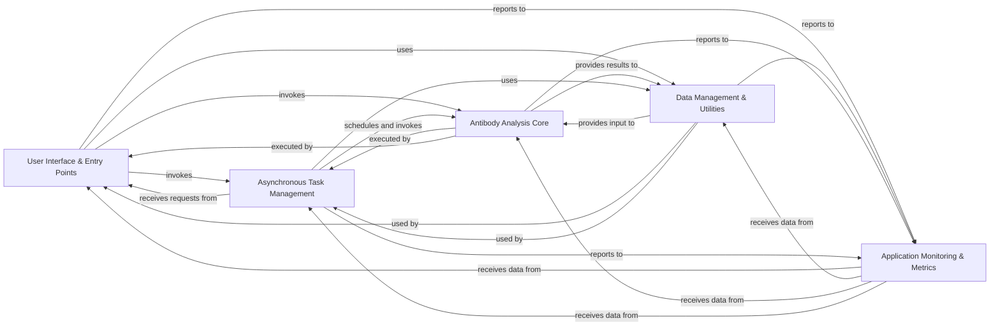

## Details

Abstract Components Overview

### User Interface & Entry Points [[Expand]](./User_Interface_Entry_Points.md)
Serves as the primary interface for users, managing both command-line interactions and the web application. It handles initial user input and dispatches requests for processing or task initiation.

**Related Classes/Methods**:

- <a href="https://github.com/Merck/BioPhi/biophi/common/cli/main.py#L1-L1" target="_blank" rel="noopener noreferrer">`biophi/common/cli/main.py` (1:1)</a>
- <a href="https://github.com/Merck/BioPhi/biophi/common/cli/web.py#L1-L1" target="_blank" rel="noopener noreferrer">`biophi/common/cli/web.py` (1:1)</a>
- <a href="https://github.com/Merck/BioPhi/biophi/common/web/views.py#L1-L1" target="_blank" rel="noopener noreferrer">`biophi/common/web/views.py` (1:1)</a>
- <a href="https://github.com/Merck/BioPhi/biophi/humanization/web/views.py#L1-L1" target="_blank" rel="noopener noreferrer">`biophi/humanization/web/views.py` (1:1)</a>

### Data Management & Utilities [[Expand]](./Data_Management_Utilities.md)
Responsible for all aspects of data handling, including reading, parsing, validating, and formatting various biological sequence inputs and outputs. It also provides general utilities for sequence manipulation.

**Related Classes/Methods**:

- <a href="https://github.com/Merck/BioPhi/biophi/common/utils/io.py#L1-L1" target="_blank" rel="noopener noreferrer">`biophi/common/utils/io.py` (1:1)</a>
- <a href="https://github.com/Merck/BioPhi/biophi/common/utils/seq.py#L1-L1" target="_blank" rel="noopener noreferrer">`biophi/common/utils/seq.py` (1:1)</a>

### Antibody Analysis Core [[Expand]](./Antibody_Analysis_Core.md)
Contains the fundamental algorithms and logic for antibody humanization (e.g., Sapiens humanization, CDR grafting) and humanness score calculations, including comparisons against germline sequences and statistical analysis.

**Related Classes/Methods**:

- <a href="https://github.com/Merck/BioPhi/biophi/humanization/methods/humanization.py#L1-L1" target="_blank" rel="noopener noreferrer">`biophi/humanization/methods/humanization.py` (1:1)</a>
- <a href="https://github.com/Merck/BioPhi/biophi/humanization/methods/humanness.py#L1-L1" target="_blank" rel="noopener noreferrer">`biophi/humanization/methods/humanness.py` (1:1)</a>
- <a href="https://github.com/Merck/BioPhi/biophi/humanization/methods/stats.py#L1-L1" target="_blank" rel="noopener noreferrer">`biophi/humanization/methods/stats.py` (1:1)</a>

### Asynchronous Task Management [[Expand]](./Asynchronous_Task_Management.md)
Manages the scheduling, execution, and monitoring of long-running computational tasks (e.g., humanization, humanness analysis) to ensure the application remains responsive, especially in a web context.

**Related Classes/Methods**:

- <a href="https://github.com/Merck/BioPhi/biophi/common/utils/scheduler.py#L1-L1" target="_blank" rel="noopener noreferrer">`biophi/common/utils/scheduler.py` (1:1)</a>
- <a href="https://github.com/Merck/BioPhi/biophi/humanization/web/tasks.py#L1-L1" target="_blank" rel="noopener noreferrer">`biophi/humanization/web/tasks.py` (1:1)</a>

### Application Monitoring & Metrics [[Expand]](./Application_Monitoring_Metrics.md)
Collects and records various application events, such as user submissions, task statuses, and operational metrics. This data is crucial for system health monitoring, debugging, and usage pattern analysis.

**Related Classes/Methods**:

- <a href="https://github.com/Merck/BioPhi/biophi/common/utils/stats.py#L1-L1" target="_blank" rel="noopener noreferrer">`biophi/common/utils/stats.py` (1:1)</a>
- <a href="https://github.com/Merck/BioPhi/biophi/common/web/tasks.py#L1-L1" target="_blank" rel="noopener noreferrer">`biophi/common/web/tasks.py` (1:1)</a>
- <a href="https://github.com/Merck/BioPhi/biophi/common/web/views.py#L1-L1" target="_blank" rel="noopener noreferrer">`biophi/common/web/views.py` (1:1)</a>

### [FAQ](https://github.com/CodeBoarding/GeneratedOnBoardings/tree/main?tab=readme-ov-file#faq)