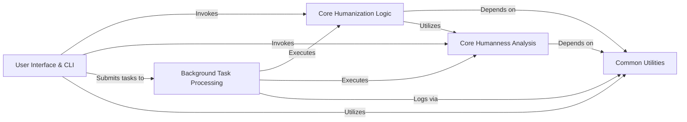

## Component Details

This architecture analysis for BioPhi outlines the core components and their interactions within the system. The main flow involves user interaction through CLI or web interfaces, which can directly invoke core humanization or humanness analysis logic, or offload computationally intensive tasks to a background processing system. All components rely on a shared set of common utilities for data handling, I/O, logging, and system-level operations, ensuring efficient and consistent functionality across the application.

### User Interface & CLI
This component provides the primary interaction points for users, encompassing both command-line interfaces (CLI) for direct tool execution (OASis, Sapiens) and the web-based interface for broader accessibility. It handles user input, displays results, and orchestrates the initiation of core BioPhi functionalities.

**Related Classes/Methods**:

- <a href="https://github.com/Merck/BioPhi/blob/master/biophi/humanization/cli/oasis.py#L19-L96" target="_blank" rel="noopener noreferrer">`BioPhi.biophi.humanization.cli.oasis` (19:96)</a>
- <a href="https://github.com/Merck/BioPhi/blob/master/biophi/humanization/cli/sapiens.py#L33-L124" target="_blank" rel="noopener noreferrer">`BioPhi.biophi.humanization.cli.sapiens` (33:124)</a>
- <a href="https://github.com/Merck/BioPhi/blob/master/biophi/common/cli/web.py#L10-L21" target="_blank" rel="noopener noreferrer">`BioPhi.biophi.common.cli.web` (10:21)</a>
- <a href="https://github.com/Merck/BioPhi/blob/master/biophi/common/cli/main.py#L8-L22" target="_blank" rel="noopener noreferrer">`BioPhi.biophi.common.cli.main.MainGroup` (8:22)</a>
- `BioPhi.biophi.humanization.web.views` (full file reference)
- `BioPhi.biophi.common.web.views` (full file reference)

### Core Humanization Logic
This component encapsulates the primary algorithms and methods for antibody humanization, including the Sapiens deep learning model and CDR Grafting techniques. It defines the parameters and processes for transforming non-human antibody sequences into human-like sequences, focusing on sequence modification and optimization.

**Related Classes/Methods**:

- `BioPhi.biophi.humanization.methods.humanization` (full file reference)

### Core Humanness Analysis
Dedicated to calculating and assessing the humanness of antibody sequences, primarily using the OASis method. It includes statistical functions to determine humanness scores, identify non-human peptides, and generate related metrics, providing quantitative insights into sequence humanness.

**Related Classes/Methods**:

- `BioPhi.biophi.humanization.methods.humanness` (full file reference)
- `BioPhi.biophi.humanization.methods.stats` (full file reference)

### Background Task Processing
Responsible for managing and executing long-running, computationally intensive tasks asynchronously. It utilizes a scheduler (e.g., Celery) to offload operations like humanization and humanness calculations from the main application thread, ensuring responsiveness and efficient resource utilization.

**Related Classes/Methods**:

- `BioPhi.biophi.humanization.web.tasks` (full file reference)
- `BioPhi.biophi.common.web.tasks` (full file reference)
- `BioPhi.biophi.common.utils.scheduler` (full file reference)

### Common Utilities
Provides foundational utilities for input/output operations, including parsing antibody files (FASTA, PDB), handling sequence data, and managing data structures. It also offers general system utilities such as logging, statistics tracking, and text formatting, supporting robust data handling, monitoring, and consistent information presentation across the application.

**Related Classes/Methods**:

- `BioPhi.biophi.common.utils.io` (full file reference)
- `BioPhi.biophi.common.utils.seq` (full file reference)
- `BioPhi.biophi.common.utils.stats` (full file reference)
- `BioPhi.biophi.common.utils.formatting` (full file reference)

### [FAQ](https://github.com/CodeBoarding/GeneratedOnBoardings/tree/main?tab=readme-ov-file#faq)