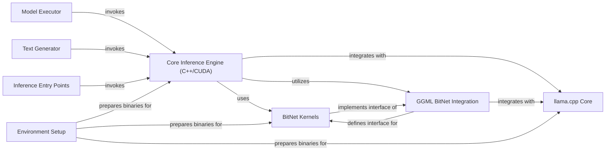

## Details

The BitNet architecture is designed for efficient LLM inference, centered around a high-performance Core Inference Engine (C++/CUDA). This engine directly uses specialized BitNet Kernels for binarized operations and integrates with the foundational llama.cpp Core via the GGML BitNet Integration layer, which defines the necessary interfaces. User interaction begins at Inference Entry Points, which invoke the Model Executor to load models and subsequently trigger the Core Inference Engine. The Text Generator then processes the engine's output to produce human-readable text. The entire system's operational readiness is ensured by the Environment Setup, which prepares binaries for all critical components.

### Core Inference Engine (C++/CUDA) [[Expand]](./Core_Inference_Engine_C_CUDA_.md)
The performance-critical, low-level component executing LLM inference on GPU hardware. It directly implements BitNet-specific kernels and integrates with llama.cpp.

**Related Classes/Methods**:

- <a href="https://github.com/microsoft/BitNet/blob/main/gpu/bitnet_kernels/bitnet_kernels.cu" target="_blank" rel="noopener noreferrer">`/home/ubuntu/CodeBoarding/repo/BitNet/gpu/bitnet_kernels/bitnet_kernels.cu`</a>
- <a href="https://github.com/microsoft/BitNet/blob/main/gpu/bitnet_kernels/bitnet_kernels.h" target="_blank" rel="noopener noreferrer">`/home/ubuntu/CodeBoarding/repo/BitNet/gpu/bitnet_kernels/bitnet_kernels.h`</a>
- <a href="https://github.com/microsoft/BitNet/blob/main/3rdparty/llama.cpp" target="_blank" rel="noopener noreferrer">`/home/ubuntu/CodeBoarding/repo/BitNet/3rdparty/llama.cpp`</a>
- <a href="https://github.com/microsoft/BitNet/blob/main/include/ggml-bitnet.h" target="_blank" rel="noopener noreferrer">`/home/ubuntu/CodeBoarding/repo/BitNet/include/ggml-bitnet.h`</a>

### BitNet Kernels
Optimized CUDA kernels for efficient BitNet-specific operations, such as binarized matrix multiplications and quantization. These are the custom, performance-critical GPU implementations.

**Related Classes/Methods**:

- <a href="https://github.com/microsoft/BitNet/blob/main/gpu/bitnet_kernels/bitnet_kernels.cu" target="_blank" rel="noopener noreferrer">`/home/ubuntu/CodeBoarding/repo/BitNet/gpu/bitnet_kernels/bitnet_kernels.cu`</a>
- <a href="https://github.com/microsoft/BitNet/blob/main/gpu/bitnet_kernels/bitnet_kernels.h" target="_blank" rel="noopener noreferrer">`/home/ubuntu/CodeBoarding/repo/BitNet/gpu/bitnet_kernels/bitnet_kernels.h`</a>

### GGML BitNet Integration
Header files that define the interface and data structures for integrating BitNet operations within the GGML framework, enabling llama.cpp to utilize BitNet functionalities.

**Related Classes/Methods**:

- <a href="https://github.com/microsoft/BitNet/blob/main/include/ggml-bitnet.h" target="_blank" rel="noopener noreferrer">`/home/ubuntu/CodeBoarding/repo/BitNet/include/ggml-bitnet.h`</a>

### llama.cpp Core
A third-party library providing foundational LLM inference capabilities, including model loading, graph computation, and general matrix operations. The Core Inference Engine integrates with and extends this.

**Related Classes/Methods**:

- <a href="https://github.com/microsoft/BitNet/blob/main/3rdparty/llama.cpp" target="_blank" rel="noopener noreferrer">`/home/ubuntu/CodeBoarding/repo/BitNet/3rdparty/llama.cpp`</a>

### Model Executor
A higher-level component responsible for loading models and invoking the Core Inference Engine (C++/CUDA) to perform inference based on the loaded model.

**Related Classes/Methods**:

- <a href="https://github.com/microsoft/BitNet/blob/main/gpu/generate.py" target="_blank" rel="noopener noreferrer">`FastGen.build`</a>

### Text Generator
A higher-level component that utilizes the Core Inference Engine (C++/CUDA) to generate text outputs from LLM inference, handling tokenization and decoding.

**Related Classes/Methods**:

- <a href="https://github.com/microsoft/BitNet/blob/main/gpu/generate.py" target="_blank" rel="noopener noreferrer">`FastGen.generate_all`</a>
- <a href="https://github.com/microsoft/BitNet/blob/main/gpu/tokenizer.py" target="_blank" rel="noopener noreferrer">`/home/ubuntu/CodeBoarding/repo/BitNet/gpu/tokenizer.py`</a>

### Inference Entry Points
Represents the various high-level interfaces or command-line tools that serve as the initial points of interaction for users or other systems to trigger LLM inference via the Core Inference Engine (C++/CUDA).

**Related Classes/Methods**:

- <a href="https://github.com/microsoft/BitNet/blob/main/gpu/generate.py" target="_blank" rel="noopener noreferrer">`fire integration`</a>

### Environment Setup
Responsible for the build process, compilation, and preparation of binaries for the Core Inference Engine (C++/CUDA) and its dependencies, ensuring the optimized C++/CUDA components are ready for execution.

**Related Classes/Methods**:

- <a href="https://github.com/microsoft/BitNet/blob/main/CMakeLists.txt" target="_blank" rel="noopener noreferrer">`/home/ubuntu/CodeBoarding/repo/BitNet/CMakeLists.txt`</a>
- <a href="https://github.com/microsoft/BitNet/blob/main/gpu/bitnet_kernels/compile.sh" target="_blank" rel="noopener noreferrer">`/home/ubuntu/CodeBoarding/repo/BitNet/gpu/bitnet_kernels/compile.sh`</a>

### [FAQ](https://github.com/CodeBoarding/GeneratedOnBoardings/tree/main?tab=readme-ov-file#faq)