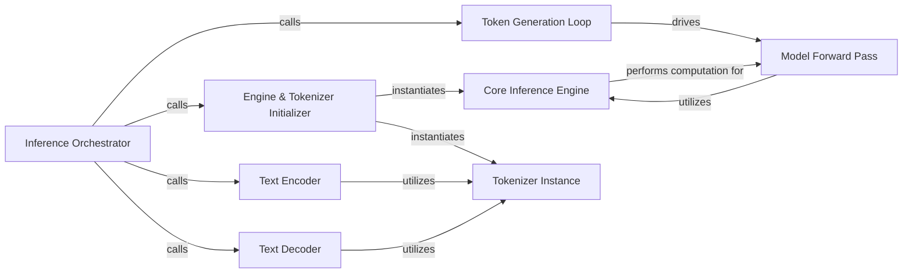

## Details

The BitNet LLM inference subsystem is designed for efficient token generation, leveraging a `Core Inference Engine` (`FastGen`) to manage the underlying model computations. The `Inference Orchestrator` (`main`) serves as the primary entry point, coordinating the entire process from environment setup and input encoding to iterative token generation and output decoding. It relies on the `Engine & Tokenizer Initializer` (`build`) to prepare the inference environment, including instantiating the `Core Inference Engine` and `Tokenizer Instance`. Text inputs are transformed into numerical tokens by the `Text Encoder` (`encode`), which utilizes the `Tokenizer Instance`. The `Token Generation Loop` (`generate_all`) iteratively drives the `Model Forward Pass` (prefill and decode steps within `FastGen`) to produce new tokens. Finally, the `Text Decoder` (`decode`) converts the generated token IDs back into human-readable text, also utilizing the `Tokenizer Instance`.

### Inference Orchestrator
Manages the complete LLM inference lifecycle, including initializing the environment, preparing inputs, driving token generation, and processing outputs. It acts as the high-level Python entry point for the LLM inference process.

**Related Classes/Methods**:

- <a href="https://github.com/microsoft/BitNet/blob/main/gpu/generate.py#L322-L355" target="_blank" rel="noopener noreferrer">`gpu.generate.main`:322-355</a>

### Engine & Tokenizer Initializer
Sets up the inference environment by instantiating the Core Inference Engine and the Tokenizer Instance.

**Related Classes/Methods**:

- <a href="https://github.com/microsoft/BitNet/blob/main/gpu/generate.py#L41-L77" target="_blank" rel="noopener noreferrer">`gpu.generate.build`:41-77</a>

### Text Encoder
Converts human-readable input prompts into numerical token IDs for the LLM.

**Related Classes/Methods**:

- <a href="https://github.com/microsoft/BitNet/blob/main/gpu/tokenizer.py#L95-L156" target="_blank" rel="noopener noreferrer">`gpu.tokenizer.encode`:95-156</a>

### Token Generation Loop
Iteratively generates tokens until a stop condition is met, driving the Model Forward Pass.

**Related Classes/Methods**:

- <a href="https://github.com/microsoft/BitNet/blob/main/gpu/generate.py#L216-L304" target="_blank" rel="noopener noreferrer">`gpu.generate.FastGen.generate_all`:216-304</a>

### Text Decoder
Converts numerical token IDs generated by the LLM back into human-readable text.

**Related Classes/Methods**:

- <a href="https://github.com/microsoft/BitNet/blob/main/gpu/tokenizer.py#L202-L207" target="_blank" rel="noopener noreferrer">`gpu.tokenizer.decode`:202-207</a>

### Core Inference Engine
The core engine responsible for performing inference, likely interfacing with low-level C++/CUDA kernels. It encapsulates the prefill and decode models and their compilation.

**Related Classes/Methods**:

- <a href="https://github.com/microsoft/BitNet/blob/main/gpu/generate.py#L37-L304" target="_blank" rel="noopener noreferrer">`gpu.generate.FastGen`:37-304</a>

### Tokenizer Instance
An instance of the tokenizer used for encoding and decoding text, encapsulating the vocabulary and tokenization rules.

**Related Classes/Methods**:

- <a href="https://github.com/microsoft/BitNet/blob/main/gpu/tokenizer.py" target="_blank" rel="noopener noreferrer">`gpu.tokenizer.Tokenizer`</a>

### Model Forward Pass
Encapsulates the computational steps of passing input through the LLM for both initial prompt processing (prefill) and subsequent token generation (decode). This involves compiling and executing the underlying model's forward pass operations.

**Related Classes/Methods**:

- <a href="https://github.com/microsoft/BitNet/blob/main/gpu/generate.py#L90-L156" target="_blank" rel="noopener noreferrer">`gpu.generate.FastGen.compile_prefill`:90-156</a>
- <a href="https://github.com/microsoft/BitNet/blob/main/gpu/generate.py#L158-L214" target="_blank" rel="noopener noreferrer">`gpu.generate.FastGen.compile_generate`:158-214</a>

### [FAQ](https://github.com/CodeBoarding/GeneratedOnBoardings/tree/main?tab=readme-ov-file#faq)