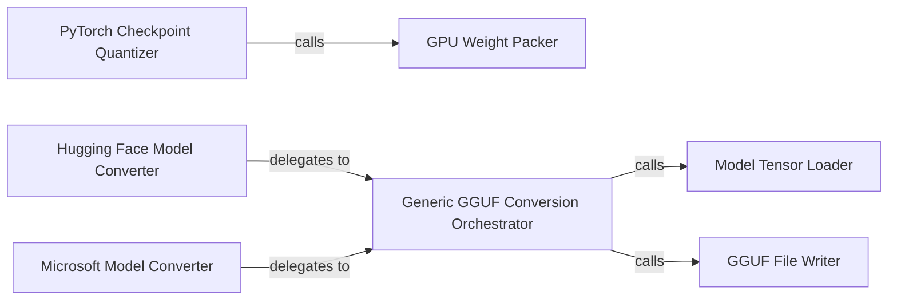

## Details

The Model Preparation & Quantization subsystem transforms various LLM model formats into the optimized GGUF format, including advanced quantization and weight packing for efficient GPU inference. It emphasizes utilities, tools, and model loading/deserialization, with specialized converters for different model ecosystems and core components for performance optimization and reusable GGUF conversion logic.

### Hugging Face Model Converter
Orchestrates the end-to-end conversion of Hugging Face models into the GGUF format. This includes loading model parameters, setting metadata, handling vocabulary, and initiating the final file write.

**Related Classes/Methods**:

- <a href="https://github.com/microsoft/BitNet/blob/main/utils/convert-hf-to-gguf-bitnet.py" target="_blank" rel="noopener noreferrer">`utils.convert-hf-to-gguf-bitnet`</a>

### Microsoft Model Converter
Manages the conversion of Microsoft-specific model formats to GGUF, leveraging common utilities for loading and writing shared with other converters.

**Related Classes/Methods**:

- <a href="https://github.com/microsoft/BitNet/blob/main/utils/convert-ms-to-gguf-bitnet.py" target="_blank" rel="noopener noreferrer">`utils.convert-ms-to-gguf-bitnet`</a>

### PyTorch Checkpoint Quantizer
Converts PyTorch model checkpoints and applies initial quantization steps (e.g., 8-bit, 16-bit, and 2-bit conversions) specifically tailored for efficient GPU inference.

**Related Classes/Methods**:

- <a href="https://github.com/microsoft/BitNet/blob/main/gpu/convert_checkpoint.py" target="_blank" rel="noopener noreferrer">`gpu.convert_checkpoint`</a>

### GPU Weight Packer
Executes advanced weight packing and permutation, specifically optimizing 8-bit integer weights into highly efficient 2-bit integers. This process is critical for maximizing GPU memory access and computational efficiency.

**Related Classes/Methods**:

- <a href="https://github.com/microsoft/BitNet/blob/main/gpu/pack_weight.py" target="_blank" rel="noopener noreferrer">`gpu.pack_weight`</a>

### Generic GGUF Conversion Orchestrator
Provides a generic and reusable entry point for GGUF conversion. It encapsulates core functionalities for loading, processing, and writing GGUF models and vocabularies, serving as a common backbone for format-specific converters.

**Related Classes/Methods**:

- <a href="https://github.com/microsoft/BitNet/blob/main/utils/convert.py#L1601-L1707" target="_blank" rel="noopener noreferrer">`utils.convert.main`:1601-1707</a>

### Model Tensor Loader
Handles the loading of model tensors from various sources and performs necessary initial transformations, such as permutation and type casting, to prepare them for further processing.

**Related Classes/Methods**:

- <a href="https://github.com/microsoft/BitNet/blob/main/utils/convert.py#L1065-L1066" target="_blank" rel="noopener noreferrer">`utils.convert.load`:1065-1066</a>

### GGUF File Writer
Manages the comprehensive process of writing all model-related data, including metadata, vocabulary, and tensor data, into the final GGUF file format.

**Related Classes/Methods**:

- <a href="https://github.com/microsoft/BitNet/blob/main/utils/convert.py#L1341-L1369" target="_blank" rel="noopener noreferrer">`utils.convert.write_all`:1341-1369</a>

### [FAQ](https://github.com/CodeBoarding/GeneratedOnBoardings/tree/main?tab=readme-ov-file#faq)