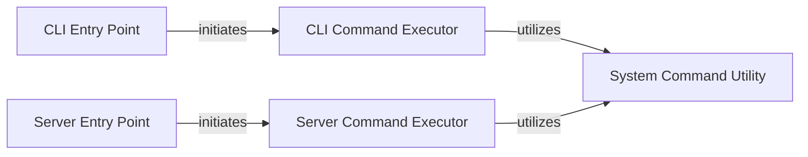

## Details

The BitNet inference subsystem provides two primary interfaces for users to interact with the underlying inference engine: a Command-Line Interface (CLI) and a network server. The `CLI Entry Point` serves as the initial interface for direct user interaction, parsing arguments and delegating to the `CLI Command Executor`. Similarly, the `Server Entry Point` manages network requests and dispatches them to the `Server Command Executor`. Both command executors, whether for CLI or server environments, rely on a shared `System Command Utility` to execute the external `llama-cli` inference engine. This architecture clearly separates concerns, with dedicated entry points for different interaction modes and a common utility for low-level command execution, ensuring modularity and maintainability.

### CLI Entry Point
The main entry point for command-line users. It is responsible for parsing command-line arguments, setting up the CLI environment, and initiating the inference process based on user input. This component aligns with the "Command-Line Interface (CLI) Pattern" and serves as the initial interface for direct user interaction.

**Related Classes/Methods**:

- <a href="https://github.com/microsoft/BitNet/blob/main/run_inference.py#L16-L37" target="_blank" rel="noopener noreferrer">`run_inference`:16-37</a>

### CLI Command Executor
Encapsulates the core logic for executing an inference command when invoked via the CLI. This includes preparing inputs by constructing the `llama-cli` command with parsed arguments, and invoking the underlying inference engine (which is external to this subsystem) through a generic command execution utility. It acts as the direct handler for CLI-specific inference requests.

**Related Classes/Methods**:

- <a href="https://github.com/microsoft/BitNet/blob/main/run_inference.py#L16-L37" target="_blank" rel="noopener noreferrer">`run_inference`:16-37</a>

### Server Entry Point
The main entry point for external systems or users interacting via a network server. It manages the server's lifecycle, listens for incoming network requests, and dispatches them for processing. This component adapts the "Python Bindings/CLI Interface" for a server environment, providing a robust network-facing interface.

**Related Classes/Methods**:

- <a href="https://github.com/microsoft/BitNet/blob/main/run_inference_server.py#L16-L44" target="_blank" rel="noopener noreferrer">`run_server`:16-44</a>

### Server Command Executor
Encapsulates the core logic for executing an inference command within the server environment. This involves parsing request payloads, preparing inputs for the inference engine, invoking the underlying inference engine (external to this subsystem), and formatting responses for network clients. This component is implicitly handled within the `run_server` function, which orchestrates the server-side inference flow.

**Related Classes/Methods**:

- <a href="https://github.com/microsoft/BitNet/blob/main/run_inference_server.py#L16-L44" target="_blank" rel="noopener noreferrer">`run_server`:16-44</a>

### System Command Utility
A low-level utility responsible for executing arbitrary system commands. It provides a generic interface for running external processes and ensures their successful completion. This component is utilized by both CLI and Server Command Executors to interact with the underlying inference engine.

**Related Classes/Methods**:

- <a href="https://github.com/microsoft/BitNet/blob/main/run_inference.py#L8-L14" target="_blank" rel="noopener noreferrer">`run_command`:8-14</a>

### [FAQ](https://github.com/CodeBoarding/GeneratedOnBoardings/tree/main?tab=readme-ov-file#faq)