```mermaid
graph LR
    User_Interface_CLI_Server_["User Interface (CLI/Server)"]
    Environment_Build_System["Environment & Build System"]
    Model_Preparation_Quantization["Model Preparation & Quantization"]
    Inference_Orchestrator_Python_["Inference Orchestrator (Python)"]
    Core_Inference_Engine_C_CUDA_["Core Inference Engine (C++/CUDA)"]
    Tokenizer_Text_Processing["Tokenizer & Text Processing"]
    User_Interface_CLI_Server_ -- "initiates inference request" --> Inference_Orchestrator_Python_
    User_Interface_CLI_Server_ -- "triggers setup/build" --> Environment_Build_System
    Environment_Build_System -- "prepares environment for" --> Model_Preparation_Quantization
    Environment_Build_System -- "compiles & links" --> Core_Inference_Engine_C_CUDA_
    Model_Preparation_Quantization -- "outputs optimized GGUF model" --> Inference_Orchestrator_Python_
    Inference_Orchestrator_Python_ -- "delegates computation to" --> Core_Inference_Engine_C_CUDA_
    Inference_Orchestrator_Python_ -- "sends text/tokens for processing to" --> Tokenizer_Text_Processing
    Core_Inference_Engine_C_CUDA_ -- "returns inference results to" --> Inference_Orchestrator_Python_
    Tokenizer_Text_Processing -- "returns processed text/tokens to" --> Inference_Orchestrator_Python_
    click User_Interface_CLI_Server_ href "https://github.com/CodeBoarding/GeneratedOnBoardings/blob/main/BitNet/User_Interface_CLI_Server_.md" "Details"
    click Environment_Build_System href "https://github.com/CodeBoarding/GeneratedOnBoardings/blob/main/BitNet/Environment_Build_System.md" "Details"
    click Model_Preparation_Quantization href "https://github.com/CodeBoarding/GeneratedOnBoardings/blob/main/BitNet/Model_Preparation_Quantization.md" "Details"
    click Inference_Orchestrator_Python_ href "https://github.com/CodeBoarding/GeneratedOnBoardings/blob/main/BitNet/Inference_Orchestrator_Python_.md" "Details"
    click Core_Inference_Engine_C_CUDA_ href "https://github.com/CodeBoarding/GeneratedOnBoardings/blob/main/BitNet/Core_Inference_Engine_C_CUDA_.md" "Details"
```

## Details

The BitNet project implements an efficient LLM inference runtime, primarily leveraging a Python-orchestrated C++/CUDA core. User interaction, whether via CLI or server, initiates the inference process through the `User Interface` component. This interface delegates requests to the `Inference Orchestrator (Python)`, which is responsible for loading optimized GGUF models, managing the inference loop, and coordinating with lower-level components. For text input and output, the `Inference Orchestrator` sends text or tokens to the `Tokenizer & Text Processing` component, which then returns the processed text or tokens. The `Inference Orchestrator` then offloads the computationally intensive inference tasks to the `Core Inference Engine (C++/CUDA)`, which executes optimized BitNet kernels and integrates with `llama.cpp` for high-performance GPU computation. The results from the `Core Inference Engine` are returned to the `Inference Orchestrator`. The project's foundation is supported by the `Environment & Build System`, which handles compilation of custom CUDA kernels and `llama.cpp` integration, and the `Model Preparation & Quantization` component, which converts and optimizes various LLM formats into the GGUF format for efficient inference.

### User Interface (CLI/Server) [[Expand]](./User_Interface_CLI_Server_.md)
The primary interface for users or external systems to interact with the BitNet inference runtime, handling commands for inference or serving network requests.

**Related Classes/Methods**:

- <a href="https://github.com/microsoft/BitNet/blob/main/run_inference.py" target="_blank" rel="noopener noreferrer">`run_inference.py`</a>
- <a href="https://github.com/microsoft/BitNet/blob/main/run_inference_server.py" target="_blank" rel="noopener noreferrer">`run_inference_server.py`</a>

### Environment & Build System [[Expand]](./Environment_Build_System.md)
Manages the project's build process, environment configuration, and compiles custom CUDA kernels and integrates llama.cpp.

**Related Classes/Methods**:

- <a href="https://github.com/microsoft/BitNet/blob/main/setup_env.py" target="_blank" rel="noopener noreferrer">`setup_env.py`</a>
- <a href="https://github.com/microsoft/BitNet/blob/main/CMakeLists.txt" target="_blank" rel="noopener noreferrer">`CMakeLists.txt`</a>
- <a href="https://github.com/microsoft/BitNet/blob/main/gpu/bitnet_kernels/compile.sh" target="_blank" rel="noopener noreferrer">`gpu/bitnet_kernels/compile.sh`</a>

### Model Preparation & Quantization [[Expand]](./Model_Preparation_Quantization.md)
Transforms various LLM model formats into the optimized GGUF format, including advanced quantization and weight packing for efficient GPU inference.

**Related Classes/Methods**:

- <a href="https://github.com/microsoft/BitNet/blob/main/utils/convert-hf-to-gguf-bitnet.py" target="_blank" rel="noopener noreferrer">`utils/convert-hf-to-gguf-bitnet.py`</a>
- <a href="https://github.com/microsoft/BitNet/blob/main/utils/convert-ms-to-gguf-bitnet.py" target="_blank" rel="noopener noreferrer">`utils/convert-ms-to-gguf-bitnet.py`</a>
- <a href="https://github.com/microsoft/BitNet/blob/main/gpu/convert_checkpoint.py" target="_blank" rel="noopener noreferrer">`gpu/convert_checkpoint.py`</a>
- <a href="https://github.com/microsoft/BitNet/blob/main/gpu/pack_weight.py" target="_blank" rel="noopener noreferrer">`gpu/pack_weight.py`</a>

### Inference Orchestrator (Python) [[Expand]](./Inference_Orchestrator_Python_.md)
The high-level Python component that manages the LLM inference process, loading GGUF models, orchestrating the inference loop, and interfacing with low-level C++/CUDA kernels.

**Related Classes/Methods**:

- <a href="https://github.com/microsoft/BitNet/blob/main/gpu/generate.py" target="_blank" rel="noopener noreferrer">`gpu/generate.py`</a>
- <a href="https://github.com/microsoft/BitNet/blob/main/gpu/model.py" target="_blank" rel="noopener noreferrer">`gpu/model.py`</a>

### Core Inference Engine (C++/CUDA) [[Expand]](./Core_Inference_Engine_C_CUDA_.md)
The performance-critical, low-level component executing LLM inference on GPU hardware, including optimized BitNet-specific kernels and integration with llama.cpp.

**Related Classes/Methods**:

- <a href="https://github.com/microsoft/BitNet/blob/main/gpu/bitnet_kernels/bitnet_kernels.cu" target="_blank" rel="noopener noreferrer">`gpu/bitnet_kernels/bitnet_kernels.cu`</a>
- <a href="https://github.com/microsoft/BitNet/blob/main/gpu/bitnet_kernels/bitnet_kernels.h" target="_blank" rel="noopener noreferrer">`gpu/bitnet_kernels/bitnet_kernels.h`</a>
- <a href="https://github.com/microsoft/BitNet/blob/main/3rdparty/llama.cpp" target="_blank" rel="noopener noreferrer">`3rdparty/llama.cpp`</a>
- <a href="https://github.com/microsoft/BitNet/blob/main/include/ggml-bitnet.h" target="_blank" rel="noopener noreferrer">`include/ggml-bitnet.h`</a>

### Tokenizer & Text Processing
Handles the conversion of human-readable text prompts into numerical token sequences for model input and decoding model output tokens back into text.

**Related Classes/Methods**:

- <a href="https://github.com/microsoft/BitNet/blob/main/gpu/tokenizer.py" target="_blank" rel="noopener noreferrer">`gpu/tokenizer.py`</a>

### [FAQ](https://github.com/CodeBoarding/GeneratedOnBoardings/tree/main?tab=readme-ov-file#faq)