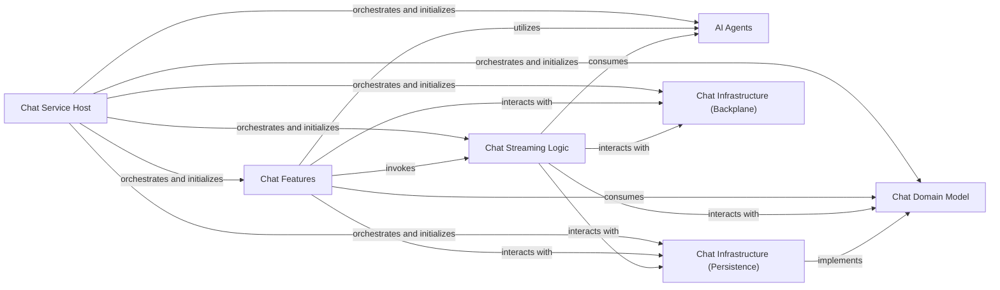

## Details

The `AI-Powered Chat Service` is a specialized microservice designed to provide an AI-driven chat interface for user interactions, leveraging advanced AI/ML capabilities for tasks such as product inquiries or customer support. Its architecture adheres to the Cloud-Native Microservices Application built with .NET Aspire patterns, emphasizing Domain-Driven Design (DDD) and Vertical Slice Architecture.

### Chat Service Host
This is the main entry point and orchestration component for the `BookWorm.Chat` microservice. It is responsible for bootstrapping the application, configuring the web host, registering all necessary services (including database contexts, AI agents, backplane services, and feature handlers), and setting up the HTTP request pipeline. It integrates seamlessly with .NET Aspire's service defaults and chassis building blocks, ensuring a consistent and scalable deployment.

**Related Classes/Methods**:

- `BookWorm.Chat.Program` (1:1)

### Chat Domain Model
This component defines the core business entities and rules governing chat conversations. It includes the `Conversation` aggregate root, `ConversationMessage` value objects, and the `IConversationRepository` interface. It encapsulates the essential business logic and enforces domain invariants, ensuring data integrity and consistency within the chat context.

**Related Classes/Methods**:

- `BookWorm.Chat.Domain.AggregatesModel.Conversation` (1:1)
- `BookWorm.Chat.Domain.AggregatesModel.ConversationMessage` (1:1)
- `BookWorm.Chat.Domain.AggregatesModel.IConversationRepository` (1:1)

### Chat Features
This component implements specific functionalities (vertical slices) for various chat operations, adhering to CQRS principles. Each subfolder (e.g., `Create`, `Get`, `Stream`, `Update`, `Delete`, `Cancel`) represents a distinct feature, containing its command/query, endpoint, and potentially validators. The `Stream` feature, with `ChatStreamEndpoint.cs` and `ChatStreamHub.cs`, is particularly crucial for enabling real-time, interactive chat experiences.

**Related Classes/Methods**:

- `BookWorm.Chat.Features.Create.CreateChatEndpoint` (1:1)
- `BookWorm.Chat.Features.Stream.ChatStreamEndpoint` (1:1)
- `BookWorm.Chat.Features.Stream.ChatStreamHub` (1:1)

### AI Agents
This component houses specialized AI components that leverage AI/ML capabilities (likely via Semantic Kernel, given the project context) to process and enrich chat messages. Examples include `BookAgent` for product inquiries, `LanguageAgent` for language processing, `SentimentAgent` for sentiment analysis, and `SummarizeAgent` for conversation summarization. These agents are key to the "AI-Powered" aspect of the service.

**Related Classes/Methods**:

- `BookWorm.Chat.Agents.BookAgent` (1:1)
- `BookWorm.Chat.Agents.LanguageAgent` (1:1)
- `BookWorm.Chat.Agents.SentimentAgent` (1:1)
- `BookWorm.Chat.Agents.SummarizeAgent` (1:1)

### Chat Infrastructure (Persistence)
This component is responsible for managing the persistence of chat conversations and messages. It utilizes Entity Framework Core with `ChatDbContext` to interact with a PostgreSQL database. The `ConversationRepository` implements the `IConversationRepository` from the domain layer, providing concrete data access operations and abstracting the underlying database technology.

**Related Classes/Methods**:

- `BookWorm.Chat.Infrastructure.ChatDbContext` (1:1)
- `BookWorm.Chat.Infrastructure.Repositories.ConversationRepository` (1:1)

### Chat Infrastructure (Backplane)
This component provides mechanisms for distributed state management and real-time communication across multiple instances of the Chat Service, primarily using Redis. It includes `RedisBackplaneService` for message broadcasting, `RedisCancellationManager` for managing cancellation tokens across instances, and `RedisConversationState` for maintaining conversation state and message buffers in a scalable and resilient manner.

**Related Classes/Methods**:

- `BookWorm.Chat.Infrastructure.Backplane.RedisBackplaneService` (1:1)
- `BookWorm.Chat.Infrastructure.Backplane.RedisConversationState` (1:1)
- `BookWorm.Chat.Infrastructure.Backplane.RedisCancellationManager` (1:1)

### Chat Streaming Logic
This is the core component responsible for orchestrating the real-time chat flow, particularly when interacting with AI agents. It integrates the AI Agents with the chat stream, manages the interaction context, and handles the continuous flow of messages between users and the AI. It likely leverages Semantic Kernel's streaming capabilities to provide dynamic and interactive AI responses.

**Related Classes/Methods**:

- `BookWorm.Chat.Infrastructure.ChatStreaming.ChatStreaming` (1:1)
- `BookWorm.Chat.Infrastructure.ChatStreaming.IChatStreaming` (1:1)
- `BookWorm.Chat.Infrastructure.ChatStreaming.ChatAgents` (1:1)

### [FAQ](https://github.com/CodeBoarding/GeneratedOnBoardings/tree/main?tab=readme-ov-file#faq)