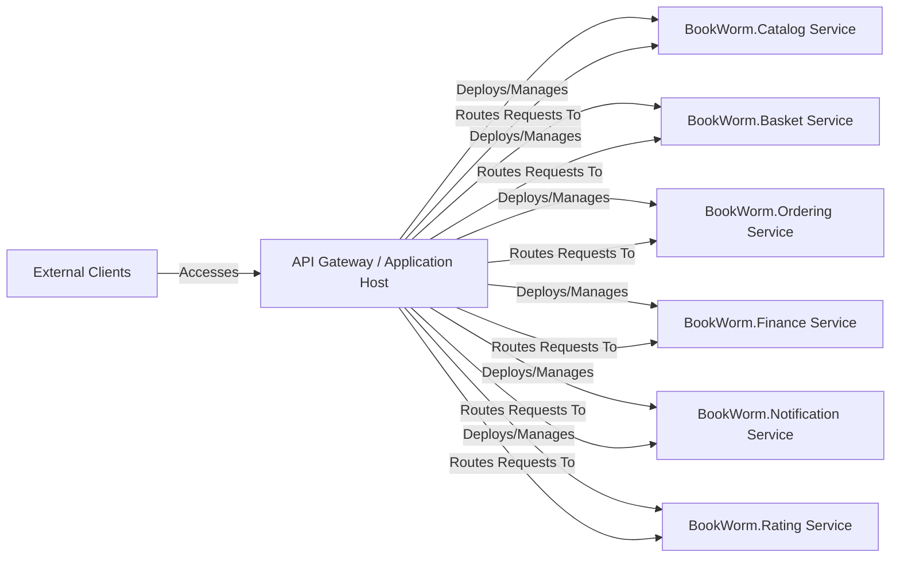

## Details

This Cloud-Native Microservices Application leverages an API Gateway / Application Host as its central orchestrator and primary entry point. The architecture embodies service decomposition, the API Gateway pattern, orchestration, scalability, and resilience, with distinct microservices for Catalog, Basket, Ordering, Finance, Notification, and Rating functionalities, all managed and routed through the central host.

### API Gateway / Application Host [[Expand]](./API_Gateway_Application_Host.md)
This component, built with .NET Aspire, is the central orchestrator for deploying and managing all microservices and their dependencies (databases, message brokers, etc.). It also acts as an API Gateway, handling intelligent routing, load balancing, and initial request processing for all incoming external traffic, directing it to the appropriate backend microservice.

**Related Classes/Methods**:

- `src/Aspire/BookWorm.AppHost/AppHost.cs`
- `src/Aspire/BookWorm.AppHost/Container/proxy/yarp.json`

### BookWorm.Catalog Service
Manages the product catalog, including books, their details, availability, and pricing. It's a core domain service in the e-commerce system.

**Related Classes/Methods**: _None_

### BookWorm.Basket Service
Handles user shopping baskets, allowing users to add, remove, and manage items before checkout.

**Related Classes/Methods**: _None_

### BookWorm.Ordering Service
Manages the order lifecycle, from creation to fulfillment, incorporating CQRS and Event Sourcing patterns.

**Related Classes/Methods**: _None_

### BookWorm.Finance Service
Handles financial transactions, payments, and potentially invoicing related to orders.

**Related Classes/Methods**: _None_

### BookWorm.Notification Service
Responsible for sending various notifications (e.g., order confirmations, shipping updates) to users via different channels (e.g., email, chat).

**Related Classes/Methods**: _None_

### BookWorm.Rating Service
Manages user ratings and reviews for books, potentially integrating with AI for sentiment analysis.

**Related Classes/Methods**: _None_

### External Clients
Represents any external system or user interface (e.g., web browser, mobile app, third-party API consumer) that interacts with the BookWorm application.

**Related Classes/Methods**: _None_

### [FAQ](https://github.com/CodeBoarding/GeneratedOnBoardings/tree/main?tab=readme-ov-file#faq)