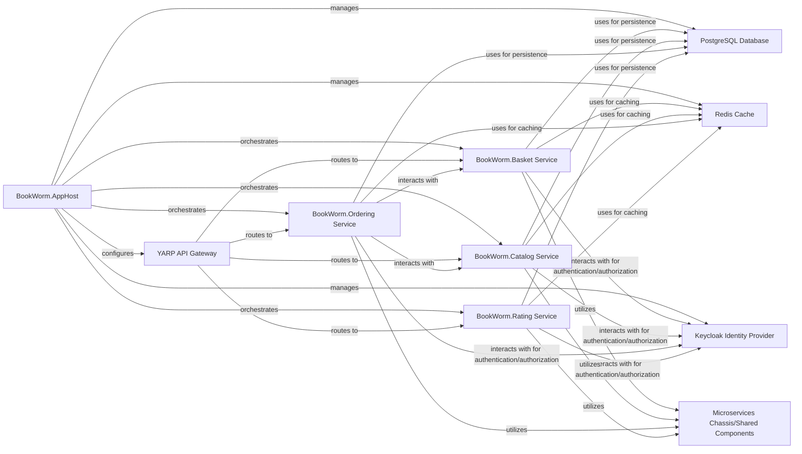

## Details

Component overview for BookWorm Orchestration, focusing on the structure, flow, and purpose of the key components in this .NET Aspire cloud-native microservices application.

### BookWorm.AppHost
The central deployment and management layer for the entire application. It defines, configures, and launches all microservices and their associated infrastructure components (e.g., PostgreSQL, Redis, Keycloak), acting as the single point of entry for running the distributed system.

**Related Classes/Methods**: _None_

### BookWorm.Basket Service
Manages user shopping baskets, allowing users to add, remove, and update items before checkout.

**Related Classes/Methods**: _None_

### BookWorm.Catalog Service
Provides information about available books, including details, pricing, and inventory.

**Related Classes/Methods**: _None_

### BookWorm.Ordering Service
Handles the order placement process, managing order states, and coordinating with other services for fulfillment.

**Related Classes/Methods**: _None_

### BookWorm.Rating Service
Manages user ratings and reviews for books.

**Related Classes/Methods**: _None_

### PostgreSQL Database
The primary relational database used by various microservices for persistent data storage.

**Related Classes/Methods**: _None_

### Redis Cache
A high-performance in-memory data store used for caching, session management, and potentially message brokering.

**Related Classes/Methods**: _None_

### Keycloak Identity Provider
An open-source identity and access management solution providing authentication and authorization services for the application.

**Related Classes/Methods**: _None_

### YARP API Gateway
A reverse proxy that acts as the single entry point for external clients, routing requests to the appropriate microservices.

**Related Classes/Methods**: _None_

### Microservices Chassis/Shared Components
A collection of common infrastructure, cross-cutting concerns, and shared domain models (e.g., logging, metrics, health checks, common data types, event definitions) that all microservices leverage to ensure consistency and reduce boilerplate.

**Related Classes/Methods**: _None_

### [FAQ](https://github.com/CodeBoarding/GeneratedOnBoardings/tree/main?tab=readme-ov-file#faq)