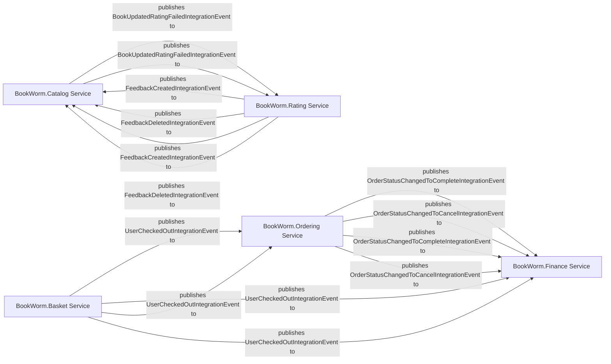

## Details

Analysis of the core domain services of the BookWorm application, highlighting their responsibilities, architectural patterns (DDD, Cloud-Native Microservices, Event-Driven Architecture), and inter-service communication via integration events.

### BookWorm.Catalog Service
This microservice is the authoritative source for all book-related information. It manages the lifecycle of books, authors, categories, and publishers. Its core responsibility is to provide a consistent and accurate catalog of available books, including AI-driven features like embedding generation for search and recommendation. It adheres to DDD by having its own `Domain` and `Features` (CQRS commands/queries) and interacts with other services via `IntegrationEvents`.

**Related Classes/Methods**:

- `BookWorm.Catalog Service` (1:1)

### BookWorm.Basket Service
This microservice manages the user's shopping basket, allowing users to add, remove, and update items. It's a crucial part of the e-commerce flow, bridging the gap between catalog browsing and order placement. It embodies DDD principles with its own domain and features, and its event publishing is key to initiating subsequent processes like ordering and finance.

**Related Classes/Methods**:

- `BookWorm.Basket Service` (1:1)

### BookWorm.Ordering Service
This microservice is responsible for the entire order lifecycle, from creation to fulfillment or cancellation. Its use of **Event Sourcing (Marten)** is a key architectural pattern, providing an immutable audit log of all changes to an order. It's central to the transaction processing within the application.

**Related Classes/Methods**:

- `BookWorm.Ordering Service` (1:1)

### BookWorm.Finance Service
This microservice handles the financial aspects of orders, primarily focusing on payment processing and ensuring transactional consistency across multiple services using the **Saga Pattern**. It orchestrates complex business processes that span across different bounded contexts, ensuring atomicity and reliability in a distributed environment.

**Related Classes/Methods**:

- `BookWorm.Finance Service` (1:1)

### BookWorm.Rating Service
This microservice manages user ratings and feedback for books. It's a distinct bounded context that allows users to contribute to the quality assessment of the catalog. Its event publishing ensures that other services, like the Catalog Service, can react to new feedback.

**Related Classes/Methods**:

- `BookWorm.Rating Service` (1:1)

### [FAQ](https://github.com/CodeBoarding/GeneratedOnBoardings/tree/main?tab=readme-ov-file#faq)