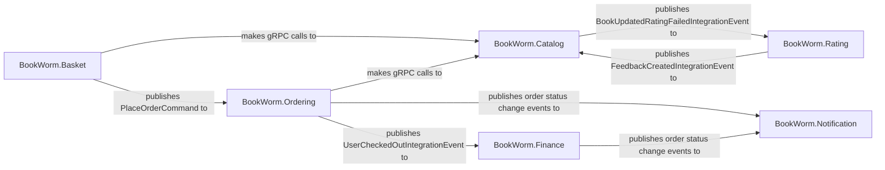

## Details

The E-commerce Microservices subsystem is a core part of the BookWorm project, embodying the business domain logic. It's built following a Cloud-Native Microservices Architecture with .NET Aspire, emphasizing Domain-Driven Design (DDD) and Vertical Slice Architecture. The communication between these services primarily occurs through events (MassTransit) and gRPC.

### BookWorm.Catalog
This service is the authoritative source for all product-related information, including books, authors, categories, and publishers. It provides APIs for querying and managing catalog data. Its domain is rich with aggregates like AuthorAggregate, BookAggregate, CategoryAggregate, and PublisherAggregate. It also handles integration events related to book ratings.

**Related Classes/Methods**:

- `AuthorAggregate` (1:1)
- `BookAggregate` (1:1)
- `CategoryAggregate` (1:1)
- `PublisherAggregate` (1:1)
- `IAuthorRepository` (1:1)
- `IBookRepository` (1:1)
- `ICategoryRepository` (1:1)
- `IPublisherRepository` (1:1)
- `CreateBookCommand` (1:1)
- `GetBookQuery` (1:1)
- `ListBooksEndpoint` (1:1)
- `BookService` (1:1)
- `FeedbackCreatedIntegrationEventHandler` (1:1)

### BookWorm.Basket
Manages customer shopping baskets, allowing users to add, update, and remove items. It interacts with the Catalog service to validate product information and publishes events related to basket operations.

**Related Classes/Methods**:

- `CustomerBasket` (1:1)
- `BasketItem` (1:1)
- `IBasketRepository` (1:1)
- `BasketRepository` (1:1)
- `CreateBasketCommand` (1:1)
- `GetBasketQuery` (1:1)
- `UpdateBasketEndpoint` (1:1)
- `BookService` (1:1)
- `IBookService` (1:1)
- `PlaceOrderCommand` (1:1)

### BookWorm.Ordering
Manages the entire order lifecycle, from creation to completion or cancellation. It interacts with the Catalog service for product validation and publishes order status change events. It also leverages Marten for event sourcing and projections.

**Related Classes/Methods**:

- `Order` (1:1)
- `Buyer` (1:1)
- `IOrderRepository` (1:1)
- `IBuyerRepository` (1:1)
- `CreateOrderCommand` (1:1)
- `CompleteOrderEndpoint` (1:1)
- `CancelOrderCommand` (1:1)
- `MartenConfigs` (1:1)
- `UserCheckedOutIntegrationEvent` (1:1)
- `OrderStatusChangedToCompleteIntegrationEvent` (1:1)

### BookWorm.Finance
Handles financial aspects, primarily managing order state and payment processing through a Saga pattern. It reacts to events from the Ordering service and publishes financial status updates.

**Related Classes/Methods**:

- `OrderStateMachine` (1:1)
- `OrderState` (1:1)
- `PlaceOrderCommand` (1:1)
- `CompleteOrderCommand` (1:1)
- `CancelOrderCommand` (1:1)
- `UserCheckedOutIntegrationEvent` (1:1)
- `OrderStatusChangedToCompleteIntegrationEvent` (1:1)

### BookWorm.Rating
Manages user feedback and ratings for books. It allows users to submit ratings and publishes events when feedback is created or deleted, which can then be consumed by other services (e.g., Catalog).

**Related Classes/Methods**:

- `Feedback` (1:1)
- `IFeedbackRepository` (1:1)
- `FeedbackRepository` (1:1)
- `CreateFeedbackCommand` (1:1)
- `ListFeedbacksQuery` (1:1)
- `FeedbackCreatedIntegrationEvent` (1:1)
- `FeedbackDeletedIntegrationEvent` (1:1)

### BookWorm.Notification
Responsible for sending various notifications, primarily emails, based on events from other services (e.g., order status changes). It utilizes an outbox pattern to ensure reliable message delivery.

**Related Classes/Methods**:

- `EmailOutboxService` (1:1)
- `MailKitSender` (1:1)
- `SendGridSender` (1:1)
- `PlaceOrderCommandHandler` (1:1)
- `CompleteOrderCommandHandler` (1:1)
- `CancelOrderCommandHandler` (1:1)
- `CleanUpSentEmailWorker` (1:1)
- `ResendErrorEmailWorker` (1:1)

### [FAQ](https://github.com/CodeBoarding/GeneratedOnBoardings/tree/main?tab=readme-ov-file#faq)