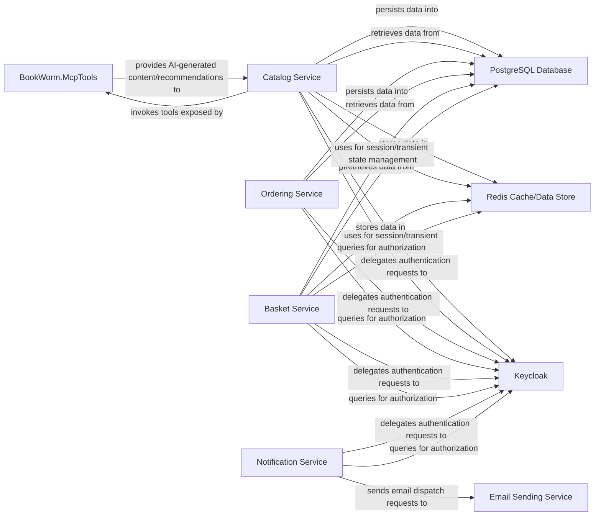

## Details

The Persistent & External Services component is a critical layer that underpins the entire BookWorm microservices ecosystem by providing essential data persistence, external integrations, and specialized capabilities. While direct code analysis for all external services isn't feasible with the available tools (as they are external systems or infrastructure), BookWorm.McpTools serves as a concrete example of how specialized external services (AI/ML) are integrated.

### BookWorm.McpTools
This component is the dedicated integration point for specialized AI/ML models, particularly those leveraging Semantic Kernel. It enables other microservices, notably the Catalog Service, to consume AI capabilities for tasks such as content generation, data enrichment, and intelligent recommendations related to books, authors, categories, and publishers. It defines the necessary data models (Author.cs, Book.cs, Category.cs, Publisher.cs), interfaces (ICatalogApi.cs), and "tools" (Product.cs) that AI models can utilize to interact with the system and perform specific actions or retrieve data.

**Related Classes/Methods**:

- `src/Integrations/BookWorm.McpTools/BookWorm.McpTools.csproj` (1:1)
- `src/Integrations/BookWorm.McpTools/Extensions/Extensions.cs` (1:1)
- `src/Integrations/BookWorm.McpTools/Models/Author.cs` (1:1)
- `src/Integrations/BookWorm.McpTools/Models/Book.cs` (1:1)
- `src/Integrations/BookWorm.McpTools/Models/Category.cs` (1:1)
- `src/Integrations/BookWorm.McpTools/Models/Publisher.cs` (1:1)
- `src/Integrations/BookWorm.McpTools/Program.cs` (1:1)
- `src/Integrations/BookWorm.McpTools/Prompts/Instruction.cs` (1:1)
- `src/Integrations/BookWorm.McpTools/Services/ICatalogApi.cs` (1:1)
- `src/Integrations/BookWorm.McpTools/Tools/Product.cs` (1:1)

### PostgreSQL Database
This is the primary relational database used for persistent storage across various microservices. It serves as the authoritative source for core business data, such as product catalogs, user orders, and customer information. Each microservice likely manages its own schema or bounded context within PostgreSQL, adhering to Domain-Driven Design principles.

**Related Classes/Methods**: _None_

### Redis Cache/Data Store
An in-memory data store primarily used for caching frequently accessed data, managing user sessions, and potentially for real-time data processing or as a message broker. It significantly enhances application performance by reducing the load on the primary database and providing low-latency data access.

**Related Classes/Methods**: _None_

### Keycloak
An external, open-source identity and access management solution responsible for centralized user authentication, authorization, and single sign-on (SSO) across all microservices. It secures the application by managing user identities, roles, and permissions, ensuring that only authorized users can access specific functionalities and data.

**Related Classes/Methods**: _None_

### Email Sending Service
An external service or integration dedicated to dispatching transactional and marketing emails to users. This includes communications such as order confirmations, password reset links, shipping notifications, and promotional offers.

**Related Classes/Methods**: _None_

### Catalog Service
A microservice responsible for managing the product catalog, interacting with AI/ML models for content/recommendations, and persisting data to PostgreSQL and caching with Redis.

**Related Classes/Methods**: _None_

### Ordering Service
A microservice responsible for managing user orders and persisting data to PostgreSQL.

**Related Classes/Methods**: _None_

### Basket Service
A microservice responsible for managing user shopping cart contents, persisting data to PostgreSQL, and caching with Redis.

**Related Classes/Methods**: _None_

### Notification Service
A microservice responsible for dispatching transactional and marketing emails to users via the Email Sending Service.

**Related Classes/Methods**: _None_

### [FAQ](https://github.com/CodeBoarding/GeneratedOnBoardings/tree/main?tab=readme-ov-file#faq)