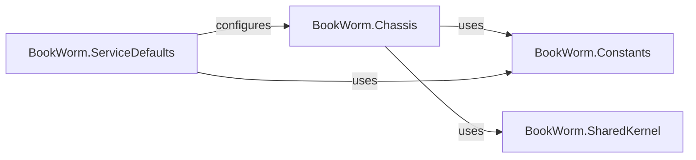

## Details

The Shared Microservice Foundation is a crucial conceptual layer in the BookWorm project, providing the common infrastructure and architectural patterns that all individual microservices leverage. It's fundamental because it promotes consistency, reduces boilerplate, and enforces architectural best practices across the entire system. This foundation is composed of four key components: BookWorm.Chassis, BookWorm.SharedKernel, BookWorm.ServiceDefaults, and BookWorm.Constants.

### BookWorm.Chassis
This project acts as the core microservices chassis, providing common architectural building blocks and cross-cutting concerns. It encapsulates infrastructure-level patterns such as Command/Query Responsibility Segregation (CQRS), Event-Driven Architecture (Event Bus), Repository, and Specification. It also includes infrastructure for logging, OpenTelemetry for observability, and standardized exception handling, ensuring consistency and reusability across all microservices.

**Related Classes/Methods**: _None_

### BookWorm.SharedKernel
This component embodies the Domain-Driven Design (DDD) concept of a Shared Kernel. It contains core domain concepts, value objects, entities, and interfaces that are shared and understood across multiple bounded contexts (microservices). This ensures a consistent ubiquitous language and common understanding of fundamental domain elements, reducing duplication and promoting interoperability.

**Related Classes/Methods**: _None_

### BookWorm.ServiceDefaults
This project centralizes default configurations, extensions, and conventions for all microservices within the BookWorm solution. It standardizes aspects like API specifications (OpenAPI, AsyncAPI), authentication mechanisms, Cross-Origin Resource Sharing (CORS) policies, and HTTP client configurations. Its purpose is to promote consistency, reduce boilerplate code, and simplify the setup of new services by providing a common baseline.

**Related Classes/Methods**: _None_

### BookWorm.Constants
This component is a dedicated library for storing application-wide constants. This includes magic strings, numerical values, configuration keys, or other fixed data that needs to be consistently referenced across different microservices or shared components. Centralizing constants prevents hardcoding, reduces errors, and simplifies maintenance.

**Related Classes/Methods**: _None_

### [FAQ](https://github.com/CodeBoarding/GeneratedOnBoardings/tree/main?tab=readme-ov-file#faq)