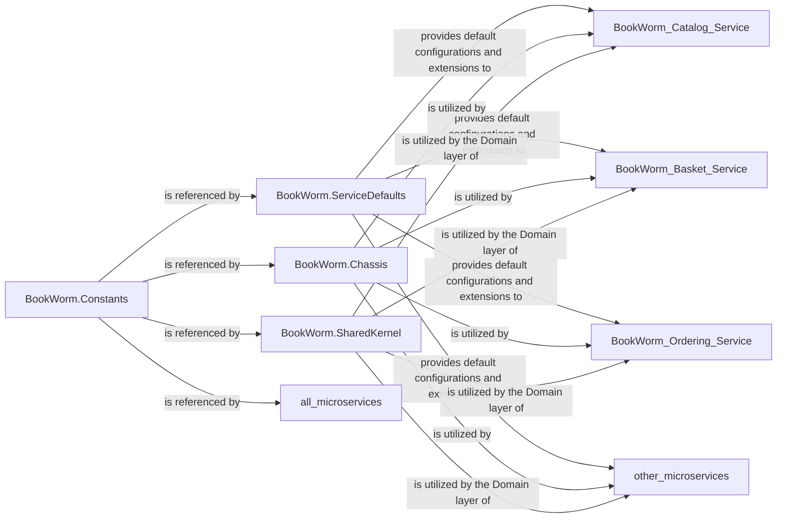

## Details

These four components are fundamental because they collectively form the "Shared Platform / Building Blocks" that underpin the entire microservices architecture. They provide the necessary infrastructure, architectural patterns, and domain primitives to ensure consistency, reusability, and adherence to the project's architectural biases (Cloud-Native, DDD, EDA, AI-Powered). Without these foundational components, each microservice would have to re-implement common functionalities, leading to inconsistencies, increased development time, and higher maintenance overhead. They embody the "Microservices Chassis" and "Building Blocks" patterns, which are crucial for efficient and scalable microservice development.

### BookWorm.ServiceDefaults
This component acts as a "Microservices Chassis," providing a standardized set of configurations, extensions, and common services consistently applied across all microservices. It encapsulates cross-cutting concerns related to service bootstrapping and external interactions, including API specification (OpenAPI, AsyncAPI), authentication (Keycloak integration), Kestrel server settings, and general application configuration. It is fundamental because it ensures consistency and reduces boilerplate across all microservices, aligning with the "Microservices Chassis" pattern.

**Related Classes/Methods**:

- `All files in directory` (1:1)

### BookWorm.Chassis
This core "Building Block" implements common architectural patterns and technical cross-cutting concerns. It provides reusable abstractions and implementations for Command Query Responsibility Segregation (CQRS) with `ICommand`/`IQuery` and their handlers, an `EventBus` for internal domain event dispatching, a generic `Repository` pattern, and a flexible `Specification` pattern for querying. Additionally, it integrates functionalities for AI extensions, search capabilities, exception handling, structured logging, OpenTelemetry for distributed tracing, and request pipelines (e.g., validation, logging). It is fundamental as it provides the core technical patterns (CQRS, EventBus, Repository) and cross-cutting concerns (logging, telemetry, AI extensions) essential for building robust and scalable microservices, adhering to the "Microservices Chassis" and "Building Blocks" patterns.

**Related Classes/Methods**:

- `All files in directory` (1:1)

### BookWorm.SharedKernel
This "Building Block" encapsulates fundamental Domain-Driven Design (DDD) concepts and base types that are shared across multiple bounded contexts (microservices). It defines core DDD constructs such as `Entity`, `IAggregateRoot`, `DomainEvent`, and `ValueObject`, along with helper utilities and common result types. This ensures a consistent "Ubiquitous Language" and foundational domain modeling across the system. It is fundamental because it enforces DDD principles and provides a consistent domain model across services, crucial for maintaining a clear and shared understanding of the business domain.

**Related Classes/Methods**:

- `All files in directory` (1:1)

### BookWorm.Constants
This "Building Block" centralizes system-wide constant values and enumerations used throughout the application. This includes constants related to .NET Aspire, core application settings (e.g., authorization roles, data schema lengths, pagination defaults, RESTful API conventions), feature flags, and logging categories. It is fundamental because it promotes consistency, reduces magic strings/numbers, and simplifies configuration management across the entire system.

**Related Classes/Methods**:

- `All files in directory` (1:1)

### [FAQ](https://github.com/CodeBoarding/GeneratedOnBoardings/tree/main?tab=readme-ov-file#faq)