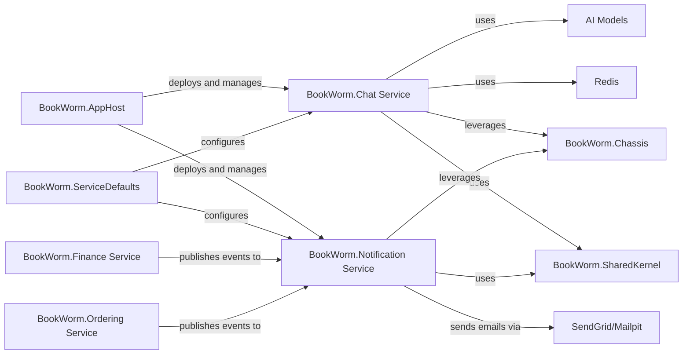

## Details

Analysis of the User Communication & AI Services subsystem within the BookWorm project, focusing on its components and their interactions.

### BookWorm.Chat Service
This microservice provides real-time chat functionality, enabling users to interact with AI agents. It manages conversation history, leverages AI models (such as Gemma 3 and Nomic Embed Text via Semantic Kernel) for intelligent responses, and utilizes SignalR for real-time communication. It also integrates with Redis for managing chat state and cancellation, ensuring a responsive and scalable chat experience.

**Related Classes/Methods**:

- `BookWorm.Chat.Agents.*` (1:1)
- `BookWorm.Chat.Domain.AggregatesModel.Conversation` (1:1)
- `BookWorm.Chat.Features.Stream.ChatStreamHub` (1:1)
- `BookWorm.Chat.Infrastructure.Backplane.RedisBackplaneService` (1:1)
- `BookWorm.Chat.Infrastructure.ChatStreaming.ChatStreaming` (1:1)

### BookWorm.Notification Service
This microservice is dedicated to sending various notifications to users, primarily email-based, by consuming integration events published by other services. It implements a robust Outbox pattern to guarantee reliable message delivery, even in the face of transient failures. The service supports multiple email sending providers (e.g., SendGrid, MailKit) and includes background workers for managing and retrying email dispatches.

**Related Classes/Methods**:

- `BookWorm.Notification.Domain.Models.Outbox` (1:1)
- `BookWorm.Notification.Infrastructure.Senders.MailKit.MailKitSender` (1:1)
- `BookWorm.Notification.Infrastructure.Senders.SendGrid.SendGridSender` (1:1)
- `BookWorm.Notification.Infrastructure.Senders.Outbox.EmailOutboxService` (1:1)
- `BookWorm.Notification.IntegrationEvents.EventHandlers.*CommandHandler` (1:1)
- `BookWorm.Notification.Workers.CleanUpSentEmailWorker` (1:1)
- `BookWorm.Notification.Workers.ResendErrorEmailWorker` (1:1)

### BookWorm.AppHost
Responsible for deploying and managing the lifecycle of services.

**Related Classes/Methods**: _None_

### BookWorm.ServiceDefaults
Provides common configurations and default settings to microservices.

**Related Classes/Methods**: _None_

### AI Models
External AI models like Gemma 3 and Nomic Embed Text.

**Related Classes/Methods**: _None_

### Redis
External Redis instance for managing real-time chat state.

**Related Classes/Methods**: _None_

### BookWorm.Chassis
Provides common microservice functionalities such as logging, metrics, and health checks.

**Related Classes/Methods**: _None_

### BookWorm.SharedKernel
Provides domain constructs and shared utilities.

**Related Classes/Methods**: _None_

### BookWorm.Finance Service
Publishes integration events related to finance operations.

**Related Classes/Methods**: _None_

### BookWorm.Ordering Service
Publishes integration events related to order operations.

**Related Classes/Methods**: _None_

### SendGrid/Mailpit
External email sending providers like SendGrid or Mailpit.

**Related Classes/Methods**: _None_

### [FAQ](https://github.com/CodeBoarding/GeneratedOnBoardings/tree/main?tab=readme-ov-file#faq)