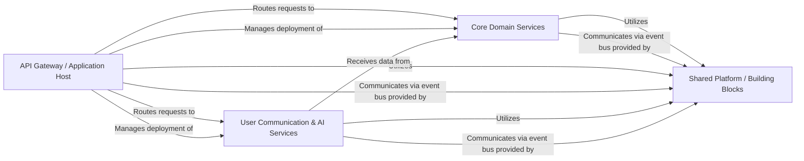

## Details

One paragraph explaining the functionality which is represented by this graph. What the main flow is and what is its purpose.

### API Gateway / Application Host [[Expand]](./API_Gateway_Application_Host.md)
This component serves as the primary entry point for all external requests, acting as an API Gateway. It orchestrates the deployment and lifecycle of the various microservices, handling routing, load balancing, and initial request processing before forwarding to the appropriate service.

**Related Classes/Methods**:

- `src/Aspire/BookWorm.AppHost/AppHost.cs` (1:1)
- `src/Aspire/BookWorm.AppHost/Container/proxy/yarp.json` (1:1)

### Core Domain Services [[Expand]](./Core_Domain_Services.md)
This composite component encapsulates the core business logic of the BookWorm application, adhering to Domain-Driven Design principles. It includes services for managing the book catalog, user shopping baskets, book ratings, order processing, and financial transactions. These services interact primarily through events.

**Related Classes/Methods**:

- `src/Services/Catalog/BookWorm.Catalog/` (1:1)
- `src/Services/Rating/BookWorm.Rating/` (1:1)
- `src/Services/Basket/BookWorm.Basket/` (1:1)
- `src/Services/Ordering/BookWorm.Ordering/` (1:1)
- `src/Services/Finance/BookWorm.Finance/` (1:1)

### Shared Platform / Building Blocks [[Expand]](./Shared_Platform_Building_Blocks.md)
This foundational layer provides common architectural patterns, utilities, and cross-cutting concerns for all microservices. It includes Domain-Driven Design primitives (Entities, Aggregates), CQRS patterns, an Event Bus for inter-service communication, AI extensions, and standardized configurations for API specifications, authentication, and observability.

**Related Classes/Methods**:

- `src/Aspire/BookWorm.ServiceDefaults/` (1:1)
- `src/BuildingBlocks/BookWorm.Chassis/` (1:1)
- `src/BuildingBlocks/BookWorm.SharedKernel/` (1:1)
- `src/BuildingBlocks/BookWorm.Constants/` (1:1)

### User Communication & AI Services [[Expand]](./User_Communication_AI_Services.md)
This component handles real-time user interactions and notifications. It provides chat functionality with AI integration (leveraging AI agents) and sends various notifications to users, such as order status updates, by consuming events from other services.

**Related Classes/Methods**:

- `src/Services/Chat/BookWorm.Chat/` (1:1)
- `src/Services/Notification/BookWorm.Notification/` (1:1)

### [FAQ](https://github.com/CodeBoarding/GeneratedOnBoardings/tree/main?tab=readme-ov-file#faq)