```mermaid
graph LR
    BookWorm_Orchestration["BookWorm Orchestration"]
    E_commerce_Microservices["E-commerce Microservices"]
    AI_Powered_Chat_Service["AI-Powered Chat Service"]
    Shared_Microservice_Foundation["Shared Microservice Foundation"]
    Persistent_External_Services["Persistent & External Services"]
    BookWorm_Orchestration -- "Manages" --> E_commerce_Microservices
    BookWorm_Orchestration -- "Manages" --> AI_Powered_Chat_Service
    BookWorm_Orchestration -- "Configures" --> Shared_Microservice_Foundation
    BookWorm_Orchestration -- "Integrates with" --> Persistent_External_Services
    E_commerce_Microservices -- "Uses" --> Shared_Microservice_Foundation
    E_commerce_Microservices -- "Interacts with" --> Persistent_External_Services
    E_commerce_Microservices -- "Exchanges Events/Commands with" --> E_commerce_Microservices
    AI_Powered_Chat_Service -- "Uses" --> Shared_Microservice_Foundation
    AI_Powered_Chat_Service -- "Interacts with" --> Persistent_External_Services
    Shared_Microservice_Foundation -- "Used by" --> E_commerce_Microservices
    Shared_Microservice_Foundation -- "Used by" --> AI_Powered_Chat_Service
    Shared_Microservice_Foundation -- "Configured by" --> BookWorm_Orchestration
    Persistent_External_Services -- "Provides data/services to" --> E_commerce_Microservices
    Persistent_External_Services -- "Provides data/services to" --> AI_Powered_Chat_Service
    Persistent_External_Services -- "Managed by" --> BookWorm_Orchestration
    click BookWorm_Orchestration href "https://github.com/CodeBoarding/GeneratedOnBoardings/blob/main/BookWorm/BookWorm_Orchestration.md" "Details"
    click E_commerce_Microservices href "https://github.com/CodeBoarding/GeneratedOnBoardings/blob/main/BookWorm/E_commerce_Microservices.md" "Details"
    click AI_Powered_Chat_Service href "https://github.com/CodeBoarding/GeneratedOnBoardings/blob/main/BookWorm/AI_Powered_Chat_Service.md" "Details"
    click Shared_Microservice_Foundation href "https://github.com/CodeBoarding/GeneratedOnBoardings/blob/main/BookWorm/Shared_Microservice_Foundation.md" "Details"
    click Persistent_External_Services href "https://github.com/CodeBoarding/GeneratedOnBoardings/blob/main/BookWorm/Persistent_External_Services.md" "Details"
```

## Details

One paragraph explaining the functionality which is represented by this graph. What the main flow is and what is its purpose.

### BookWorm Orchestration [[Expand]](./BookWorm_Orchestration.md)
The central deployment and management layer for the entire application. It defines, configures, and launches all microservices and their associated infrastructure components (e.g., PostgreSQL, Redis, Keycloak), acting as the single point of entry for running the distributed system.

**Related Classes/Methods**:

- `src/Aspire/BookWorm.AppHost/AppHost.cs` (1:1)
- `src/Aspire/BookWorm.AppHost/Extensions/` (1:1)

### E-commerce Microservices [[Expand]](./E_commerce_Microservices.md)
These are the core business domain services responsible for managing the product catalog, customer shopping baskets, order processing, financial transactions, user ratings, and order-related notifications. They embody the domain logic and communicate primarily through events and gRPC.

**Related Classes/Methods**:

- `src/Services/Catalog/BookWorm.Catalog/` (1:1)
- `src/Services/Basket/BookWorm.Basket/` (1:1)
- `src/Services/Ordering/BookWorm.Ordering/` (1:1)
- `src/Services/Finance/BookWorm.Finance/` (1:1)
- `src/Services/Rating/BookWorm.Rating/` (1:1)
- `src/Services/Notification/BookWorm.Notification/` (1:1)

### AI-Powered Chat Service [[Expand]](./AI_Powered_Chat_Service.md)
A specialized microservice providing an AI-driven chat interface for user interactions, leveraging advanced AI/ML capabilities for tasks such as product inquiries or customer support.

**Related Classes/Methods**:

- `src/Services/Chat/BookWorm.Chat/` (1:1)

### Shared Microservice Foundation [[Expand]](./Shared_Microservice_Foundation.md)
This foundational layer provides common infrastructure, reusable building blocks, shared domain concepts, and consistent configurations across all microservices. It includes patterns for Command/Query Responsibility Segregation (CQRS), an event bus, observability features, and standardized API conventions.

**Related Classes/Methods**:

- `src/BuildingBlocks/BookWorm.Chassis/` (1:1)
- `src/BuildingBlocks/BookWorm.SharedKernel/` (1:1)
- `src/Aspire/BookWorm.ServiceDefaults/` (1:1)
- `src/BuildingBlocks/BookWorm.Constants/` (1:1)

### Persistent & External Services [[Expand]](./Persistent_External_Services.md)
This component represents the essential external dependencies and data persistence layers that support the microservices. It includes relational databases, in-memory data stores, identity and access management, email sending capabilities, and specialized AI/ML models for various tasks.

**Related Classes/Methods**:

- `src/Integrations/BookWorm.McpTools/` (1:1)

### [FAQ](https://github.com/CodeBoarding/GeneratedOnBoardings/tree/main?tab=readme-ov-file#faq)