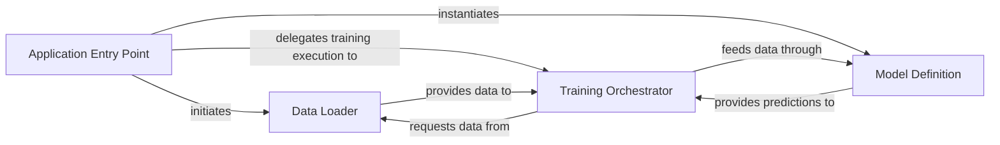

## Details

The CBAM.PyTorch project is structured around a clear separation of concerns for training a deep learning model. The Application Entry Point (train.py) orchestrates the entire process, initializing the Data Loader to prepare the dataset and instantiating the Model Definition which encapsulates the neural network architecture. The Application Entry Point then delegates the core training execution to the Training Orchestrator. The Data Loader provides processed data to the Training Orchestrator, which in turn feeds this data through the Model Definition for forward passes. The Model Definition then provides predictions back to the Training Orchestrator for loss calculation and backpropagation. This architecture ensures a modular and efficient training pipeline.

### Application Entry Point [[Expand]](./Application_Entry_Point.md)
The main script (train.py) that initializes and coordinates the training process. It sets up the data pipeline, instantiates the model, and delegates the training loop to the trainer component.

**Related Classes/Methods**:

- <a href="https://github.com/luuuyi/CBAM.PyTorch/blob/master/train.py" target="_blank" rel="noopener noreferrer">`train.py`</a>

### Data Loader
Responsible for loading and preprocessing the dataset (data_loader.ImageNet_datasets.ImageNetData). It provides the training and validation data to the trainer in an iterable format.

**Related Classes/Methods**:

- <a href="https://github.com/luuuyi/CBAM.PyTorch/blob/master/data_loader/ImageNet_datasets.py#L24-L57" target="_blank" rel="noopener noreferrer">`data_loader.ImageNet_datasets.ImageNetData`:24-57</a>

### Model Definition
Encapsulates the neural network architecture, specifically the model.resnet_cbam.ResNet. This component defines the forward pass and the structure of the model, including the CBAM module.

**Related Classes/Methods**:

- <a href="https://github.com/luuuyi/CBAM.PyTorch/blob/master/model/resnet_cbam.py#L141-L198" target="_blank" rel="noopener noreferrer">`model.resnet_cbam.ResNet`:141-198</a>

### Training Orchestrator
Manages the core training loop (trainer.trainer), including iterating over epochs, performing forward and backward passes, optimizing model parameters, and logging metrics. It receives data from the Data Loader and interacts with the Model Definition.

**Related Classes/Methods**:

- <a href="https://github.com/luuuyi/CBAM.PyTorch/blob/master/trainer/trainer.py#L9-L143" target="_blank" rel="noopener noreferrer">`trainer.trainer`:9-143</a>

### [FAQ](https://github.com/CodeBoarding/GeneratedOnBoardings/tree/main?tab=readme-ov-file#faq)